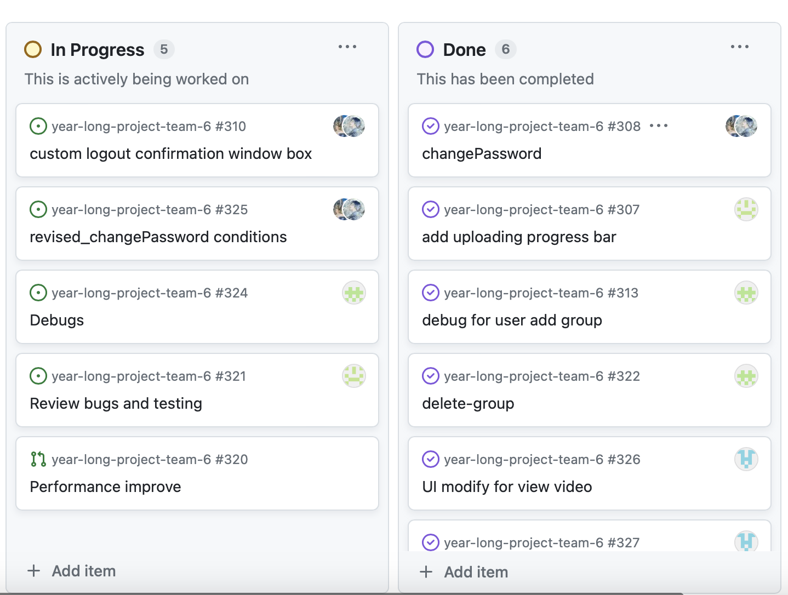
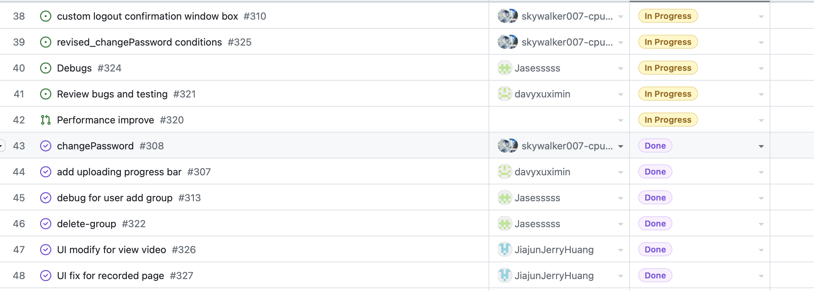
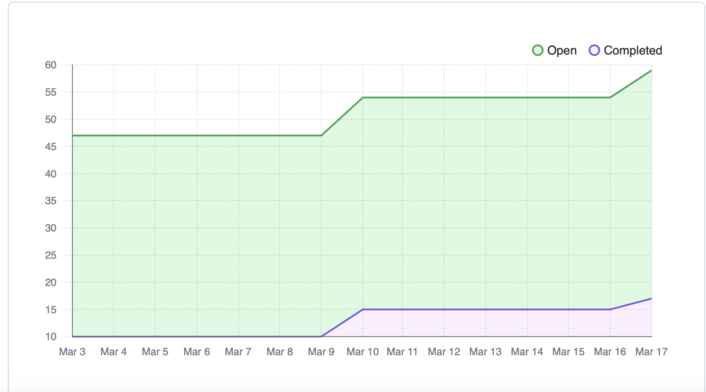

# Team Log - _Team 6_

## Reminder of username 
* skywalker007-cpu --- **Zetian Zhao**

* davyxuximin --- **XiMin Xu**

* JiajunJerryHuang --- **Jiajun Huang**

* Jasesssss --- **Yiqi Xu**

* WenruiChen --- **Wenrui Chen**

## Applicable data range
**March/4/2023** to **March/10/2023**

## Milestone Goals
User able to change the password.

Change the UI layout for menu on the member page based on the comments from the peer tesing. 

Debugging the functionality of adding a group.

Debugging the funcitonality of deleting a group. 

Having a window to make user ensure if they want to log out. 

Modifying the UI according to the peer testing comments. 

Testing

## Completed Tasks 
User able to change the password.

Change the UI layout for menu on the member page based on the comments from the peer tesing. 

Debugging the functionality of adding a group.

Debugging the funcitonality of deleting a group. 

Having a window to make user ensure if they want to log out. 

Modifying the UI according to the peer testing comments. 

delete group debug

add up progress bar

change password feature

## Task in progress
For the window after logout, we will still work on it for better appealing. 

Testing and debugging

## Test Report
*Code :*
We will be testing all our routers and component next week

## Project on Board
*Board format:*

*Table format:*

*Burn Chart:*
