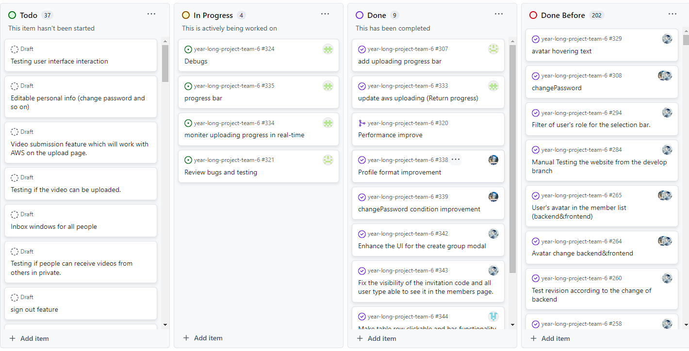
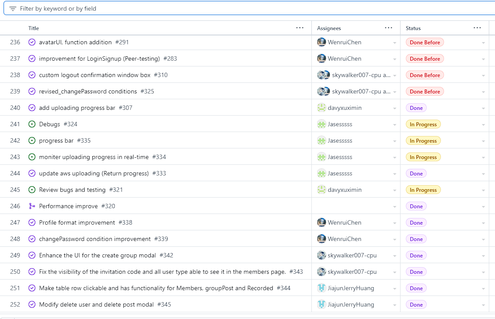
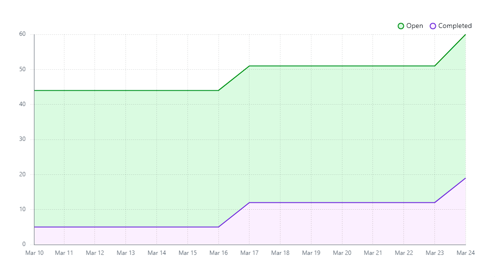

# Team Log - _Team 6_

## Reminder of username 
* skywalker007-cpu --- **Zetian Zhao**

* davyxuximin --- **XiMin Xu**

* JiajunJerryHuang --- **Jiajun Huang**

* Jasesssss --- **Yiqi Xu**

* WenruiChen --- **Wenrui Chen**

## Applicable data range
**March/4/2023** to **March/10/2023**

## Milestone Goals
User able to change the password.

Change the UI layout for menu on the member page based on the comments from the peer tesing. 

Debugging the functionality of adding a group.

Debugging the funcitonality of deleting a group. 

Having a window to make user ensure if they want to log out. 

Modifying the UI according to the peer testing comments. 

Testing

## Completed Tasks 
* The UI of the create group modal page has been improved. For exmaple, adjustment of the input and button location. Moreover, the CSS of the input text also be modified. 
* The visibility of the invitation code has changed. Now, all the user type in the website able to see the invitation code for more convenient joining process. 
* Update the aws uploading (Return progress)
* Modify the tables in members, groupPost, recorded
* changePassword conditions improved (currentPassw != oldPassw)
* two buttons in profile page are arranged

## Task in progress
* Make the real-time progress return
* Update progress bar
* Testing and debugging

## Test Report
*Code :*
We will be testing all our routers and component next week

## Project on Board
*Board format:*

*Table format:*

*Burn Chart:*
