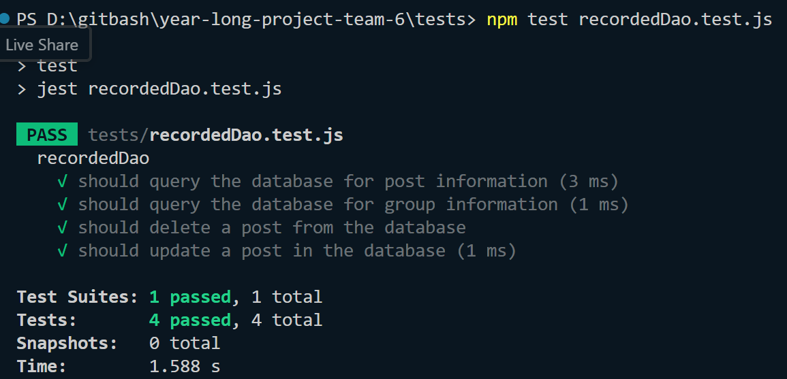
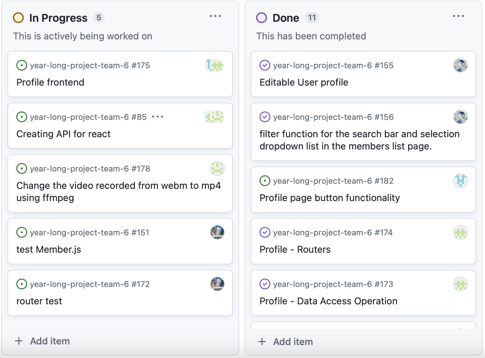
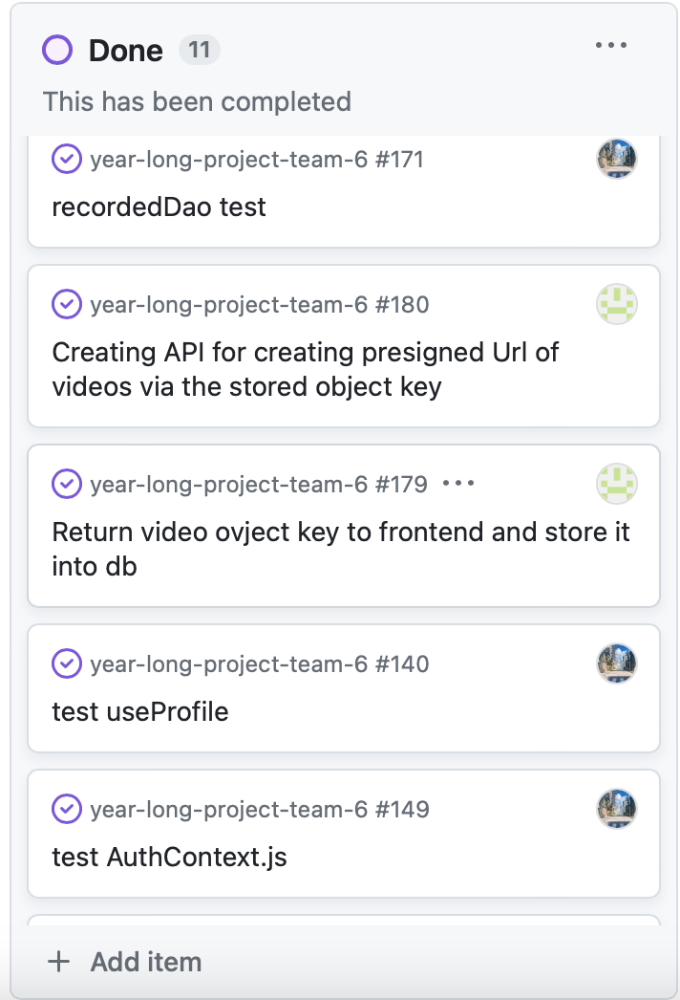
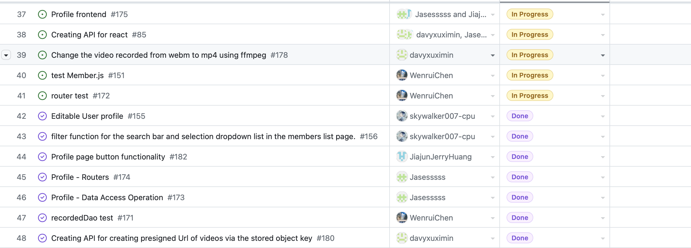
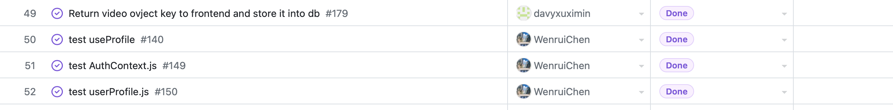
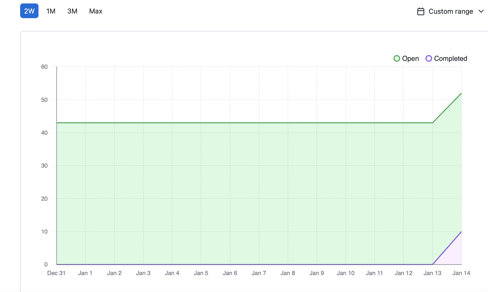

# Team Log - _Team 6_

## Reminder of username 
* skywalker007-cpu --- **Zetian Zhao**

* davyxuximin --- **XiMin Xu**

* JiajunJerryHuang --- **Jiajun Huang**

* Jasesssss --- **Yiqi Xu**

* WenruiChen --- **Wenrui Chen**

## Applicable data range
**Jan/8/2024** to **Jan/14/2024**

## Milestone Goals
All UI should be well to go

User should able to create group 

User should able to upload videos in specific groups

Users should able to change their personal profile

User should able to view videos

User should able to download videos

Testing


## Completed Tasks 

User should able to create group 

Users are able to change their personal profile

## Task in progress

User can upload videos but not in groups

User should able to view and download videos

UI need to be improved

Testing

## Test Report
*Code :*
```
jest.mock('mysql');
const mysql = require('mysql');
const RecordedDao = require('../app/backend/dao/recordedDao');

const mockQuery = jest.fn();
const mockDb = {
    query: mockQuery,
};

describe('recordedDao', () => {
    let dao;

    beforeEach(() => {
        dao = new RecordedDao(mockDb);
        mockQuery.mockReset();
    });

    it('should query the database for post information', () => {
        const callback = jest.fn();
        const userId = 'testUserId';
        dao.getPostInfor(userId, callback);
    
        const expectedQuery = `
            SELECT p.userid, p.post_id, p.post_title, p.post_date, p.s3_content_key, p.post_text
            FROM posts p WHERE p.userid = ?
        `.trim();
    
        expect(mockQuery).toHaveBeenCalledWith(
            expect.stringContaining(expectedQuery),
            [userId],
            expect.any(Function)
        );
    });
    

    it('should query the database for group information', () => {
        const callback = jest.fn();
        dao.getGroupInfor(callback);
    
        const expectedQuery = 'SELECT groupid, groupname FROM groups';
    
        const sanitizedExpected = expectedQuery.replace(/\s+/g, ' ').trim();
        const sanitizedReceived = mockQuery.mock.calls[0][0].replace(/\s+/g, ' ').trim();
    
        expect(sanitizedReceived).toEqual(expect.stringMatching(`${sanitizedExpected}(;)?$`));
    });       

    it('should delete a post from the database', () => {
        const callback = jest.fn();
        const postId = 'testPostId';
        dao.deletePost(postId, callback);
    
        const expectedQuery = 'DELETE FROM posts WHERE post_id = ?';
    
        const sanitizedExpected = expectedQuery.replace(/\s+/g, ' ').trim();
        const sanitizedReceived = mockQuery.mock.calls[0][0].replace(/\s+/g, ' ').trim();
    
        expect(sanitizedReceived).toEqual(expect.stringContaining(sanitizedExpected));
    });
    

    it('should update a post in the database', () => {
        const callback = jest.fn();
        const postId = 'testPostId';
        const newTitle = 'New Title';
        const newText = 'New Text';
        dao.editPost(postId, newTitle, newText, callback);
    
        const expectedQuery = 'UPDATE posts SET post_title = ?, post_text = ? WHERE post_id = ?';
    
        const sanitizedExpected = expectedQuery.replace(/\s+/g, ' ').trim();
        const sanitizedReceived = mockQuery.mock.calls[0][0].replace(/\s+/g, ' ').trim();
    
        expect(sanitizedReceived).toEqual(expect.stringContaining(sanitizedExpected));
    });    
});
```
```
```
*Output:*



## Project on Board
*Board format:*




*Table format:*





## Burnup chart
