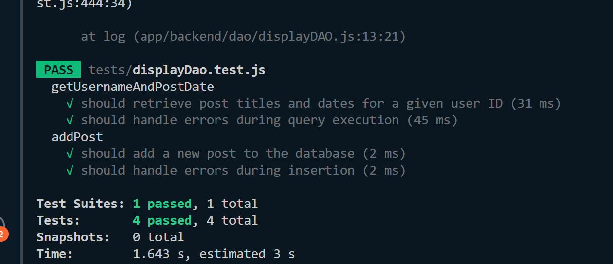

# Team Log - _Team 6_

## Reminder of username 
* skywalker007-cpu --- **Zetian Zhao**

* davyxuximin --- **XiMin Xu**

* JiajunJerryHuang --- **Jiajun Huang**

* Jasesssss --- **Yiqi Xu**

* WenruiChen --- **Wenrui Chen**

## Applicable data range
**Jan/15/2024** to **Jan/21/2024**

## Milestone Goals
All UI should be well to go

User should able to create group 

User should able to upload videos in specific groups

Users should able to change their personal profile

User should able to view videos

User should able to download videos

Testing


## Completed Tasks 

User should able to create group 

Users are able to change their personal profile

## Task in progress

User can upload videos but not in groups

User should able to view and download videos

UI need to be improved

Testing

## Test Report
*Code :*
```
// const PostDao = require('../app/backend/dao/displayDAO');

const dbFunctions = require('../app/backend/dao/displayDAO');
const db = require('../app/backend/db/db');

jest.mock('../app/backend/db/db', () => ({
  query: jest.fn()
}));

describe('getUsernameAndPostDate', () => {
  it('should retrieve post titles and dates for a given user ID', async () => {
    const userId = 123;
    const expectedResult = [{ post_title: 'Test Post', post_date: '2024-01-20' }];
    db.query.mockImplementation((query, params, callback) => {
      callback(null, expectedResult);
    });
    const callback = jest.fn();
    await dbFunctions.getUsernameAndPostDate(userId, callback);
    expect(callback).toHaveBeenCalledWith(null, expectedResult);
  });

  it('should handle errors during query execution', async () => {
    const userId = 123;
    const expectedError = new Error('Test Error');

    db.query.mockImplementation((query, params, callback) => {
      callback(expectedError, null);
    });

    const callback = jest.fn();
    await dbFunctions.getUsernameAndPostDate(userId, callback);

    expect(callback).toHaveBeenCalledWith(expectedError, null);
  });
});

describe('addPost', () => {
  it('should add a new post to the database', async () => {
    const postData = {
      user_group_id: 1,
      s3_content_key: 'test-key',
      post_text: 'Test post text',
      userid: 123,
      post_title: 'Test Post'
    };

    db.query.mockImplementation((query, params, callback) => {
      callback(null, { insertId: 1 }); // Simulating a successful insertion with an insertId
    });

    const callback = jest.fn();
    await dbFunctions.addPost(postData, callback);

    expect(callback).toHaveBeenCalledWith(null, { insertId: 1 });
  });

  it('should handle errors during insertion', async () => {
    const postData = {
      user_group_id: 1,
      s3_content_key: 'test-key',
      post_text: 'Test post text',
      userid: 123,
      post_title: 'Test Post'
    };

    const expectedError = new Error('Test Error');

    db.query.mockImplementation((query, params, callback) => {
      callback(expectedError, null);
    });

    const callback = jest.fn();
    await dbFunctions.addPost(postData, callback);

    expect(callback).toHaveBeenCalledWith(expectedError, null);
  });
});

```

```
const { addNewGroup, editGroupName, deleteGroup, getGroupInfo } = require('../app/backend/dao/groupDao');
const db = require('../app/backend/db/db');

jest.mock('../app/backend/db/db');

describe('addNewGroup', () => {
    test('adds a new group to the database', async () => {
        db.query.mockImplementationOnce((query, values, callback) => {
            callback(null, { insertId: 1 }); // Assuming the query was successful and returned an insertId
        });
        const callback = jest.fn();
        await addNewGroup('TestGroup', '123456', callback);
        expect(db.query).toHaveBeenCalledWith(
            'INSERT INTO `groups` (`groupname`, `invite_code`) VALUES (?, ?)',
            ['TestGroup', '123456'],
            expect.any(Function)
        );
        expect(callback).toHaveBeenCalledWith(null, { insertId: 1 });
    });

    test('handles database error', async () => {
        db.query.mockImplementationOnce((query, values, callback) => {
            callback('Database error', null);
        });
        const callback = jest.fn();
        await addNewGroup('TestGroup', '123456', callback);
        expect(db.query).toHaveBeenCalledWith(
            'INSERT INTO `groups` (`groupname`, `invite_code`) VALUES (?, ?)',
            ['TestGroup', '123456'],
            expect.any(Function)
        );
        expect(callback).toHaveBeenCalledWith('Error adding group', null);
    });
});
describe('editGroupName', () => {
    test('edits the group name in the database', async () => {
        db.query.mockImplementationOnce((query, values, callback) => {
            callback(null, { affectedRows: 1 }); // Assuming the query was successful and affected 1 row
        });
        const callback = jest.fn();
        await editGroupName(1, 'NewTestGroup', callback);
        expect(db.query).toHaveBeenCalledWith(
            'UPDATE groups SET groupname = ? WHERE groupid = ?',
            ['NewTestGroup', 1],
            expect.any(Function)
        );
        expect(callback).toHaveBeenCalledWith(null, { affectedRows: 1 });
    });

    test('handles database error', async () => {
        db.query.mockImplementationOnce((query, values, callback) => {
            callback('Database error', null);
        });
        const callback = jest.fn();
        await editGroupName(1, 'NewTestGroup', callback);
        expect(db.query).toHaveBeenCalledWith(
            'UPDATE groups SET groupname = ? WHERE groupid = ?',
            ['NewTestGroup', 1],
            expect.any(Function)
        );
        expect(callback).toHaveBeenCalledWith('Database error', null);
    });
});
describe('deleteGroup', () => {
    test('deletes the group from the database', async () => {
        db.query.mockImplementationOnce((query, values, callback) => {
            callback(null, { affectedRows: 1 }); // Assuming the query was successful and affected 1 row
        });
        const callback = jest.fn();
        await deleteGroup(1, callback);
        expect(db.query).toHaveBeenCalledWith(
            'DELETE FROM groups WHERE groupid = ?',
            [1],
            expect.any(Function)
        );
        expect(callback).toHaveBeenCalledWith(null, { affectedRows: 1 });
    });

    test('handles database error', async () => {
        // Mocking a database error
        db.query.mockImplementationOnce((query, values, callback) => {
            callback('Database error', null);
        });
        const callback = jest.fn();
        await deleteGroup(1, callback);
        expect(db.query).toHaveBeenCalledWith(
            'DELETE FROM groups WHERE groupid = ?',
            [1],
            expect.any(Function)
        );
        expect(callback).toHaveBeenCalledWith('Database error', null);
    });
});
describe('getGroupInfo', () => {
    test('returns group information from the database', async () => {
        const mockResults = [{ groupId: 1, groupName: 'TestGroup' }];
        db.query.mockImplementationOnce((query, values, callback) => {
            callback(null, mockResults);
        });
        const callback = jest.fn();
        await getGroupInfo(1, callback);
        expect(db.query).toHaveBeenCalledWith(
            'SELECT * FROM groups WHERE groupid = ?',
            [1],
            expect.any(Function)
        );
        expect(callback).toHaveBeenCalledWith(null, mockResults[0]);
    });

    test('handles database error', async () => {
        db.query.mockImplementationOnce((query, values, callback) => {
            callback('Database error', null);
        });
        const callback = jest.fn();
        await getGroupInfo(1, callback);
        expect(db.query).toHaveBeenCalledWith(
            'SELECT * FROM groups WHERE groupid = ?',
            [1],
            expect.any(Function)
        );
        expect(callback).toHaveBeenCalledWith('Database error', null);
    });
});
```

```
const { addNewGroup, editGroupName, deleteGroup, getGroupInfo } = require('../app/backend/dao/groupDao');
const express = require('express');
const request = require('supertest');
const router = require('../app/backend/router/groupRouter');

jest.mock('../app/backend/dao/groupDao');

const app = express();
app.use(express.json());
app.use('/groups', router);

describe('Group Routes', () => {
    const mockGroupId = 1;
    const mockGroupName = 'TestGroup';
    const mockGroupCode = 'ABC123';

    test('POST /groups/edit-group/:id should edit group name', async () => {
        editGroupName.mockImplementation((groupId, newGroupName, callback) => {
            callback(null, {});
        });

        const response = await request(app)
            .post('/groups/edit-group/1')
            .send({ newGroupName: 'NewTestGroup' });

        expect(response.status).toBe(200);
        expect(response.text).toContain('Group name updated successfully');
    });

    test('POST /groups/add-group - should add a new group successfully', async () => {
        const mockResult = { insertId: mockGroupId };
        addNewGroup.mockImplementationOnce((groupName, code, callback) => {
            callback(null, mockResult);
        });

        const response = await request(app)
            .post('/groups/add-group')
            .send({ groupName: mockGroupName, code: mockGroupCode });

        expect(response.status).toBe(200);
        expect(response.text).toContain('New group added successfully');
    });

    test('DELETE /groups/delete-group/:id should delete a group', async () => {
        deleteGroup.mockImplementation((groupId, callback) => {
            callback(null, {});
        });

        const response = await request(app).delete('/groups/delete-group/1');

        expect(response.status).toBe(200);
        expect(response.text).toContain('Group deleted successfully');
    });

    test('GET /groups/get-group-info/:id should get group information', async () => {
        const mockGroup = {
            id: mockGroupId,
            name: mockGroupName,
            code: mockGroupCode,
        };

        getGroupInfo.mockImplementation((groupId, callback) => {
            callback(null, mockGroup);
        });

        const response = await request(app).get('/groups/get-group-infor/1');

        expect(response.status).toBe(200);
        expect(response.body).toEqual(mockGroup);
    }, 10000);
});

```

```
// const dbFunctions = require('../app/backend/dao/PostDao');
const mockDb = require('../app/backend/db/db');
const PostDao = require('../app/backend/dao/PostDao');
const mysql = require('mysql');
const bcrypt = require('bcrypt');

jest.mock('mysql');
jest.mock('bcrypt');
jest.mock('../app/backend/db/db', () => ({
    query: jest.fn()
}));


describe('PostDao', () => {
    mysql.createConnection.mockImplementation(() => ({
        query: jest.fn()
    }));
    const mockDb = new mysql.createConnection();
    const postDao = new PostDao(mockDb);

    describe('getUsernameAndPostDate', () => {
        it('should retrieve username and post date', async () => {
            const expectedResult = [{ username: 'TestUser', post_date: '2024-01-20' }];
            mockDb.query.mockImplementation((query, callback) => {
                callback(null, expectedResult);
            });
            const callback = jest.fn();
            await postDao.getUsernameAndPostDate(callback);
            expect(callback).toHaveBeenCalledWith(null, expectedResult);
        });

        it('should handle errors during query execution', async () => {
            const expectedError = new Error('Test Error');
            mockDb.query.mockImplementation((query, callback) => {
                callback(expectedError, null);
            });
            const callback = jest.fn();
            await postDao.getUsernameAndPostDate(callback);
            expect(callback).toHaveBeenCalledWith(expectedError, null);
        });
    });

    describe('authenticateUser', () => {
        it('should authenticate a user with valid credentials', async () => {
            const email = 'test@example.com';
            const password = 'password';
                    mockDb.query.mockImplementation((query, params, callback) => {
                if (query.includes('SELECT password FROM users WHERE email = ?')) {
                    const results = [{ password: 'password' }];
                    callback(null, results);
                } else {
                    callback(null, []);
                }
            });
            //instance
            const postDao = new PostDao(mockDb);
            let userExists;
            const callback = jest.fn();
            await postDao.authenticateUser(email, password, callback);
            // actual parameters
            console.log('Actual parameters received by the callback:', callback.mock.calls[0]);
            userExists = callback.mock.calls[0][1];
            expect(callback).toHaveBeenCalledWith(null, userExists);
        });        
                    

        it('should handle errors during query execution', async () => {
            const email = 'test@example.com';
            const password = 'password';
            const expectedError = new Error('Test Error');
            mockDb.query.mockImplementation((query, params, callback) => {
                callback(expectedError, null);
            });
            const callback = jest.fn();
            await postDao.authenticateUser(email, password, callback);
            expect(callback).toHaveBeenCalledWith(expectedError, null);
        });
    });

    describe('getUserByEmail', () => {
        it('should retrieve user by email', async () => {
            const email = 'test@example.com';
            const expectedResult = {
                userid: 1,
                username: 'TestUser',
                email: 'test@example.com',
                role: 'user',
                user_image: 'user.jpg'
            };
            mockDb.query.mockImplementation((query, params, callback) => {
                callback(null, [expectedResult]);
            });
            const callback = jest.fn();
            await postDao.getUserByEmail(email, callback);
            expect(callback).toHaveBeenCalledWith(null, expectedResult);
        });

        it('should handle user not found', async () => {
            const email = 'nonexistent@example.com';
            mockDb.query.mockImplementation((query, params, callback) => {
                callback(null, []);
            });
            const callback = jest.fn();
            await postDao.getUserByEmail(email, callback);
            expect(callback).toHaveBeenCalledWith(new Error('User not found'), null);
        });

        it('should handle errors during query execution', async () => {
            const email = 'test@example.com';
            const expectedError = new Error('Test Error');
            mockDb.query.mockImplementation((query, params, callback) => {
                callback(expectedError, null);
            });
            const callback = jest.fn();
            await postDao.getUserByEmail(email, callback);
            expect(callback).toHaveBeenCalledWith(expectedError, null);
        });
    });

    describe('checkUsernameExists', () => {
        it('should return true if username exists', async () => {
            const username = 'TestUser';
            mockDb.query.mockImplementation((query, params, callback) => {
                callback(null, [{ count: 1 }]);
            });
            const callback = jest.fn();
            await postDao.checkUsernameExists(username, callback);
            expect(callback).toHaveBeenCalledWith(null, true);
        });

        it('should return false if username does not exist', async () => {
            const username = 'NonExistentUser';
            mockDb.query.mockImplementation((query, params, callback) => {
                callback(null, [{ count: 0 }]);
            });
            const callback = jest.fn();
            await postDao.checkUsernameExists(username, callback);
            expect(callback).toHaveBeenCalledWith(null, false);
        });

        it('should handle errors during query execution', async () => {
            const username = 'TestUser';
            const expectedError = new Error('Test Error');
            mockDb.query.mockImplementation((query, params, callback) => {
                callback(expectedError, null);
            });
            const callback = jest.fn();
            await postDao.checkUsernameExists(username, callback);
            expect(callback).toHaveBeenCalledWith(expectedError, null);
        });
    });
    describe('checkEmailExists', () => {
        it('should return true if email exists', async () => {
            mockDb.query.mockImplementation((query, params, callback) => {
                callback(null, [{ count: 1 }]);
            });
            const callback = jest.fn();
            await postDao.checkEmailExists('test@example.com', callback);
            expect(callback).toHaveBeenCalledWith(null, true);
        });

        it('should return false if email does not exist', async () => {
            mockDb.query.mockImplementation((query, params, callback) => {
                callback(null, [{ count: 0 }]);
            });
            const callback = jest.fn();
            await postDao.checkEmailExists('nonexistent@example.com', callback);
            expect(callback).toHaveBeenCalledWith(null, false);
        });

        it('should handle errors during query execution', async () => {
            const expectedError = new Error('Test Error');
            mockDb.query.mockImplementation((query, params, callback) => {
                callback(expectedError, null);
            });
            const callback = jest.fn();
            await postDao.checkEmailExists('test@example.com', callback);
            expect(callback).toHaveBeenCalledWith(expectedError, null);
        });
    });
    describe('signup', () => {
        it('should successfully sign up a user', async () => {
            mockDb.query.mockImplementation((query, params, callback) => {
                callback(null, { insertId: 1 }); // Simulate a successful insertion
            });
            const callback = jest.fn();
            await postDao.signup('testUser', 'test@example.com', 'password', 'user', 'image.jpg', callback);
            expect(callback).toHaveBeenCalledWith(null, { insertId: 1 });
        });

        it('should handle errors during signup', async () => {
            const expectedError = new Error('Test Error');
            mockDb.query.mockImplementation((query, params, callback) => {
                callback(expectedError, null);
            });
            const callback = jest.fn();
            await postDao.signup('testUser', 'test@example.com', 'password', 'user', 'image.jpg', callback);
            expect(callback).toHaveBeenCalledWith(expectedError, null);
        });
    });
});

```

```
const {getUserProfile,editUserProfile} = require('../app/backend/dao/profileDao');
const db = require('../app/backend/db/db');

jest.mock('../app/backend/db/db');

describe('getUserProfile function', () => {
    test('should retrieve user profile successfully', async () => {
        const mockResult = {
            username: 'testUser',
            email: 'test@example.com',
            role: 'user',
            gender: 'male',
            birthday: '1990-01-01',
        };
        db.query.mockImplementationOnce((query, values, callback) => {
            callback(null, [mockResult]);
        });
        const mockCallback = jest.fn();
        await getUserProfile(1, mockCallback);
        expect(mockCallback).toHaveBeenCalledWith(null, mockResult);
    });

    test('should handle errors during user profile retrieval', async () => {
        const mockError = new Error('Database error');
        db.query.mockImplementationOnce((query, values, callback) => {
            callback(mockError, null);
        });
        const mockCallback = jest.fn();
        await getUserProfile(1, mockCallback);
        expect(mockCallback).toHaveBeenCalledWith(mockError, null);
    });
});

describe('editUserProfile function', () => {
    test('should edit user profile successfully', async () => {
        const mockResult = { affectedRows: 1 };
        db.query.mockImplementationOnce((query, values, callback) => {
            callback(null, mockResult);
        });
        const mockCallback = jest.fn();
        const userData = {
            username: 'newUsername',
            email: 'newEmail@example.com',
            gender: 'female',
            birthday: '1995-01-01',
        };
        await editUserProfile(1, userData, mockCallback);
        expect(mockCallback).toHaveBeenCalledWith(null, mockResult);
    });

    test('should handle errors during user profile editing', async () => {
        const mockError = new Error('Database error');
        db.query.mockImplementationOnce((query, values, callback) => {
            callback(mockError, null);
        });
        const mockCallback = jest.fn();
        const userData = {
            username: 'newUsername',
            email: 'newEmail@example.com',
            gender: 'female',
            birthday: '1995-01-01',
        };
        await editUserProfile(1, userData, mockCallback);
        expect(mockCallback).toHaveBeenCalledWith(mockError, null);
    });
});
```

```
const {getPostInfor, deletePost, editPost} = require('../app/backend/dao/recordedDao');
const db = require('../app/backend/db/db');
const mysql = require('mysql');

jest.mock('../app/backend/db/db');

describe('getPostInfor function', () => {
    test('should retrieve post information for a given userId', async () => {
        // Set up mock results for the database query
        const mockResults = [{ userid: 1, post_id: 1, post_title: 'Test Post', post_date: '2022-01-01', post_text: 'Lorem ipsum' }];
        db.query.mockImplementationOnce((query, values, callback) => {
            callback(null, mockResults);
        });
        const mockCallback = jest.fn();
        await getPostInfor(1, mockCallback);
        expect(mockCallback).toHaveBeenCalledWith(null, mockResults);
    });

    test('should handle errors during database query', async () => {
        const mockError = new Error('Database error');
        db.query.mockImplementationOnce((query, values, callback) => {
            callback(mockError, null);
        });
        const mockCallback = jest.fn();
        await getPostInfor(1, mockCallback);
        expect(mockCallback).toHaveBeenCalledWith(mockError, null);
    });
});

describe('deletePost function', () => {
    test('should delete a post successfully', async () => {
        const mockResult = { affectedRows: 1 };
        db.query.mockImplementationOnce((query, values, callback) => {
            callback(null, mockResult);
        });
        const mockCallback = jest.fn();
        await deletePost(1, mockCallback);
        expect(mockCallback).toHaveBeenCalledWith(null, mockResult);
    });

    test('should handle errors during post deletion', async () => {
        const mockError = new Error('Database error');
        db.query.mockImplementationOnce((query, values, callback) => {
            callback(mockError, null);
        });
        const mockCallback = jest.fn();
        await deletePost(1, mockCallback);
        expect(mockCallback).toHaveBeenCalledWith(mockError, null);
    });
});
describe('editPost function', () => {
    test('should edit a post successfully', async () => {
        const mockResult = { affectedRows: 1 };
        db.query.mockImplementationOnce((query, values, callback) => {
            callback(null, mockResult);
        });
        const mockCallback = jest.fn();
        await editPost(1, 'New Title', 'New Text', mockCallback);
        expect(mockCallback).toHaveBeenCalledWith(null, mockResult);
    });

    test('should handle errors during post editing', async () => {
        const mockError = new Error('Database error');
        db.query.mockImplementationOnce((query, values, callback) => {
            callback(mockError, null);
        });
        const mockCallback = jest.fn();
        await editPost(1, 'New Title', 'New Text', mockCallback);
        expect(mockCallback).toHaveBeenCalledWith(mockError, null);
    });
});
```

*Output:*



## Project on Board
*Board format:*


*Table format:*


## Burnup chart
