# Team Log - _Team 6_

## Reminder of username 
* skywalker007-cpu --- **Zetian Zhao**

* davyxuximin --- **XiMin Xu**

* JiajunJerryHuang --- **Jiajun Huang**

* Jasesssss --- **Yiqi Xu**

* WenruiChen --- **Wenrui Chen**

## Applicable data range
**Jan/22/2024** to **Jan/28/2024**

## Milestone Goals
Fixing function bugs

Fixing UI

updating database

Group select list

blur face

Testing

Creating pages for admin user

DAO and Router backend 

## Completed Tasks 
Group select function on the post page

DAO and Router backend (to be continued)

aws improvement

blur face

Update the database

Testing for DAO (all) and Router(almost)

User can able to download and view the video


## Task in progress
Creating pages for admin user

Testing for router

## Test Report
*Code :*
```
const request = require('supertest');
const express = require('express');
const bodyParser = require('body-parser');
const groupRouter = require('../app/backend/router/groupRouter');

const app = express();
app.use(bodyParser.json());
app.use('/api/group', groupRouter);

jest.mock('../app/backend/dao/groupDao', () => ({
    addNewGroup: jest.fn(),
    editGroupName: jest.fn(),
    deleteGroup: jest.fn(),
    getGroupInfo: jest.fn(),
    joinGroupByInviteCode: jest.fn()
}));

const { addNewGroup, editGroupName, deleteGroup, getGroupInfo, joinGroupByInviteCode } = require('../app/backend/dao/groupDao');

const groupDao = require('../app/backend/dao/groupDao');

describe('Group Router', () => {
    beforeEach(() => {
        jest.clearAllMocks();
    });

    describe('POST /add-group', () => {
        it('adds a new group', async () => {
            // Mock implementation
            addNewGroup.mockImplementation((groupName, code, callback) => {
                callback(null, { insertId: 1 });
            });

            const response = await request(app)
                .post('/api/group/add-group')
                .send({ groupName: 'TestGroup', code: '1234' });

            expect(response.statusCode).toBe(200);
            expect(response.text).toContain('New group added successfully');
            expect(addNewGroup).toHaveBeenCalledWith('TestGroup', '1234', expect.any(Function));
        });
    });

    describe('POST /edit-group/:id', () => {
        it('updates a group name', async () => {
            groupDao.editGroupName.mockImplementation((groupId, newGroupName, callback) => {
                callback(null, { affectedRows: 1 });
            });

            const response = await request(app)
                .post('/api/group/edit-group/1')
                .send({ newGroupName: 'UpdatedGroupName' });

            expect(response.statusCode).toBe(200);
            expect(response.text).toContain('Group name updated successfully');
            expect(editGroupName).toHaveBeenCalledWith('1', 'UpdatedGroupName', expect.any(Function));
        });

    });

    describe('DELETE /delete-group/:id', () => {
        it('deletes a group', async () => {
            deleteGroup.mockImplementation((groupId, callback) => {
                callback(null, { affectedRows: 1 });
            });

            const response = await request(app)
                .delete('/api/group/delete-group/1');

            expect(response.statusCode).toBe(200);
            expect(response.text).toContain('Group deleted successfully');
            expect(deleteGroup).toHaveBeenCalledWith('1', expect.any(Function));
        });

    });

    describe('GET /get-group-infor/:id', () => {
        it('retrieves group information', async () => {
            getGroupInfo.mockImplementation((groupId, callback) => {
                callback(null, { groupId: 1, groupName: 'TestGroup' });
            });

            const response = await request(app)
                .get('/api/group/get-group-infor/1');

            expect(response.statusCode).toBe(200);
            expect(response.body).toEqual({ groupId: 1, groupName: 'TestGroup' });
            expect(getGroupInfo).toHaveBeenCalledWith('1', expect.any(Function));
        });

    });

    describe('POST /join-group/:userId', () => {
        it('allows a user to join a group', async () => {
            joinGroupByInviteCode.mockImplementation((userId, inviteCode, callback) => {
                callback(null, { message: 'Successfully joined the group' });
            });

            const response = await request(app)
                .post('/api/group/join-group/1')
                .send({ inviteCode: '1234' });

            expect(response.statusCode).toBe(200);
            expect(response.body.message).toContain('Successfully joined the group');
            expect(joinGroupByInviteCode).toHaveBeenCalledWith('1', '1234', expect.any(Function));
        });
    });
});

```

```
const request = require('supertest');
const express = require('express');
const bodyParser = require('body-parser');

jest.mock('../app/backend/dao/homeDao', () => ({
    getGroups: jest.fn(),
    countPeople: jest.fn()
}));

const homeDao = require('../app/backend/dao/homeDao');
const homeRouter = require('../app/backend/router/homeRouter'); // Adjust path to your homeRouter file

const app = express();
app.use(bodyParser.json());
app.use('/api/home', homeRouter); 

describe('Home Router', () => {
    beforeEach(() => {
        jest.clearAllMocks();
    });

    describe('GET /groups/:userId', () => {
        it('retrieves groups for a user', async () => {
            const mockGroups = [{ id: 1, name: 'Group1' }, { id: 2, name: 'Group2' }];
            homeDao.getGroups.mockImplementation((userId, callback) => {
                callback(null, mockGroups);
            });

            const response = await request(app)
                .get('/api/home/groups/123');

            expect(response.statusCode).toBe(200);
            expect(response.body).toEqual(mockGroups);
            expect(homeDao.getGroups).toHaveBeenCalledWith('123', expect.any(Function));
        });

    });

    describe('GET /groups/count/:userId', () => {
        it('counts group members for a user', async () => {
            homeDao.countPeople.mockImplementation((userId, callback) => {
                callback(null, 5); // Mock count
            });

            const response = await request(app)
                .get('/api/home/groups/count/123');

            expect(response.statusCode).toBe(200);
            expect(response.body).toEqual({ memberCount: 5 });
            expect(homeDao.countPeople).toHaveBeenCalledWith('123', expect.any(Function));
        });
    });
});
```

```
const request = require('supertest');
const express = require('express');
const bodyParser = require('body-parser');

jest.mock('../app/backend/dao/displayDAO', () => ({
    getUsernameAndPostDate: jest.fn(),
    addPost: jest.fn()
}));

const displayDAO = require('../app/backend/dao/displayDAO');
const postRouter = require('../app/backend/router/postRouter'); 

const app = express();
app.use(bodyParser.json());
app.use('/api/posts', postRouter); 

describe('Post Router', () => {
    beforeEach(() => {
        jest.clearAllMocks();
    });

    describe('GET /post-history/:user_id', () => {
        it('retrieves post history for a user', async () => {
            const mockPosts = [{ postId: 1, username: 'user1', date: '2024-01-01' }];
            displayDAO.getUsernameAndPostDate.mockImplementation((userId, callback) => {
                callback(null, mockPosts);
            });

            const response = await request(app)
                .get('/api/posts/post-history/123');

            expect(response.statusCode).toBe(200);
            expect(response.body).toEqual({ data: mockPosts });
            expect(displayDAO.getUsernameAndPostDate).toHaveBeenCalledWith('123', expect.any(Function));
        });
    });

    describe('POST /add-post', () => {
        it('adds a new post', async () => {
            const mockPostData = { title: 'Test Post', content: 'This is a test' };
            displayDAO.addPost.mockImplementation((postData, callback) => {
                callback(null, { insertId: 1 });
            });

            const response = await request(app)
                .post('/api/posts/add-post')
                .send(mockPostData);

            expect(response.statusCode).toBe(200);
            expect(response.text).toContain('New post added successfully');
            expect(displayDAO.addPost).toHaveBeenCalledWith(mockPostData, expect.any(Function));
        });
    });
});

```

```
const request = require('supertest');
const express = require('express');
const bodyParser = require('body-parser');

jest.mock('../app/backend/dao/profileDao', () => ({
    editUserProfile: jest.fn(),
    getUserProfile: jest.fn()
}));

const profileDao = require('../app/backend/dao/profileDao');
const profileRouter = require('../app/backend/router/profileRouter'); // Adjust path to your profileRouter file

const app = express();
app.use(bodyParser.json());
app.use('/api/profile', profileRouter); 

describe('Profile Router', () => {
    beforeEach(() => {
        jest.clearAllMocks();
    });

    describe('PUT /edit-profile/:userId', () => {
        it('updates a user profile', async () => {
            profileDao.editUserProfile.mockImplementation((userId, userData, callback) => {
                callback(null, { message: 'Profile updated successfully' });
            });

            const response = await request(app)
                .put('/api/profile/edit-profile/123')
                .send({ name: 'Test User', email: 'test@example.com' });

            expect(response.statusCode).toBe(200);
            expect(response.text).toContain('Profile updated successfully');
            expect(profileDao.editUserProfile).toHaveBeenCalledWith('123', { name: 'Test User', email: 'test@example.com' }, expect.any(Function));
        });
    });

    describe('GET /get-profile/:userId', () => {
        it('fetches a user profile', async () => {
            const mockProfile = { userId: '123', name: 'Test User', email: 'test@example.com' };
            profileDao.getUserProfile.mockImplementation((userId, callback) => {
                callback(null, mockProfile);
            });

            const response = await request(app)
                .get('/api/profile/get-profile/123');

            expect(response.statusCode).toBe(200);
            expect(response.body).toEqual(mockProfile);
            expect(profileDao.getUserProfile).toHaveBeenCalledWith('123', expect.any(Function));
        });
    });
});

```

```
const request = require('supertest');
const express = require('express');
const bodyParser = require('body-parser');

jest.mock('../app/backend/dao/recordedDao', () => ({
    getPostInfor: jest.fn(),
    getGroupInfor: jest.fn(),
    deletePost: jest.fn(),
    editPost: jest.fn()
}));

const recordedDao = require('../app/backend/dao/recordedDao');
const recordedRouter = require('../app/backend/router/recordedRouter'); 

const app = express();
app.use(bodyParser.json());
app.use('/api', recordedRouter); 

describe('Recorded Router', () => {
    beforeEach(() => {
        jest.clearAllMocks();
    });

    describe('GET /get-posts/:user_id', () => {
        it('retrieves posts for a user', async () => {
            const mockPosts = [{ id: 1, title: 'Test Post' }];
            recordedDao.getPostInfor.mockImplementation((userId, callback) => {
                callback(null, mockPosts);
            });

            const response = await request(app)
                .get('/api/get-posts/123');

            expect(response.statusCode).toBe(200);
            expect(response.body).toEqual(mockPosts);
            expect(recordedDao.getPostInfor).toHaveBeenCalledWith('123', expect.any(Function));
        });

    });

    describe('GET /get-groups', () => {
        it('retrieves group information', async () => {
            const mockGroups = [{ id: 1, name: 'Group1' }];
            recordedDao.getGroupInfor.mockImplementation(callback => {
                callback(null, mockGroups);
            });

            const response = await request(app)
                .get('/api/get-groups');

            expect(response.statusCode).toBe(200);
            expect(response.body).toEqual(mockGroups);
            expect(recordedDao.getGroupInfor).toHaveBeenCalledWith(expect.any(Function));
        });

    });

    describe('DELETE /delete-posts/:id', () => {
        it('deletes a post', async () => {
            recordedDao.deletePost.mockImplementation((postId, callback) => {
                callback(null, { message: 'Post deleted successfully' });
            });

            const response = await request(app)
                .delete('/api/delete-posts/1');

            expect(response.statusCode).toBe(200);
            expect(response.text).toContain('Post with ID 1 deleted successfully');
            expect(recordedDao.deletePost).toHaveBeenCalledWith('1', expect.any(Function));
        });
    });

    describe('POST /edit-posts', () => {
        it('edits a post', async () => {
            const mockPostData = { id: '1', newTitle: 'Updated Title', newText: 'Updated text' };
            recordedDao.editPost.mockImplementation((postId, newTitle, newText, callback) => {
                callback(null, { message: 'Post updated successfully' });
            });

            const response = await request(app)
                .post('/api/edit-posts')
                .send(mockPostData);

            expect(response.statusCode).toBe(200);
            expect(response.text).toContain('Post with ID 1 updated successfully');
            expect(recordedDao.editPost).toHaveBeenCalledWith('1', 'Updated Title', 'Updated text', expect.any(Function));
        });
    });
});
```

```
const request = require('supertest');
const express = require('express');
const bodyParser = require('body-parser');

jest.mock('../app/backend/dao/PostDao', () => {
    return jest.fn().mockImplementation(() => ({
        authenticateUser: jest.fn(),
        getUserByEmail: jest.fn(),
        checkUsernameExists: jest.fn(),
        checkEmailExists: jest.fn(),
        signup: jest.fn()
    }));
});

const PostDao = require('../app/backend/dao/PostDao');
const userRouter = require('../app/backend/router/userRouter');

const app = express();
app.use(bodyParser.json());
const mockPostDao = new PostDao();
app.use('/api/auth', userRouter(mockPostDao));

describe('user Router', () => {
    beforeEach(() => {
        jest.clearAllMocks();
    });

    describe('POST /login', () => {
        it('handles user login', async () => {
            const mockUser = { email: 'test@example.com', password: 'password' };
            mockPostDao.authenticateUser.mockImplementation((email, password, callback) => {
                callback(null, true);
            });
            mockPostDao.getUserByEmail.mockImplementation((email, callback) => {
                callback(null, { id: 1, email: 'test@example.com', name: 'Test User' }); // Simulated user data
            });

            const response = await request(app)
                .post('/api/auth/login')
                .send(mockUser);

            expect(response.statusCode).toBe(200);
            expect(response.body).toEqual({ success: true, user: { id: 1, email: 'test@example.com', name: 'Test User' } });
            expect(mockPostDao.authenticateUser).toHaveBeenCalledWith(mockUser.email, mockUser.password, expect.any(Function));
        });
    });


    describe('POST /signup', () => {
        it('handles user signup', async () => {
            const newUser = { username: 'newuser', email: 'newuser@example.com', password: 'password', role: 'user', userImage: 'image.jpg' };
            mockPostDao.checkUsernameExists.mockImplementation((username, callback) => {
                callback(null, false);
            });
            mockPostDao.checkEmailExists.mockImplementation((email, callback) => {
                callback(null, false);
            });
            mockPostDao.signup.mockImplementation((username, email, password, role, userImage, callback) => {
                callback(null, { insertId: 1 });
            });

            const response = await request(app)
                .post('/api/auth/signup')
                .send(newUser);

            expect(response.statusCode).toBe(201);
            expect(response.body).toEqual({ success: true, message: 'User successfully registered' });
            expect(mockPostDao.checkUsernameExists).toHaveBeenCalledWith(newUser.username, expect.any(Function));
            expect(mockPostDao.checkEmailExists).toHaveBeenCalledWith(newUser.email, expect.any(Function));
            expect(mockPostDao.signup).toHaveBeenCalledWith(newUser.username, newUser.email, newUser.password, newUser.role, newUser.userImage, expect.any(Function));
        });
    });
});
```

*Output:*
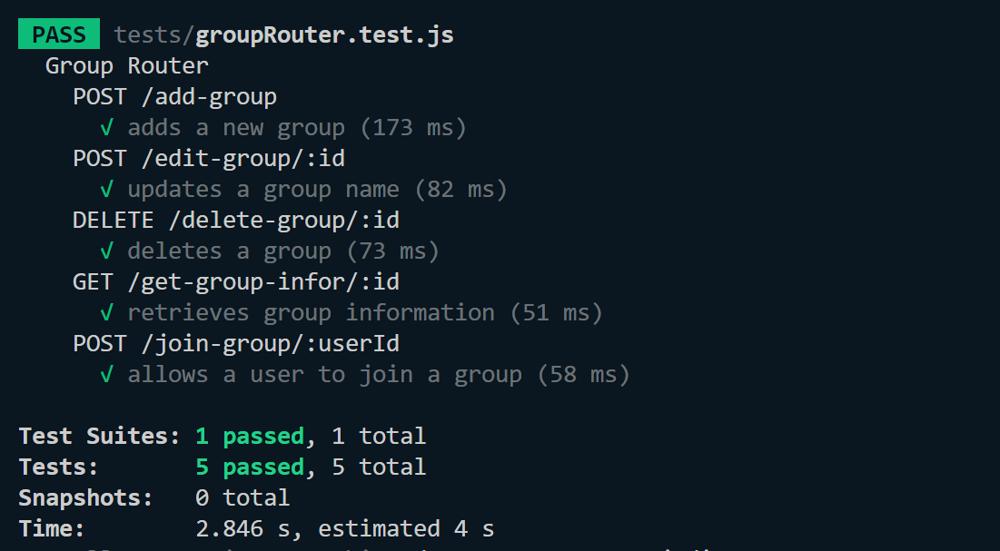
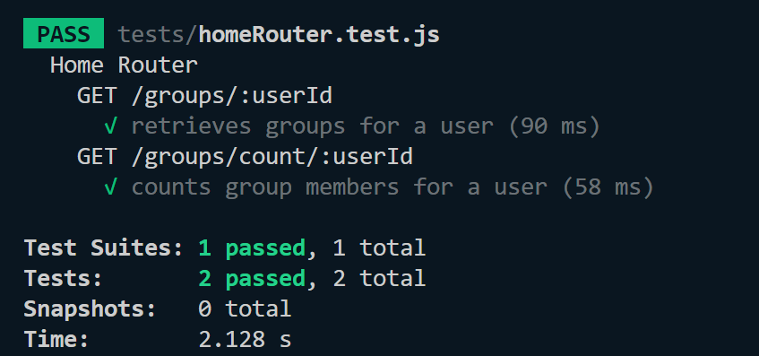
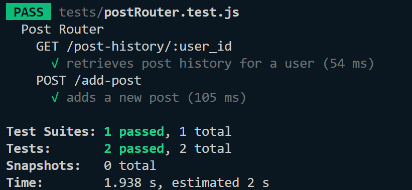
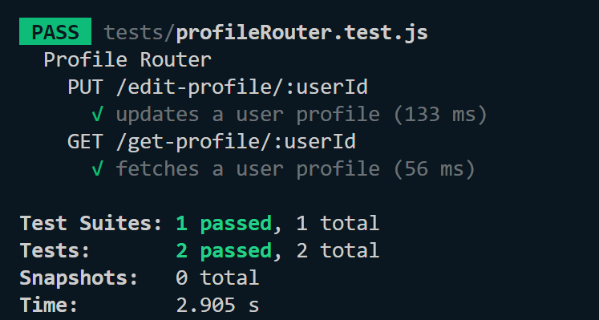
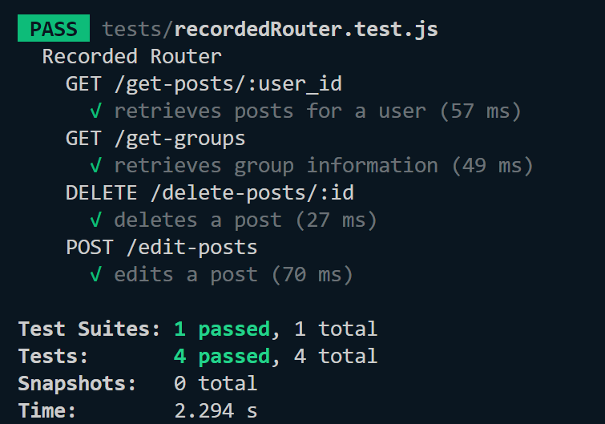
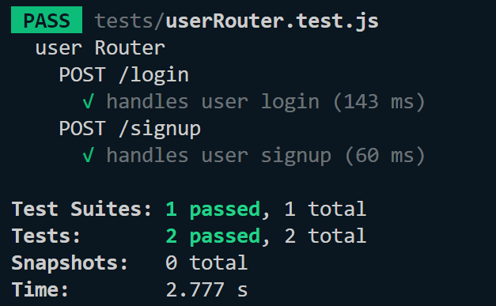


## Project on Board
*Board format:*

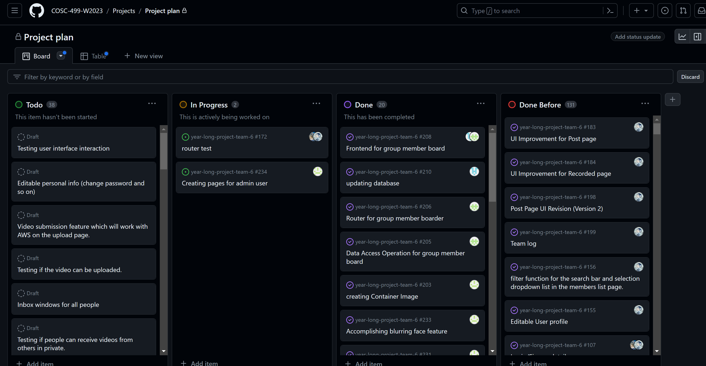

*Table format:*

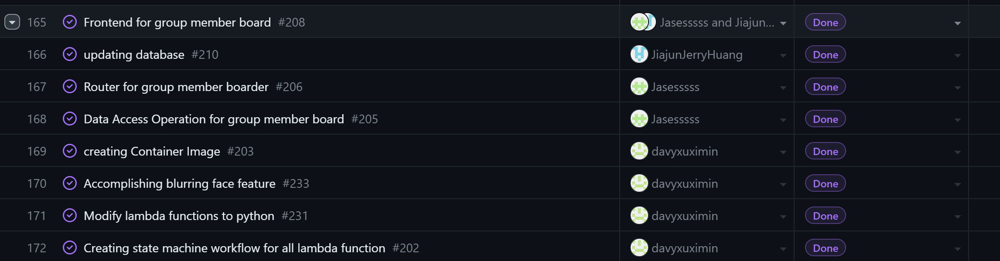
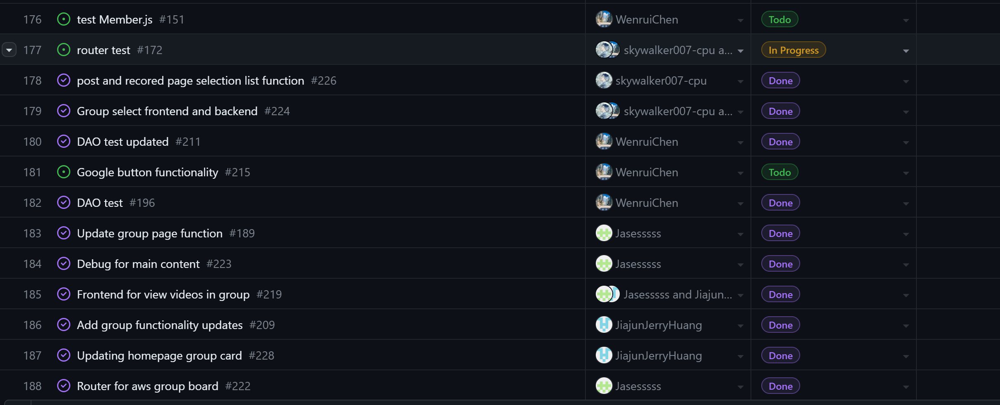
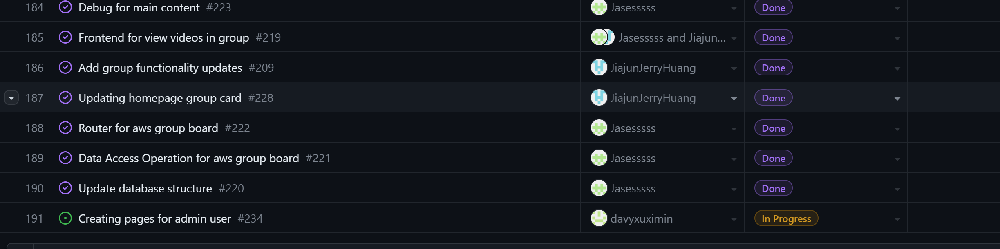

## Burnup chart
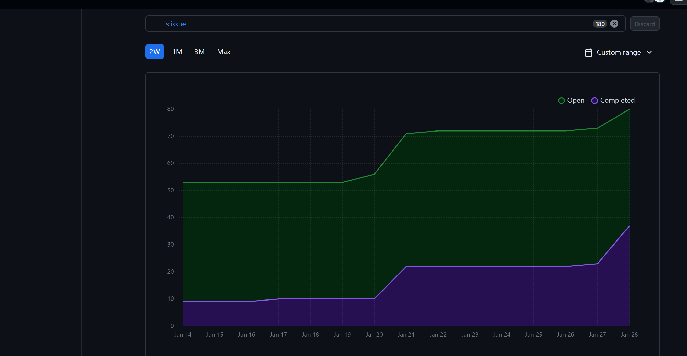