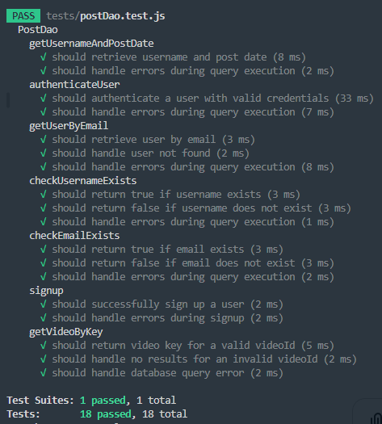
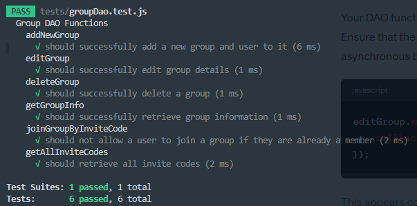
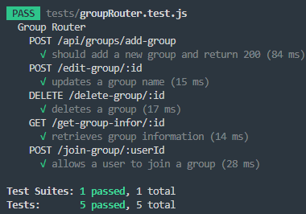
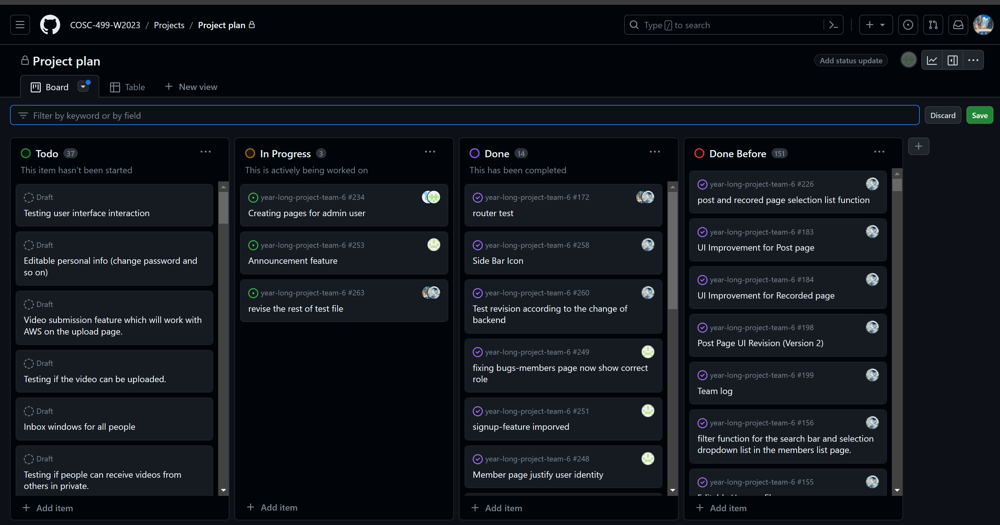
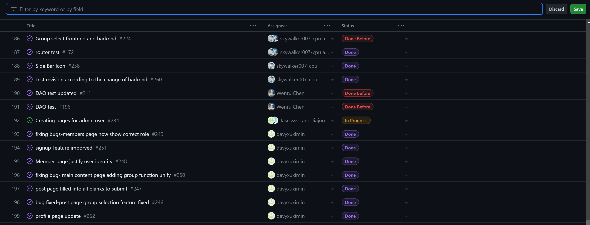
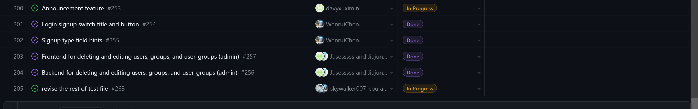
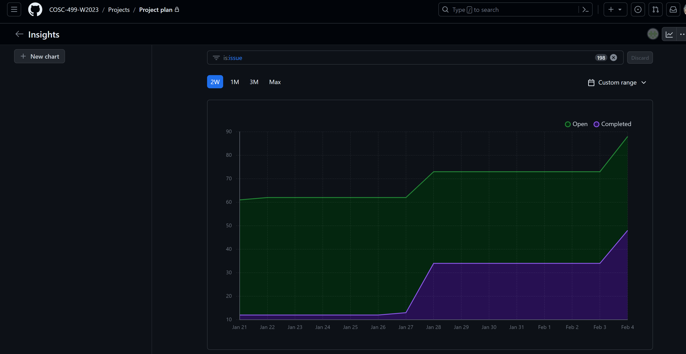

# Team Log - _Team 6_

## Reminder of username 
* skywalker007-cpu --- **Zetian Zhao**

* davyxuximin --- **XiMin Xu**

* JiajunJerryHuang --- **Jiajun Huang**

* Jasesssss --- **Yiqi Xu**

* WenruiChen --- **Wenrui Chen**

## Applicable data range
**Jan/29/2024** to **Feb/4/2024**

## Milestone Goals
Fixing function bugs

Fixing UI

updating database

Peer testing reflection 

Testing

Creating pages for admin user

## Completed Tasks 
Signup page change (hints, button, titles)

Side bar icon

Fixed bugs in post and main page

Updated the database

tests

## Task in progress
Creating pages for admin user

Announcement feature

Change avatar in profile

Testing

## Test Report
*Code :*
```
// const dbFunctions = require('../app/backend/dao/PostDao');
const mockDb = require('../app/backend/db/db');
const PostDao = require('../app/backend/dao/PostDao');
const mysql = require('mysql');
const bcrypt = require('bcrypt');

jest.mock('mysql');
jest.mock('bcrypt');
jest.mock('../app/backend/db/db', () => ({
    query: jest.fn()
}));


describe('PostDao', () => {
    mysql.createConnection.mockImplementation(() => ({
        query: jest.fn()
    }));
    const mockDb = new mysql.createConnection();
    const postDao = new PostDao(mockDb);

    describe('getUsernameAndPostDate', () => {
        it('should retrieve username and post date', async () => {
            const expectedResult = [{ username: 'TestUser', post_date: '2024-01-20' }];
            mockDb.query.mockImplementation((query, callback) => {
                callback(null, expectedResult);
            });
            const callback = jest.fn();
            await postDao.getUsernameAndPostDate(callback);
            expect(callback).toHaveBeenCalledWith(null, expectedResult);
        });

        it('should handle errors during query execution', async () => {
            const expectedError = new Error('Test Error');
            mockDb.query.mockImplementation((query, callback) => {
                callback(expectedError, null);
            });
            const callback = jest.fn();
            await postDao.getUsernameAndPostDate(callback);
            expect(callback).toHaveBeenCalledWith(expectedError, null);
        });
    });

    describe('authenticateUser', () => {
        it('should authenticate a user with valid credentials', async () => {
            const email = 'test@example.com';
            const password = 'password';
            mockDb.query.mockImplementation((query, params, callback) => {
                if (query.includes('SELECT password FROM users WHERE email = ?')) {
                    const results = [{ password: 'password' }];
                    callback(null, results);
                } else {
                    callback(null, []);
                }
            });
            //instance
            const postDao = new PostDao(mockDb);
            let userExists;
            const callback = jest.fn();
            await postDao.authenticateUser(email, password, callback);
            // actual parameters
            console.log('Actual parameters received by the callback:', callback.mock.calls[0]);
            userExists = callback.mock.calls[0][1];
            expect(callback).toHaveBeenCalledWith(null, userExists);
        });


        it('should handle errors during query execution', async () => {
            const email = 'test@example.com';
            const password = 'password';
            const expectedError = new Error('Test Error');
            mockDb.query.mockImplementation((query, params, callback) => {
                callback(expectedError, null);
            });
            const callback = jest.fn();
            await postDao.authenticateUser(email, password, callback);
            expect(callback).toHaveBeenCalledWith(expectedError, null);
        });
    });

    describe('getUserByEmail', () => {
        it('should retrieve user by email', async () => {
            const email = 'test@example.com';
            const expectedResult = {
                userid: 1,
                username: 'TestUser',
                email: 'test@example.com',
                role: 'user',
                user_image: 'user.jpg'
            };
            mockDb.query.mockImplementation((query, params, callback) => {
                callback(null, [expectedResult]);
            });
            const callback = jest.fn();
            await postDao.getUserByEmail(email, callback);
            expect(callback).toHaveBeenCalledWith(null, expectedResult);
        });

        it('should handle user not found', async () => {
            const email = 'nonexistent@example.com';
            mockDb.query.mockImplementation((query, params, callback) => {
                callback(null, []);
            });
            const callback = jest.fn();
            await postDao.getUserByEmail(email, callback);
            expect(callback).toHaveBeenCalledWith(new Error('User not found'), null);
        });

        it('should handle errors during query execution', async () => {
            const email = 'test@example.com';
            const expectedError = new Error('Test Error');
            mockDb.query.mockImplementation((query, params, callback) => {
                callback(expectedError, null);
            });
            const callback = jest.fn();
            await postDao.getUserByEmail(email, callback);
            expect(callback).toHaveBeenCalledWith(expectedError, null);
        });
    });

    describe('checkUsernameExists', () => {
        it('should return true if username exists', async () => {
            const username = 'TestUser';
            mockDb.query.mockImplementation((query, params, callback) => {
                callback(null, [{ count: 1 }]);
            });
            const callback = jest.fn();
            await postDao.checkUsernameExists(username, callback);
            expect(callback).toHaveBeenCalledWith(null, true);
        });

        it('should return false if username does not exist', async () => {
            const username = 'NonExistentUser';
            mockDb.query.mockImplementation((query, params, callback) => {
                callback(null, [{ count: 0 }]);
            });
            const callback = jest.fn();
            await postDao.checkUsernameExists(username, callback);
            expect(callback).toHaveBeenCalledWith(null, false);
        });

        it('should handle errors during query execution', async () => {
            const username = 'TestUser';
            const expectedError = new Error('Test Error');
            mockDb.query.mockImplementation((query, params, callback) => {
                callback(expectedError, null);
            });
            const callback = jest.fn();
            await postDao.checkUsernameExists(username, callback);
            expect(callback).toHaveBeenCalledWith(expectedError, null);
        });
    });
    describe('checkEmailExists', () => {
        it('should return true if email exists', async () => {
            mockDb.query.mockImplementation((query, params, callback) => {
                callback(null, [{ count: 1 }]);
            });
            const callback = jest.fn();
            await postDao.checkEmailExists('test@example.com', callback);
            expect(callback).toHaveBeenCalledWith(null, true);
        });

        it('should return false if email does not exist', async () => {
            mockDb.query.mockImplementation((query, params, callback) => {
                callback(null, [{ count: 0 }]);
            });
            const callback = jest.fn();
            await postDao.checkEmailExists('nonexistent@example.com', callback);
            expect(callback).toHaveBeenCalledWith(null, false);
        });

        it('should handle errors during query execution', async () => {
            const expectedError = new Error('Test Error');
            mockDb.query.mockImplementation((query, params, callback) => {
                callback(expectedError, null);
            });
            const callback = jest.fn();
            await postDao.checkEmailExists('test@example.com', callback);
            expect(callback).toHaveBeenCalledWith(expectedError, null);
        });
    });
    describe('signup', () => {
        it('should successfully sign up a user', async () => {
            mockDb.query.mockImplementation((query, params, callback) => {
                callback(null, { insertId: 1 }); // Simulate a successful insertion
            });
            const callback = jest.fn();
            await postDao.signup('testUser', 'test@example.com', 'password', 'image.jpg', callback);
            expect(callback).toHaveBeenCalledWith(null, { insertId: 1 });
        });

        it('should handle errors during signup', async () => {
            const expectedError = new Error('Test Error');
            mockDb.query.mockImplementation((query, params, callback) => {
                callback(expectedError, null);
            });
            const callback = jest.fn();
            await postDao.signup('testUser', 'test@example.com', 'password', 'image.jpg', callback);
            expect(callback).toHaveBeenCalledWith(expectedError, null);
        });
    });
    describe('getVideoByKey', () => {
        test('should return video key for a valid videoId', (done) => {
            const videoId = 1;
            const mockResults = [{ s3_content_key: 'video123.mp4' }];

            mockDb.query.mockImplementation((query, values, callback) => {
                expect(query).toContain('SELECT s3_content_key, blur_face FROM posts WHERE post_id = ?');
                expect(values).toEqual([videoId]);
                callback(null, mockResults);
            });

            const postDao = new PostDao(mockDb);

            postDao.getVideoByKey(videoId, (error, result) => {
                expect(error).toBeNull();
                expect(result).toEqual('video123.mp4'); // Modify this line
                done();
            });
        });

        test('should handle no results for an invalid videoId', (done) => {
            const videoId = 2;

            mockDb.query.mockImplementation((query, values, callback) => {
                expect(query).toContain('SELECT s3_content_key, blur_face FROM posts WHERE post_id = ?');
                expect(values).toEqual([videoId]);
                callback(null, []); // Simulate no results
            });

            const postDao = new PostDao(mockDb);

            postDao.getVideoByKey(videoId, (error, result) => {
                expect(error).toBeNull();
                expect(result).toBeNull();
                done();
            });
        });

        test('should handle database query error', (done) => {
            const videoId = 3;
            const mockError = new Error('Database error');

            mockDb.query.mockImplementation((query, values, callback) => {
                callback(mockError, null);
            });

            const postDao = new PostDao(mockDb);

            postDao.getVideoByKey(videoId, (error, result) => {
                expect(error).toEqual(mockError);
                expect(result).toBeNull();
                done();
            });
        });
    });

});

```

```
const request = require('supertest');
const express = require('express');
const bodyParser = require('body-parser');
const groupRouter = require('../app/backend/router/groupRouter');

const app = express();
app.use(bodyParser.json());
app.use('/api/group', groupRouter);

jest.mock('../app/backend/dao/groupDao', () => ({
    addNewGroup: jest.fn(),
    editGroup: jest.fn(),
    deleteGroup: jest.fn(),
    getGroupInfo: jest.fn(),
    joinGroupByInviteCode: jest.fn()
}));

const { addNewGroup, editGroup, deleteGroup, getGroupInfo, joinGroupByInviteCode } = require('../app/backend/dao/groupDao');

const groupDao = require('../app/backend/dao/groupDao');

describe('Group Router', () => {
    beforeEach(() => {
        jest.clearAllMocks();
    });

    describe('POST /api/groups/add-group', () => {
        it('should add a new group and return 200', async () => {
            const mockGroup = { groupName: 'Test Group', code: '1234', admin: 'adminUserId' };
            require('../app/backend/dao/groupDao').addNewGroup.mockImplementation((groupName, code, admin, cb) => cb(null, { id: 'newGroupId' }));

            await request(app)
                .post('/api/group/add-group')
                .send(mockGroup)
                .expect(200)
                .then((response) => {
                    expect(response.body.message).toContain('New group added successfully');
                });
        });
    });

    describe('POST /edit-group/:id', () => {
        it('updates a group name', async () => {
            editGroup.mockImplementation((groupId, newGroupName, newAdmin, newImage, callback) => {
                callback(null, { affectedRows: 1 });
            });

            const response = await request(app)
                .post('/api/group/edit-group/1') // Ensure the endpoint matches the router definition
                .send({ newGroupName: 'UpdatedGroupName', newAdmin: 'newAdminId', newImage: 'newImage.png' }); // Include all fields as per your router logic

            expect(response.statusCode).toBe(200);
            expect(response.text).toContain('Group details updated successfully');
            expect(editGroup).toHaveBeenCalledWith('1', 'UpdatedGroupName', 'newAdminId', 'newImage.png', expect.any(Function));
        });
    });

    describe('DELETE /delete-group/:id', () => {
        it('deletes a group', async () => {
            deleteGroup.mockImplementation((groupId, callback) => {
                callback(null, { affectedRows: 1 });
            });

            const response = await request(app)
                .delete('/api/group/delete-group/1');

            expect(response.statusCode).toBe(200);
            expect(response.text).toContain('Group deleted successfully');
            expect(deleteGroup).toHaveBeenCalledWith('1', expect.any(Function));
        });

    });

    describe('GET /get-group-infor/:id', () => {
        it('retrieves group information', async () => {
            getGroupInfo.mockImplementation((groupId, callback) => {
                callback(null, { groupId: 1, groupName: 'TestGroup' });
            });

            const response = await request(app)
                .get('/api/group/get-group-infor/1');

            expect(response.statusCode).toBe(200);
            expect(response.body).toEqual({ groupId: 1, groupName: 'TestGroup' });
            expect(getGroupInfo).toHaveBeenCalledWith('1', expect.any(Function));
        });

    });

    describe('POST /join-group/:userId', () => {
        it('allows a user to join a group', async () => {
            joinGroupByInviteCode.mockImplementation((userId, inviteCode, callback) => {
                callback(null, { message: 'Successfully joined the group' });
            });

            const response = await request(app)
                .post('/api/group/join-group/1')
                .send({ inviteCode: '1234' });

            expect(response.statusCode).toBe(200);
            expect(response.body.message).toContain('Successfully joined the group');
            expect(joinGroupByInviteCode).toHaveBeenCalledWith('1', '1234', expect.any(Function));
        });
    });
});

```

```
// const { addNewGroup, editGroupName, deleteGroup, getGroupInfo, joinGroupByInviteCode } = require('../app/backend/dao/groupDao');
const groupDao = require('../app/backend/dao/groupDao');
const db = require('../app/backend/db/db');

jest.mock('../app/backend/db/db');

describe('Group DAO Functions', () => {
    beforeEach(() => {
        // Clear all instances and calls to constructor and all methods:
        db.query.mockClear();
    });

    describe('addNewGroup', () => {
        it('should successfully add a new group and user to it', async () => {
            // Mock db.query to simulate successful insertion
            db.query
                .mockImplementationOnce((query, queryParams, callback) => callback(null, { insertId: 1 })) // Mocking insert group
                .mockImplementationOnce((query, queryParams, callback) => callback(null, { affectedRows: 1 })); // Mocking insert user to group

            const callback = jest.fn();
            await groupDao.addNewGroup('TestGroup', 'inviteCode', 1, callback);

            expect(callback).toHaveBeenCalledWith(null, expect.any(Object));
            expect(db.query).toHaveBeenCalledTimes(2);
        });

        // Add more tests here to cover error cases and other scenarios
    });

    describe('editGroup', () => {
        it('should successfully edit group details', async () => {
            // Mock db.query to simulate successful update
            db.query.mockImplementation((query, queryParams, callback) => callback(null, { affectedRows: 1 }));

            const callback = jest.fn();
            await groupDao.editGroup(1, 'NewGroupName', null, 'newImage.png', callback);

            expect(callback).toHaveBeenCalledWith(null, expect.any(Object));
            expect(db.query).toHaveBeenCalledTimes(1);
        });

        // Add more tests here to cover error cases and other scenarios
    });

    describe('deleteGroup', () => {
        it('should successfully delete a group', async () => {
            // Mock db.query to simulate successful deletion
            db.query.mockImplementation((query, queryParams, callback) => callback(null, { affectedRows: 1 }));

            const callback = jest.fn();
            await groupDao.deleteGroup(1, callback);

            expect(callback).toHaveBeenCalledWith(null, expect.any(Object));
            expect(db.query).toHaveBeenCalledTimes(1);
        });

        // Add more tests here to cover error cases and other scenarios
    });

    describe('getGroupInfo', () => {
        it('should successfully retrieve group information', async () => {
            // Mock db.query to simulate fetching group info
            db.query.mockImplementation((query, queryParams, callback) => callback(null, [{ groupid: 1, groupname: 'TestGroup' }]));

            const callback = jest.fn();
            await groupDao.getGroupInfo(1, callback);

            expect(callback).toHaveBeenCalledWith(null, expect.any(Object));
            expect(db.query).toHaveBeenCalledTimes(1);
        });

        // Add more tests here to cover error cases and other scenarios
    });

    describe('joinGroupByInviteCode', () => {
        it('should not allow a user to join a group if they are already a member', async () => {
            // Mock db.query to simulate finding the group
            db.query
                .mockImplementationOnce((query, queryParams, callback) => callback(null, [{ groupid: 1 }])) // Simulate finding group
                .mockImplementationOnce((query, queryParams, callback) => callback(null, [{ userid: 1, groupid: 1 }])); // Simulate checking user in group

            const callback = jest.fn();
            await groupDao.joinGroupByInviteCode(1, 'validCode', callback);

            expect(callback).toHaveBeenCalledWith('User is already a member of this group', null);
            expect(db.query).toHaveBeenCalledTimes(2); // Expecting 2 calls: one for finding group and one for checking user in group
        });
    });


    describe('getAllInviteCodes', () => {
        it('should retrieve all invite codes', async () => {
            // Adjust mockImplementation to correctly match the signature of db.query in this context
            db.query.mockImplementation((query, callback) => callback(null, [{ invite_code: 'code1' }, { invite_code: 'code2' }]));

            const callback = jest.fn();
            await groupDao.getAllInviteCodes(callback);

            // Verify that the callback was called with the expected results
            expect(callback).toHaveBeenCalledWith(null, [{ invite_code: 'code1' }, { invite_code: 'code2' }]);
            expect(db.query).toHaveBeenCalledTimes(1);
        });
    });
});

```

*Output:*





## Project on Board
*Board format:*



*Table format:*



<!--  -->

## Burnup chart
