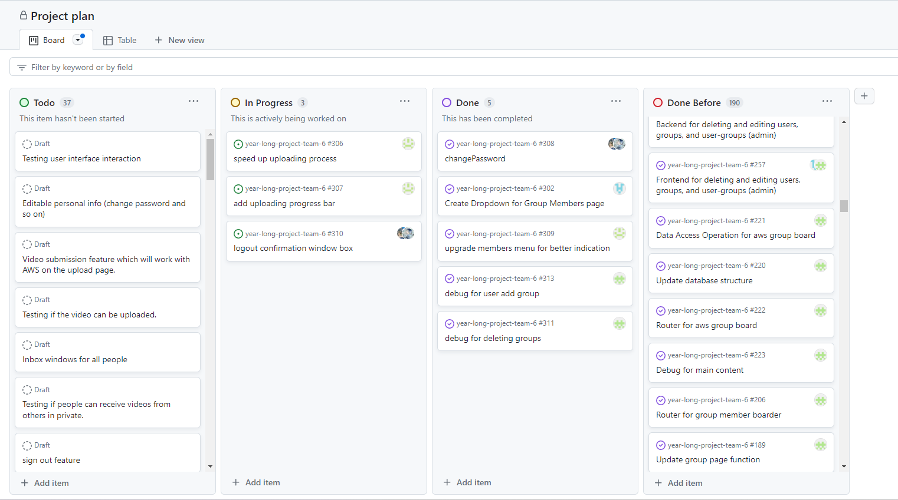
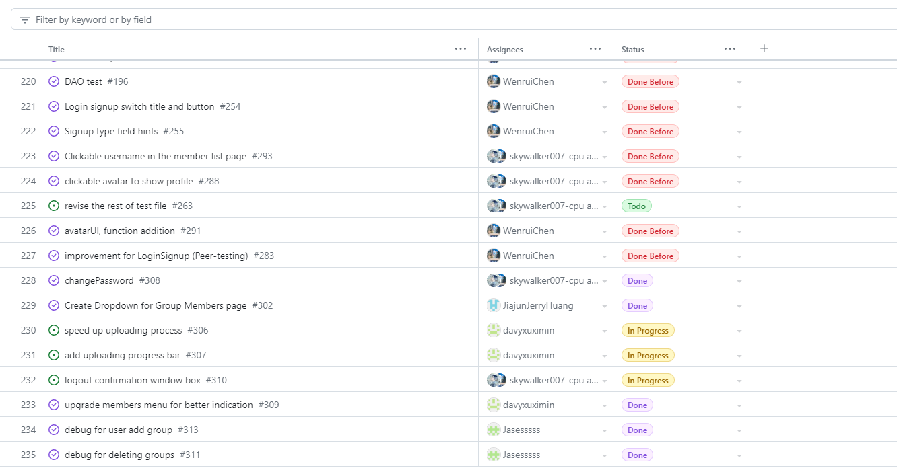
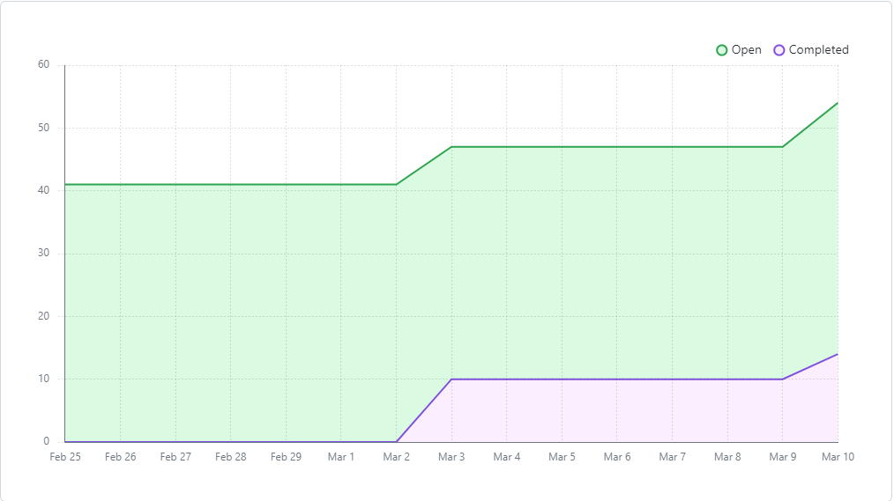

# Team Log - _Team 6_

## Reminder of username 
* skywalker007-cpu --- **Zetian Zhao**

* davyxuximin --- **XiMin Xu**

* JiajunJerryHuang --- **Jiajun Huang**

* Jasesssss --- **Yiqi Xu**

* WenruiChen --- **Wenrui Chen**

## Applicable data range
**March/4/2023** to **March/10/2023**

## Milestone Goals
User able to change the password.

Change the UI layout for menu on the member page based on the comments from the peer tesing. 

Debugging the functionality of adding a group.

Debugging the funcitonality of deleting a group. 

Having a window to make user ensure if they want to log out. 

Testing

## Completed Tasks 
Chaning password page is completed and able to activate by presing the specific button.

Group related functionality are debug successfully. 

The buttons in the menu of the members page are now visible by default. 

The confirm window is created after user press the log out button. 

## Task in progress
For the window after logout, we will still work on it for better appealing. 

Adding the progress bar when uploading the video. 

Speeding up the uploading process. (Make it faster)

## Test Report
*Code :*
We were mostly working on adding new component or fixing the UI of the component, no outstanding new features being created, so there is no tests this week.

## Project on Board
*Board format:*

*Table format:*

*Burn Chart:*
