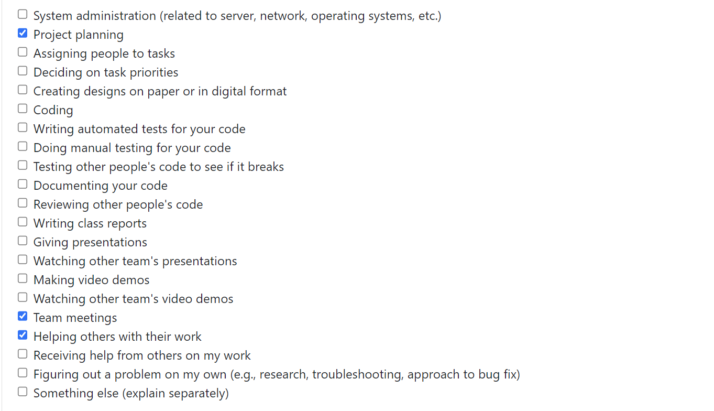
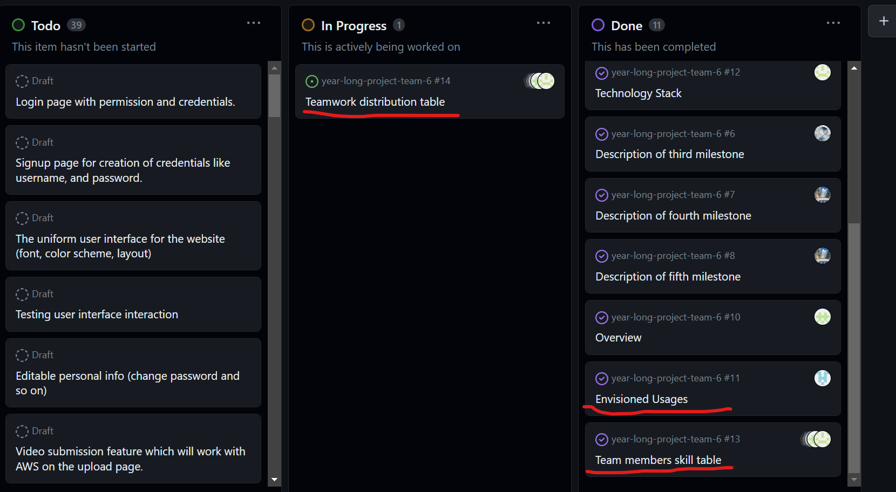
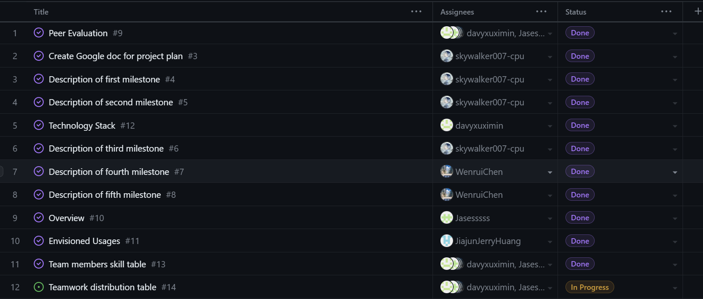

# Individual Log - Jiajun Huang (Week 4)

## Applicable data range
**September/26/2023** to **October/1/2023**

## Recap Goal 
*My Jobs This Week:* 
* Complete user scenarios with different users' perspective.
* Complete teamwork distribution table. 
* Complete personal experience and skills table. 
* Complete the peer evaluation. 

## Completed Tasks 
* Met with my teammates and divided the work
* Completed my part of the project plan. Created different user scenarios including senders, professional receivers and casual users.
* Completed peer evaluation 
* Filled my part of the teamwork distribution table and skill&experience table.

## ScreenShot of peer evaluation

## My Task on Board
*Board format:*

*Table format:*

