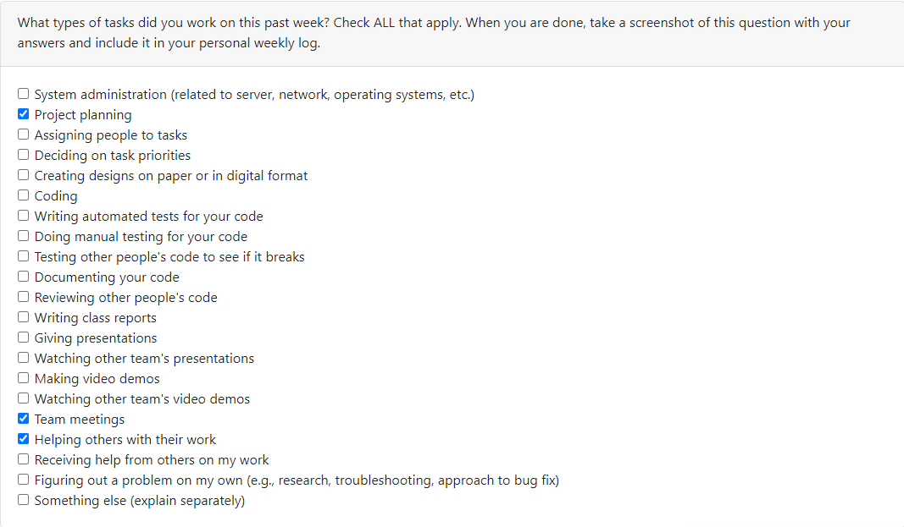
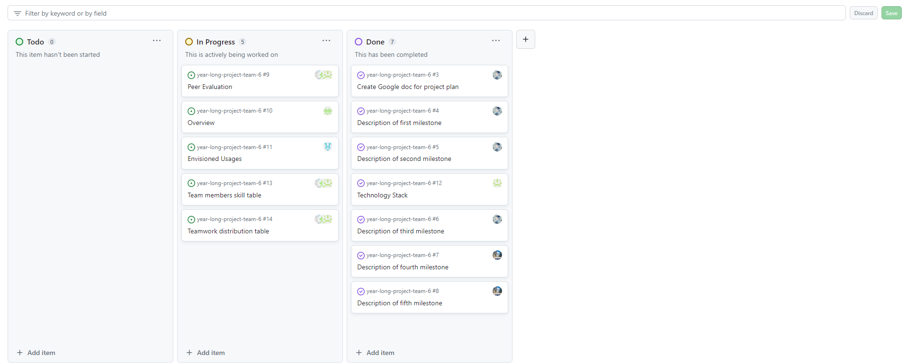
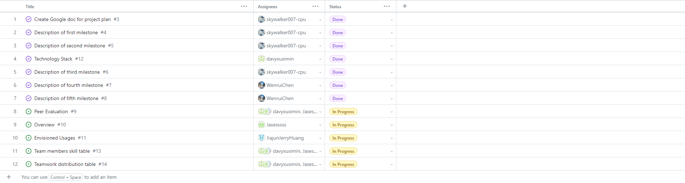

# Individual Log - Zetian Zhao (Week 4)

## Applicable data range
**September/26/2023** to **October/1/2023**

## Recap Goal 
*My jobs in this week are:* 
* Complete the description of first three major milestones in our project plan. 
* Complete the table of teamwork distribution with teammates. 
* Complete the table of personal experience and skills. 
* Complete the peer evaluation. 

## Completed Tasks 
* Had a meeting with team members 
* Completed my own objective of the week, which are the milestones of the project plan. 
* Completed peer evaluation 
* Filled the table of teamwork distribution and skill, experience. (My own part)
* Created a google document for helping team work together. 

## ScreenShot of peer evaluation

## My Task on Board
*Board format:*

*Table format:*

