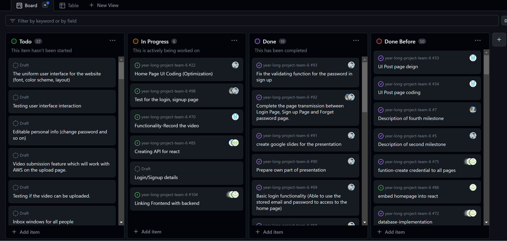
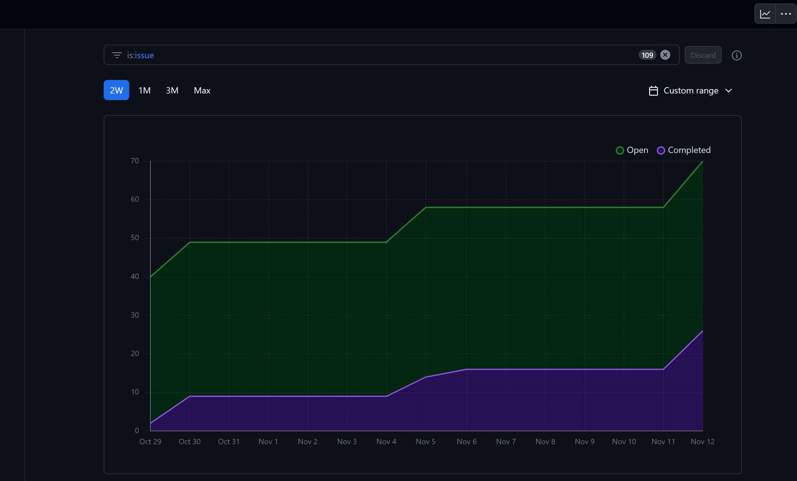

# Team Log - _Team 6_

## Reminder of username 
* skywalker007-cpu --- **Zetian Zhao**

* davyxuximin --- **XiMin Xu**

* JiajunJerryHuang --- **Jiajun Huang**

* Jasesssss --- **Yiqi Xu**

* WenruiChen --- **Wenrui Chen**

## Applicable data range
**November/7/2023** to **November/12/2023**

## Milestone Goals
Use React framework

Complete the Peer evaluation about the team.

Make sure most part of code are connected under React framework.

Tests and test reports

Organizes regular meetings during the week.

Start on understanding and deploying record.


## Completed Tasks 
Most Login/Signup format details

Automatic tests and test reports

Organized regular meetings during the week.

Completed the Peer evaluation.

Most Pages linking

## Task in progress
Deploy Record functionality

Homepage UI optimization

Creating API for React

Login/Signup format details

Backend and Frontend connection


## Test Report
*Code :*
```test
const { validateEmail, togglePasswordVisibility, validatePassw } = require('./login_signup.js');
const PostDao = require('../app/backend/dao/displayDAO');

const setPasswErrorMock = jest.fn();
// Test cases
describe('PostDao with Jest', () => {
    let dao;
    let dbMock;

    beforeEach(() => {
        dbMock = {
            query: jest.fn()
        };
        dao = new PostDao(dbMock);
    });

    it('should fetch username and post date', async () => {
        const expectedData = [{ username: 'JohnDoe', post_date: new Date() }];
        dbMock.query.mockImplementation((sql, callback) => callback(null, expectedData));

        const result = await new Promise((resolve, reject) => {
            dao.getUsernameAndPostDate((err, results) => {
                if (err) reject(err);
                resolve(results);
            });
        });

        expect(result).toEqual(expectedData);
    });

    it('should handle errors', async () => {
        const expectedError = new Error('Database error');
        dbMock.query.mockImplementation((sql, callback) => callback(expectedError, null));

        await expect(new Promise((resolve, reject) => {
            dao.getUsernameAndPostDate((err, results) => {
                if (err) reject(err);
                resolve(results);
            });
        })).rejects.toThrow('Database error');
    });
});

describe('validatePassw', () => {
    it('should set passwError to false for a valid password', () => {
        const validPassword = 'Valid@Password123';
        validatePassw(validPassword, setPasswErrorMock);
        expect(setPasswErrorMock).toHaveBeenCalledWith(false);
    });

    it('should set passwError to true for an invalid password with insufficient length', () => {
        const invalidPassword = 'Short1';
        validatePassw(invalidPassword, setPasswErrorMock);
        expect(setPasswErrorMock).toHaveBeenCalledWith(true);
    });

    it('should set passwError to true for an invalid password without a digit', () => {
        const invalidPassword = 'NoDigitPassword';
        validatePassw(invalidPassword, setPasswErrorMock);
        expect(setPasswErrorMock).toHaveBeenCalledWith(true);
    });

    it('should set passwError to true for an invalid password without a letter', () => {
        const invalidPassword = '1234567890';
        validatePassw(invalidPassword, setPasswErrorMock);
        expect(setPasswErrorMock).toHaveBeenCalledWith(true);
    });

    it('should set passwError to true for an invalid password without a symbol', () => {
        const invalidPassword = 'NoSymbol123';
        validatePassw(invalidPassword, setPasswErrorMock);
        expect(setPasswErrorMock).toHaveBeenCalledWith(true);
    });
});

describe('validateEmail', () => {
    let emailInput, emailTooltip;

    beforeEach(() => {
        // 创建可变的style对象
        const style = { visibility: 'hidden' };

        // 设置emailInput和emailTooltip对象
        emailInput = { value: '' };
        emailTooltip = { style };

        // 使用jest.fn()创建模拟函数
        document.getElementById = jest.fn((id) => {
            if (id === 'emailInput') {
                return emailInput;
            }
            if (id === 'emailTooltip') {
                return emailTooltip;
            }
            return null;
        });
    });

    test('should validate a correct email address', () => {
        emailInput.value = 'test@example.com';
        const result = validateEmail();
        expect(result).toBe(true);
        expect(emailTooltip.style.visibility).toBe('hidden');
    });

    test('should invalidate an incorrect email address', () => {
        emailInput.value = 'test@';
        const result = validateEmail();
        expect(result).toBe(false);
        expect(emailTooltip.style.visibility).toBe('visible');
    });

});
describe('togglePasswordVisibility', () => {
    let passwordInput, passwordToggle;

    beforeEach(() => {
        // 设置passwordInput对象
        passwordInput = { type: 'password' };
        // 创建一个模拟的.password-toggle元素
        passwordToggle = { textContent: '' };

        // 使用jest.fn()创建模拟函数
        document.getElementById = jest.fn((id) => {
            if (id === 'passwordInput') {
                return passwordInput;
            }
            return null;
        });
        // 使用jest.fn()模拟document.querySelector函数
        document.querySelector = jest.fn((selector) => {
            if (selector === '.password-toggle') {
                return passwordToggle;
            }
            return null;
        });
    });

    test('should show the password when the password is hidden', () => {
        togglePasswordVisibility();
        expect(passwordInput.type).toBe('text');
        expect(passwordToggle.textContent).toBe('Hide');
    });

    test('should hide the password when the password is shown', () => {
        passwordInput.type = 'text';
        togglePasswordVisibility();
        expect(passwordInput.type).toBe('password');
        expect(passwordToggle.textContent).toBe('Show');
    });
});
```
*Output:*


## Project on Board
*Board format:*



*Table format:*


## Burnup chart
