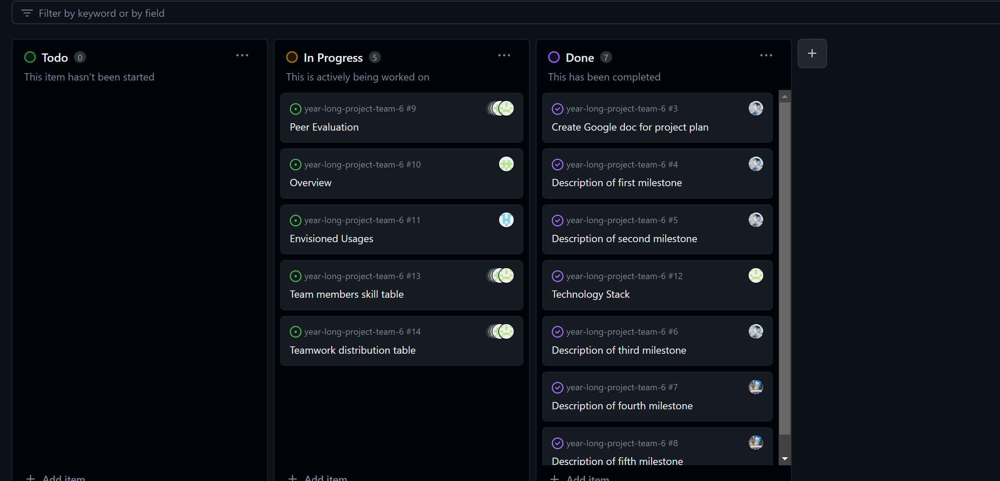
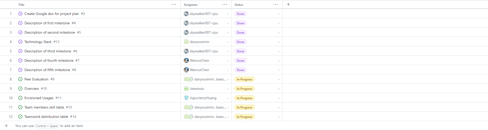
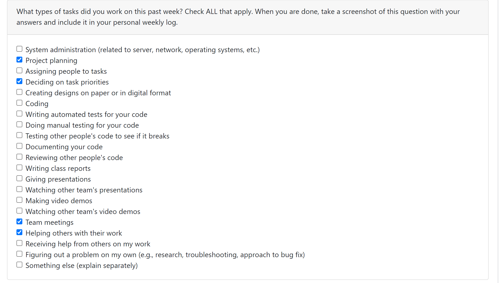

# Individual Log - Wenrui Chen (Week 4)

## Applicable data range
**September/26/2023** to **October/1/2023**

## Recap Goal 
*What I planned to do and did:* 
* Complete the last 2 major milestones, which are mainly about several functions with tests and summary of project(video and documentation). 
* Complete the table of teamwork distribution with teammates. 
* Complete the table of personal experience and skills. 
* Complete the peer evaluation. 

## Completed Tasks 
* Meeting with team members 
* Completed my own objective of the week, which are the milestones of the project plan. 
* Completed peer evaluation 
* Filled my teamwork distribution and skill, experience in google doc.

## My Task on Board
*Board format:*

*Table format:*

## ScreenShot of peer evaluation

