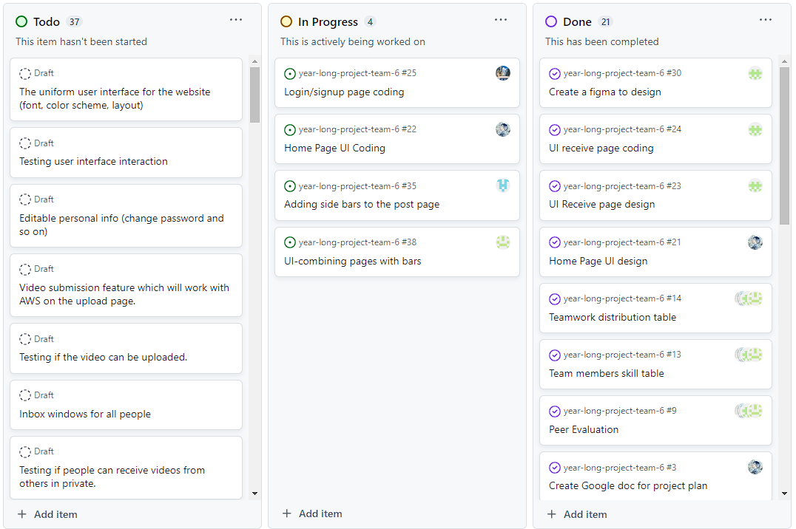
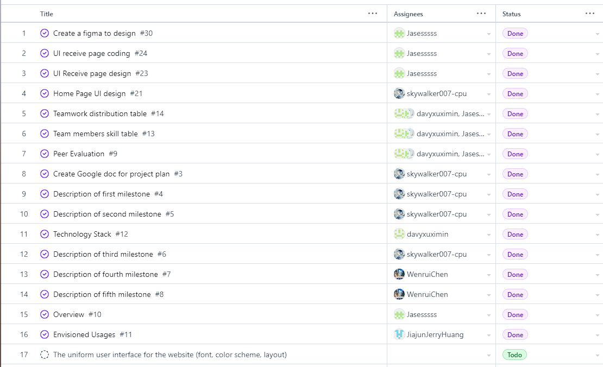
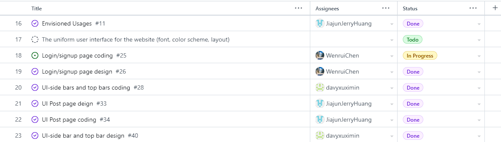
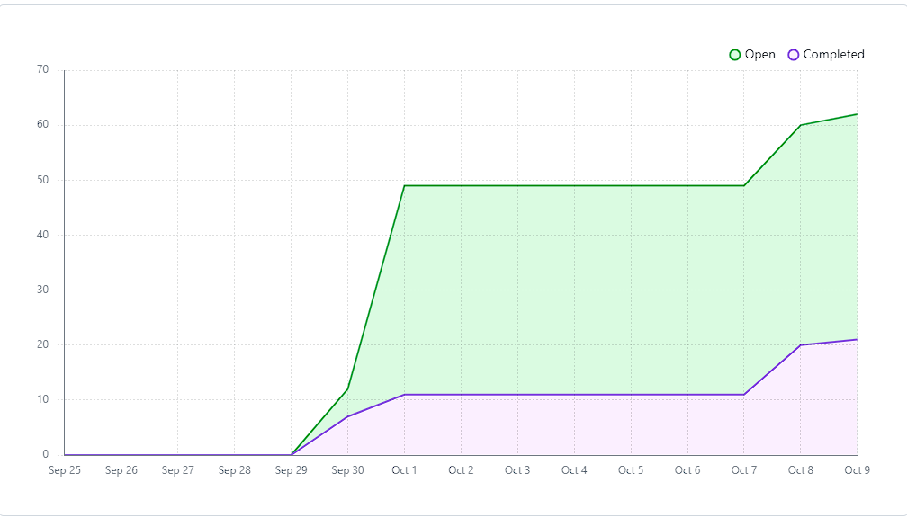

# Team Log - _Team 6_

## Reminder of username 
* skywalker007-cpu --- **Zetian Zhao**

* davyxuximin --- **XiMin Xu**

* davidxuximin --- **XiMin Xu**

* JiajunJerryHuang --- **Jiajun Huang**

* Jasesssss --- **Yiqi Xu**

* WenruiChen --- **Wenrui Chen**

## Applicable data range
**October/5/2023** to **October/9/2023**

## Milestone Goals
Complete website UI design.
Selection of the stack framework to be used for the production of the website.
Start coding website UI.

## Completed Tasks 
Completed website UI design by Figma.
Chose using LAMP stack to build our site.
Finished the layout of a few pages.

## Task in progress
One page's UI needs to be coded. 
The pages need to be connected. 

## Project on Board
*Board format:*

*Table format:*

## Burnup chart
