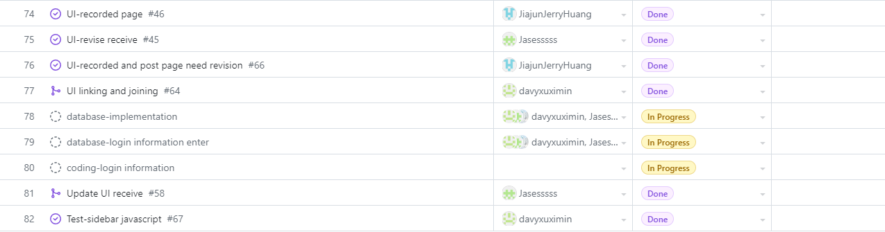

# Team Log - _Team 6_

## Reminder of username 
* skywalker007-cpu --- **Zetian Zhao**

* davyxuximin --- **XiMin Xu**

* davidxuximin --- **XiMin Xu**

* JiajunJerryHuang --- **Jiajun Huang**

* Jasesssss --- **Yiqi Xu**

* WenruiChen --- **Wenrui Chen**

## Applicable data range    (Two Weeks)
**October/9/2023** to **October/22/2023**

## Milestone Goals
Complete the basic UI of the pages for the website. 

Complete the Linking between the different pages of website. 

Compelte the Peer evaluation about the team. 

Revise the UI of the pages such as home, receive and so on. 

Combine the bars with other pages. 

Organizes regular meetings during the two weeks. 

## Completed Tasks 
Completed the basic UI for all pages.  

Completed the Linking function between the pages.  

Compelted the Peer evaluation. 

Revised the UI of Homepage. 

Revised the recive page. 

Combined the bars with other pages. 

Organizesd regular meetings during the two weeks. 

Updated the UI of the pages for the website. 

## Task in progress
Database implementation. 

Login page with the permission and credential. 

Signup page for the creaion of credentials. 

## Test Report
*Code:*
```test
import { fireEvent } from "@testing-library/dom";
import "../node_modules/@testing-library/jest-dom";
import { initializeSidebar } from '../app/UI-bars/sidebar';
import { searchGroup } from '../app/UI-bars/sidebar';
import { moveanchor } from '../app/UI-bars/sidebar';
// Mock the content of your sidebar.js file
// Note: You may have to modify the import to fit your directory structure
import '../app/UI-bars/sidebar';

describe('Sidebar Tests', () => {
  beforeAll(() => {
    // Set up our document body
    document.body.innerHTML = `
      <div id="myModal" style="display:none;"></div>
      <button id="myBtn"></button>
      <span class="close"></span>
      <input id="searchInput" />
      <div id="resultContainer"></div>
      <ul>
        <li><a>Link 1</a></li>
        <li><a class="addgroup">Add Group</a></li>
        <li><a>Link 2</a></li>
      </ul>
    `;
  });

  test('open and close modal', () => {
    initializeSidebar();
    const modal = document.getElementById('myModal');
    const btn = document.getElementById('myBtn');
    const span = document.querySelector('.close');

    fireEvent.click(btn);
    expect(modal).toHaveStyle('display: block');

    fireEvent.click(span);
    expect(modal).toHaveStyle('display: none');
  });

  test('search group function', () => {
    searchGroup();
    const searchInput = document.getElementById('searchInput');
    const resultContainer = document.getElementById('resultContainer');

    fireEvent.change(searchInput, { target: { value: '12345' } });
    fireEvent.input(searchInput);
    searchGroup();
    expect(resultContainer.innerHTML).toBe('Searching for group with code: 12345');
    
    searchInput.value = '1234';
    fireEvent.input(searchInput);
    searchGroup();
    expect(resultContainer.innerHTML).toBe('Please enter a 5-character code.');
  });

  test('add active class to links', () => {
    moveanchor();
    const links = document.querySelectorAll('li a');

    fireEvent.click(links[0]);
    expect(links[0]).toHaveClass('active');
    expect(links[1]).not.toHaveClass('active');

    fireEvent.click(links[1]);
    expect(links[0]).toHaveClass('active');
    expect(links[1]).not.toHaveClass('active');

    fireEvent.click(links[2]);
    expect(links[2]).toHaveClass('active');
    expect(links[1]).not.toHaveClass('active');
  });
});
```
*Output:*


## Project on Board
*Board format:*


*Table format:*





## Burnup chart
