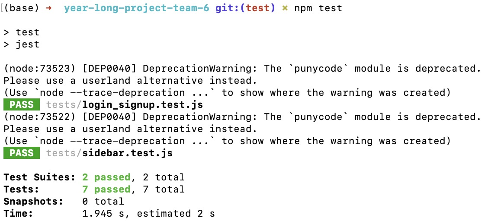
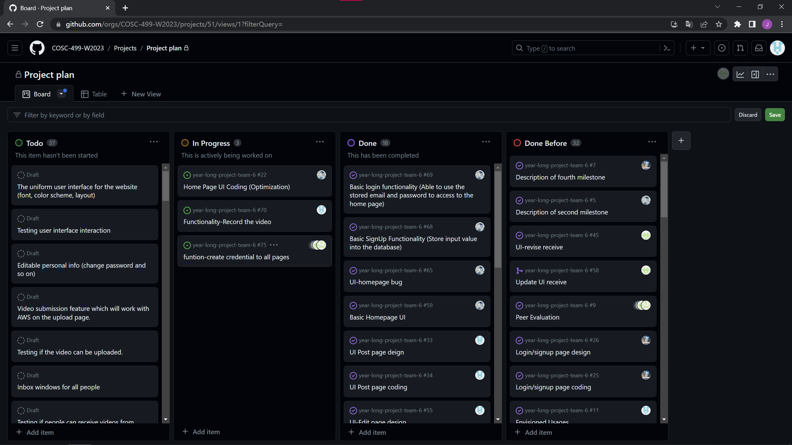
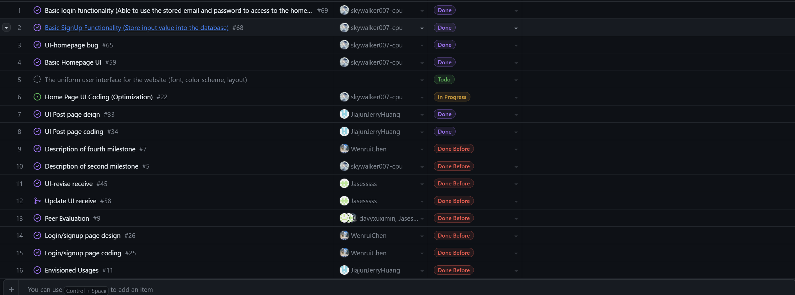
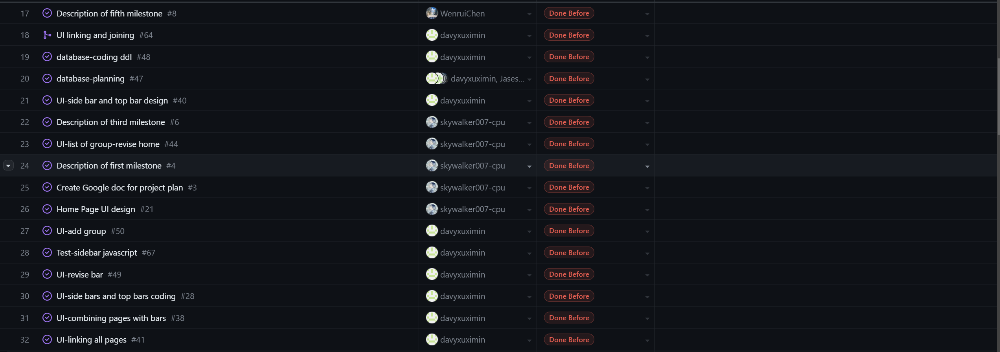
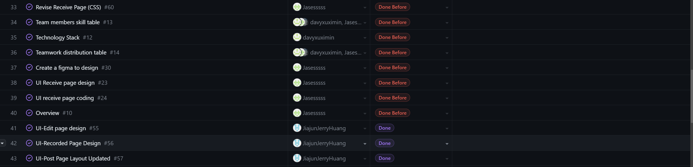
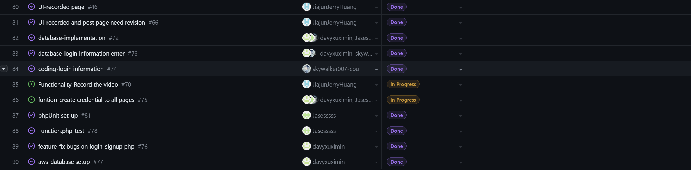
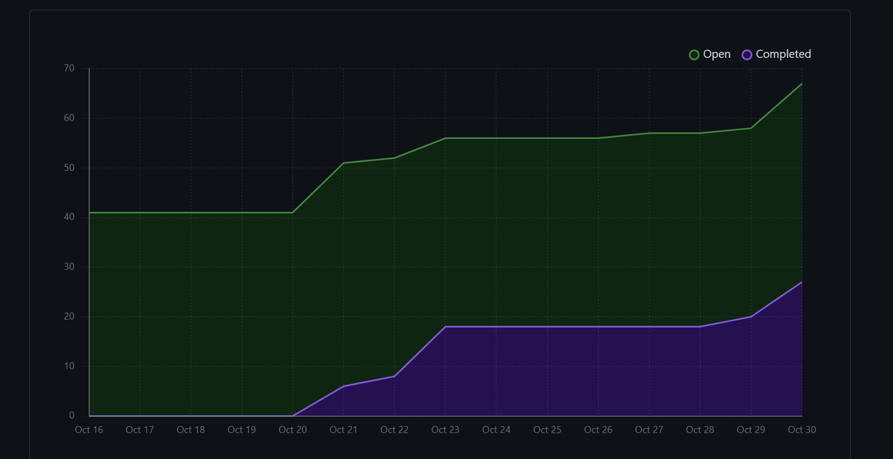

# Team Log - _Team 6_

## Reminder of username 
* skywalker007-cpu --- **Zetian Zhao**

* davyxuximin --- **XiMin Xu**

* JiajunJerryHuang --- **Jiajun Huang**

* Jasesssss --- **Yiqi Xu**

* WenruiChen --- **Wenrui Chen**

## Applicable data range    (Two Weeks)
**October/24/2023** to **October/29/2023**

## Milestone Goals
Complete creating AWS database.

Complete sign up and login functionality.

Complete the Peer evaluation about the team.

Make sure the app is linked with database.

Test sign up and login functionalities.

Organizes regular meetings during the week.

Start on understanding and deploying record.

Create credential to all pages.

## Completed Tasks 
Completed creating AWS database.

Everyone is connected with database.

Completed functionalities on sign up and login pages.

Automatic Tests passed on sign up and login page.

Organized regular meetings during the week.

Completed the Peer evaluation.

## Task in progress
Deploy Record functionality

Login page with the permission and credential.

Signup page for the creation of credentials.


## Test Report
*Code:*
```test
const { validateEmail, togglePasswordVisibility } = require('./login_signup.js');

describe('validateEmail', () => {
    let emailInput, emailTooltip;

    beforeEach(() => {
        // 创建可变的style对象
        const style = { visibility: 'hidden' };

        // 设置emailInput和emailTooltip对象
        emailInput = { value: '' };
        emailTooltip = { style };

        // 使用jest.fn()创建模拟函数
        document.getElementById = jest.fn((id) => {
            if (id === 'emailInput') {
                return emailInput;
            }
            if (id === 'emailTooltip') {
                return emailTooltip;
            }
            return null;
        });
    });

    test('should validate a correct email address', () => {
        emailInput.value = 'test@example.com';
        const result = validateEmail();
        expect(result).toBe(true);
        expect(emailTooltip.style.visibility).toBe('hidden');
    });

    test('should invalidate an incorrect email address', () => {
        emailInput.value = 'test@';
        const result = validateEmail();
        expect(result).toBe(false);
        expect(emailTooltip.style.visibility).toBe('visible');
    });

});
describe('togglePasswordVisibility', () => {
    let passwordInput, passwordToggle;

    beforeEach(() => {
        // 设置passwordInput对象
        passwordInput = { type: 'password' };
        // 创建一个模拟的.password-toggle元素
        passwordToggle = { textContent: '' };

        // 使用jest.fn()创建模拟函数
        document.getElementById = jest.fn((id) => {
            if (id === 'passwordInput') {
                return passwordInput;
            }
            return null;
        });
        // 使用jest.fn()模拟document.querySelector函数
        document.querySelector = jest.fn((selector) => {
            if (selector === '.password-toggle') {
                return passwordToggle;
            }
            return null;
        });
    });

    test('should show the password when the password is hidden', () => {
        togglePasswordVisibility();
        expect(passwordInput.type).toBe('text');
        expect(passwordToggle.textContent).toBe('Hide');
    });

    test('should hide the password when the password is shown', () => {
        passwordInput.type = 'text';
        togglePasswordVisibility();
        expect(passwordInput.type).toBe('password');
        expect(passwordToggle.textContent).toBe('Show');
    });
});
```
*Output:*


## Project on Board
*Board format:*



*Table format:*







## Burnup chart
