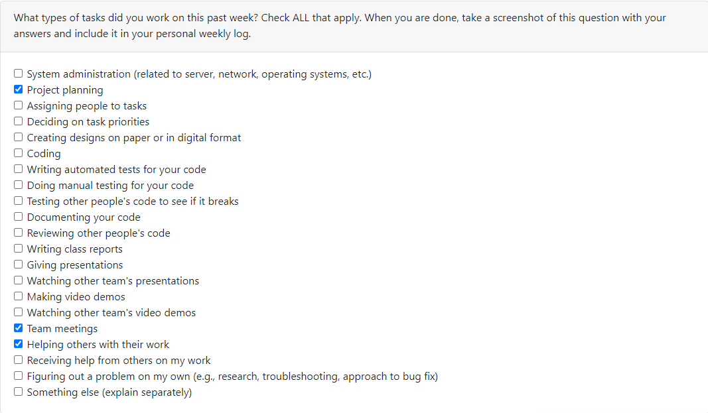
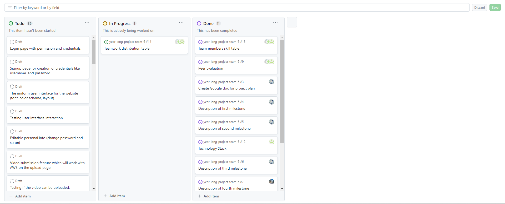
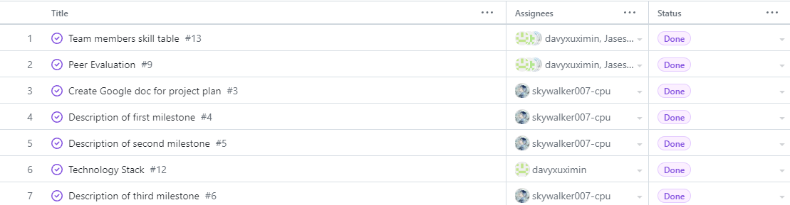

# Individual Log - Zetian Zhao (Week 4)

## Applicable data range
**September/26/2023** to **October/1/2023**

## Recap Goal 
*My jobs in this week are:* 
* Complete the description of first three major milestones in our project plan. 
* Complete the table of teamwork distribution with teammates. 
* Complete the table of personal experience and skills. 
* Complete the peer evaluation. 

## Completed Tasks 
* Had a meeting with team members 
* Completed my own objective of the week, which are the milestones of the project plan. 
* Completed peer evaluation 
* Filled the table of teamwork distribution and skill, experience. (My own part)
* Created a google document for helping team work together. 

## ScreenShot of peer evaluation

## My Task on Board
*Board format:*

*Table format:*

*** 
***
***

# Individual Log - Zetian Zhao (Week 5)

## Applicable data range
**October/5/2023** to **October/8/2023**

## Recap Goal 
*My jobs in this week are:* 
* Have a meeting to discuss our plan about the week. 
* Complete the desgin of homepage of our website. 
* Begin to create the UI of homepage of the website. 
* Complete the peer evaluation. 
* Accept the invitation of AWS and setting up my own account. 

## Completed Tasks 
* Had a meeting with team members.
* Completed the desgin of homepage of our website by using figma. 
* Completed the peer evaluation of this week. 
* Accepted the invitation of AWS and made my account ready. 
* Coding of UI about the homePage is still in progress. 

## UI design for the Home Page

## ScreenShot of peer evaluation

## My Task on Board
*Board format:*

*Table format:*

