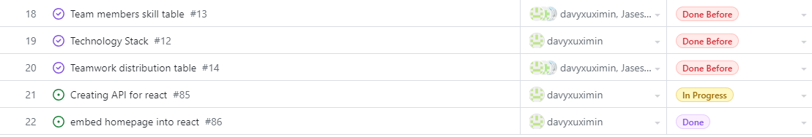
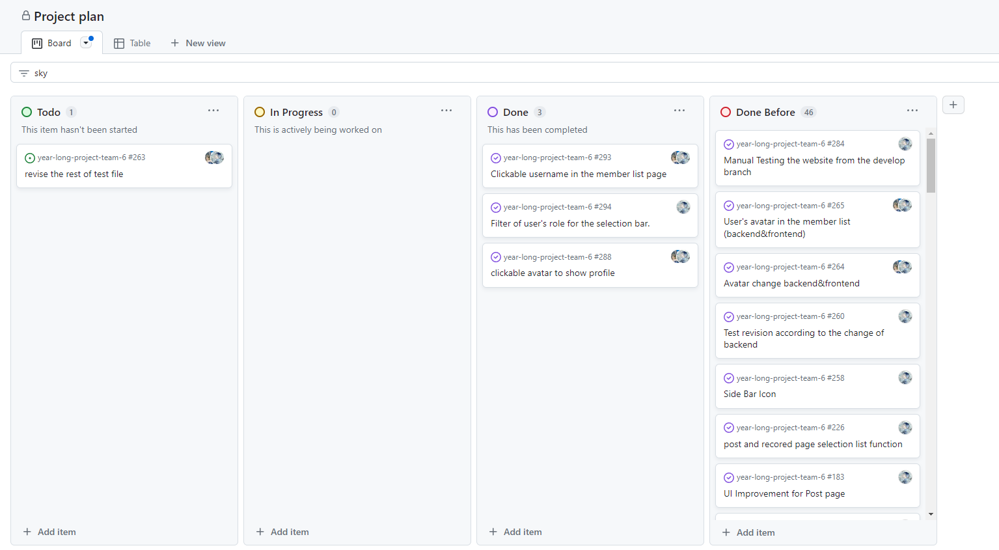
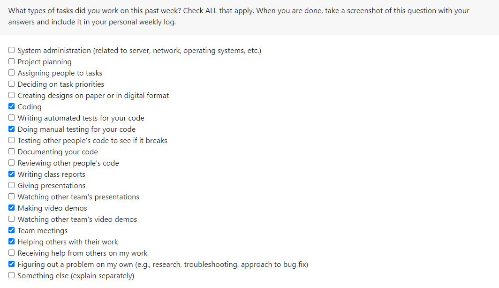

# Individual Log - Zetian Zhao (Week 4)

## Applicable date range
**September/26/2023** to **October/1/2023**

## Recap Goal 
*My jobs in this week are:* 
* Complete the description of first three major milestones in our project plan. 
* Complete the table of teamwork distribution with teammates. 
* Complete the table of personal experience and skills. 
* Complete the peer evaluation. 

## Completed Tasks 
* Had a meeting with team members 
* Completed my own objective of the week, which are the milestones of the project plan. 
* Completed peer evaluation 
* Filled the table of teamwork distribution and skill, experience. (My own part)
* Created a google document for helping team work together. 

## ScreenShot of peer evaluation

## My Task on Board
*Board format:*

*Table format:*

*** 
***
***

# Individual Log - Zetian Zhao (Week 5)

## Applicable date range
**October/5/2023** to **October/8/2023**

## Recap Goal 
*My jobs in this week are:* 
* Have a meeting to discuss our plan about the week. 
* Complete the desgin of homepage of our website. 
* Begin to create the UI of homepage of the website. 
* Complete the peer evaluation. 
* Accept the invitation of AWS and setting up my own account. 

## Completed Tasks 
* Had a meeting with team members.
* Completed the desgin of homepage of our website by using figma. 
* Completed the peer evaluation of this week. 
* Accepted the invitation of AWS and made my account ready. 
* Coding of UI about the homePage is still in progress. 

## UI design for the Home Page

## ScreenShot of peer evaluation

## My Task on Board
*Board format:*

*Table format:*

*** 
***
***

# (Two weeks) Individual Log - Zetian Zhao (Week 6 and 7)

## Applicable date range
**October/10/2023** to **October/19/2023**

## Recap Goal 
*My jobs in these two weeks are:* 

**Week 6:**
* Have a meeting to discuss our plan about the week. 
* Fully Complete the desgin of homepage of our website. 
* Complete the peer evaluation. 

**Week 7:**
* Have a regular meeting with the teammates. 
* Redo (Revised) the UI of the Homepage due after the group discussion. 
* No class (so no peer evaluation)

## Completed Tasks 
* Had a meeting in the week 6 with the team members.
* Completed the peer evaluation of week 6.
* Completed whole basic UI of the homepage.
* Had a meeting with teammates in the week 7. 
* Revised the Homepage UI after the discussion.
* Homepage UI still need some optimization. 

## Current HomePage UI (After revision)

## ScreenShot of peer evaluation on Week 6

## My Task on Board on Week 6
*Board format:*

*Table format:*

## My Task on Board on Week 7
*Board format:*

*Table format:*

*** 
***
***

# Individual Log - Zetian Zhao (Week 8)

## Applicable date range
**October/24/2023** to **October/29/2023**

## Recap Goal 
*My jobs in this week are:* 
* Have a meeting to discuss our plan about the week. 
* Able to connect AWS database with required parameters in the local machine.  
* Begin to work on the sign up functionality.  
* Begin to work on the log in functionality. 
* Complete the peer evaluation. 

## Completed Tasks 
* Had a meeting to discuss our plan about the week. 
* Was being suecessful to connect AWS database in the local machine.  
* Achieved the basic sign up function that input value can be stored in our AWS database. 
* Completed the Login function that stored input like email and password during the sign up process can be used for the login page. (Access of Homepage is successful)
* Completed the peer evaluation. 

## ScreenShot of peer evaluation

## My Task on Board
*Board format:*

*Table format:*

*** 
***
***

# Individual Log - Zetian Zhao (Week 9)

## Applicable date range
**October/30/2023** to **November/5/2023**

## Recap Goal 
*My jobs in this week are:* 
* Have a meeting to discuss our plan about the week. 
* Prepare the presentation of the demo of project. 
* Prepare my own part on the presentation. 
* Complete the peer evaluation. 
* Complete 5+ team evaluations. 

## Completed Tasks 
* Had a meeting to discuss our plan about the week. 
* Used the google slides to make the power point of the presentation.
* Completed my own portion of the presentation. 
* Completed the peer evaluation. 
* Complete the team evaluations more than 5. 

## ScreenShot of peer evaluation

## My Task on Board
*Board format:*

*Table format:*

*** 
***
***

# Individual Log - Zetian Zhao (Week 10)

## Applicable date range
**November/7/2023** to **November/12/2023**

## Recap Goal 
*My jobs in this week are:* 
* Have a meeting to discuss our plan about the week. 
* Fix the switch functionality between sign up, login in and forget password pages. 
* Complete the peer evaluation. 
* Fix the problem in the password validation during the sign up process.  

## Completed Tasks 
* Had a meeting to discuss our plan about the week. 
* Fixed the switch problem on the Main page(login, sign up). 
* Completed the peer evaluation. 
* Fixed the password validation, and make it work properly. 

## ScreenShot of peer evaluation

## My Task on Board
*Board format:*

*Table format:*

*** 
***
***

# (Two weeks) Individual Log - Zetian Zhao (Week 11 and 12)

## Applicable date range
**November/13/2023** to **November/26/2023**

## Recap Goal 
*My jobs in these two weeks are:* 

**Week 11:**
* Have a meeting to discuss our plan about the week. 
* Complete the members list page when clicking the "check members" on the home page. 
* Reading break, so no peer evaluation need to complete. 

**Week 12:**
* Have a regular meeting with the teammates. 
* Complete the frontend part (UI) of the user profile for the log-in users. 
* Complete the peer evaluation. 

## Completed Tasks 
* Had a meeting in the week 11 with the team members.
* Completed the UI of members list for the "check members" button. 
* Had a meeting with teammates in the week 12. 
* Completed the UI of User profile with basic mock user data. 
* Completed the peer evaluation of week 12.

## ScreenShot of What I have done

## ScreenShot of peer evaluation on Week 12

## My Task on Board on Week 11
*Board format:*

*Table format:*
.png)
.png)

## My Task on Board on Week 12
*Board format:*

*Table format:*
.png)
.png)

*** 
***
***

# Individual Log - Zetian Zhao (Week 13)

## Applicable date range
**November/27/2023** to **December/3/2023**

## Recap Goal 
*My jobs in this week are:* 
* Have a meeting to discuss our plan about the week. 
* Fix the problem that when project start, it should begin with the login page.
* Add the authentication to the homepage of the website. 
* Complete the logout button, profile button. 
* Complete the edit function in the profile page. 
* Complete the function of search bar and selection dropdown list in the members list page. 
* Complete the peer evaluation. 
* Complete design document. 

## Completed Tasks 
* Had a meeting to discuss our plan about the week. 
* Fixed the starting page problem of the program. Now, it start at the Login page. 
* Created a authentication for the people to the homepage. (People how are not login cannot use our website. Cannot go to the homepage.)
* Completed the buttons like log out and user profile. 
* Completed the functionality of edit button on the profile page. 
* Completed the function that user able to filter user with search bar and selection role list. 
* Completed the peer evaluation. 
* Completed the design document. 

## ScreenShot of peer evaluation

## My Task on Board
*Board format:*

*Table format:*

*** 
***
***
# *Term 2*
*** 
***
***

# Individual Log - Zetian Zhao (Week 1)

## Applicable date range
**January/8/2024** to **January/14/2024**

## Recap Goal 
*My jobs in this week are:* 
* Have a meeting to discuss our plan about the week. 
* Complete the UI Improvement for the recorded page. 
* Complete the UI Improvement for the post vidoe page. 
* Complete the peer evaluation. 

## Completed Tasks 
* Had a meeting to discuss our plan about the week. 
* The UI revision for the recorded page has been done. (First version)
* The UI Change of the videos post page has also been accomplished. (May require future Improvement)
* Completed the peer evaluation. 

## ScreenShot of peer evaluation

## Revised UI
*Post Page:*

*Recorded Page:*

## My Task on Board
*Board format:*

*Table format:*

*** 
***
***

# Individual Log - Zetian Zhao (Week 2)

## Applicable date range
**January/15/2024** to **January/21/2024**

## Recap Goal 
*My jobs in this week are:* 
* Have a meeting to discuss our plan about the week. 
* Complete UI revision for the post page. 
* Complete the automated test for the group router backend. 
* Complete the Team log. 
* Complete the peer evaluation. 

## Completed Tasks 
* Had a meeting to discuss our plan about the week. 
* Completed revision about the layout of the post page UI. 
* Completed the automated test for the group router backend functions.  
* Completed the team log for the entire team about this week. 
* Completed the peer evaluation. 

## ScreenShot of peer evaluation

## Revised UI
*Post Page:*

## My Task on Board
*Board format:*

*Table format:*

*missions with tag "done before" are from the previous weeks.*

*** 
***
***

# Individual Log - Zetian Zhao (Week 3)

## Applicable date range
**January/22/2024** to **January/28/2024**

## Recap Goal 
*My jobs in this week are:* 
* Have a meeting to discuss our plan about the week. 
* Complete the function that user able to select the group id for their posted video. 
* Complete the GroupRouter test left from last week. 
* Revised the UI layout of the post page (Have some problem again)
* Complete the selection list function in the post page and recorded page. 
* Complete the peer evaluation. 

## Completed Tasks 
* Had a meeting to discuss our plan about the week. 
* User able to select the group id from the list and only able to view the group that they have joined in. 
* The groupRouter test have all passed test and it has been considered as completed.  
* UI of the post page have been fixed again. 
* Selection list functionality work properly in the post and recorded page. 
* Completed the peer evaluation.

## ScreenShot of peer evaluation

## Work - people able to only select the group they have join in. 
*Group id list for the Post Page:*

## My Task on Board
*Board format:*

*Table format:*

*missions with tag "done before" are from the previous weeks.*

*** 
***
***

# Individual Log - Zetian Zhao (Week 4)

## Applicable date range
**January/29/2024** to **February/4/2024**

## Recap Goal 
*My jobs in this week are:* 
* Have a meeting to discuss our plan about the week. 
* Prepare the peer testing presentation. 
* Change the Icon of the sidebar. 
* Revise the test file since the backend has been changed a bit. 
* Complete the peer evaluation and peer testing evaluation.

## Completed Tasks 
* Had a meeting to discuss our plan about the week. 
* The peer testing session went well with good preparation. 
* The icons of the sidebar has been improved with the better replacement.
* Several test files has been revised and still have left some to work in the future.  
* Completed the peer evaluation and peer testing evaluation.

## ScreenShot of peer evaluation

## Work - New icons in the side bar
*New Icons for the recorded and post page:*
 

## My Task on Board
*Board format:*

*Table format:*

*missions with tag "done before" are from the previous weeks.*

*** 
***
***

# Individual Log - Zetian Zhao (Week 5)

## Applicable date range
**February/5/2024** to **February/11/2024**

## Recap Goal 
*My jobs in this week are:* 
* Have a meeting to discuss our plan about the week. 
* Add the feature that user able to see avatar with username in the member list. 
* Add the functionality that user able to change the avatar. 
* Complete the peer evaluation and peer testing evaluation.

## Completed Tasks 
* Had a meeting to discuss our plan about the week. 
* Completed the function that there is a user's avatar beside the username in the member list page. If the user do not have a avatar, there is a default image for the avatar.  
* Completed the button to change the user's avatar in the profile page. 
* Completed the peer evaluation and peer testing evaluation.

## ScreenShot of peer evaluation

## Work - New icons in the side bar
*New Icons for the recorded and post page:*
 

## My Task on Board
*Board format:*

*Table format:*

*missions with tag "done before" are from the previous weeks.*

*** 
***
***

# Individual Log - Zetian Zhao (Week 6)

## Applicable date range
**February/12/2024** to **February/18/2024**

## Recap Goal 
*My jobs in this week are:* 
* Have a meeting to discuss our plan about the week. 
* See if the added features after the peer testing session work properly. 
* Check entire website functionality (previous features + current features) and see if there is any break down error. 
* Complete the peer evaluation.

## Completed Tasks 
* Had a meeting to discuss our plan about the week. 
* The newly added funcionality to the website has been checked and worked with stablity. 
* All functions of the website were working properly and no error occured. 
* Completed the peer evaluation.

## ScreenShot of peer evaluation

## My Task on Board
*Board format:*

*Table format:*

*missions with tag "done before" are from the previous weeks.*

*** 
***
***

# Individual Log - Zetian Zhao (Week 7 and 8)

## Applicable date range
**February/19/2024** to **March/3/2024**

## Recap Goal 
*My jobs in this week are:* 
* Have a meeting to discuss our plan about the week 8. 
* Complete the clickable avatar feature on the member list page. (Complete it on Week 7)
* Complete the clckable name feature which will show the information about the members. 
* Complete the selection bar filtering function based on the user's role. 
* Complete the peer evaluation.

## Completed Tasks 
* Had a meeting to discuss our plan about the week 8. 
* Completed the clickable avatar at week 7 and user able to see the basic information of the people in the same group. 
* Completed the clickable name in the members list page and its function is similar to the clickable avatar.
* Completed the role filtering feature for the selection bar in the members page. Therefore, client can filter out users by thier different roles.
* Completed the peer evaluation.

## ScreenShot of peer evaluation

## My Task on Board
*Board format:*

*Table format:*

*missions with tag "done before" are from the previous weeks.*

*** 
***
***

# Individual Log - Zetian Zhao (Week 9)

## Applicable date range
**March/4/2024** to **March/10/2024**

## Recap Goal 
*My jobs in this week are:* 
* Have a meeting to discuss our plan about the week 9. 
* Have a button for changing the password for the user. 
* Make a form that require current password, new passoword and confirm your new password.
* Complete the peer testing. 
* Complete the peer evaluation.

## Completed Tasks 
* Had a meeting to discuss our plan about the week 9. 
* The button that able to change the password is properly working. 
* The form has done and is activated by the "change password" button and validation of the new password is also existed. 
* Completed the peer testing.
* Completed the peer evaluation.

## ScreenShot of peer evaluation

## My Task on Board
*Board format:*

*Table format:*

*missions with tag "done before" are from the previous weeks.*

***
***
***

# Individual Log - Zetian Zhao (Week 10)

## Applicable date range
**March/11/2024** to **March/17/2024**

## Recap Goal 
*My jobs in this week are:* 
* Have a meeting to discuss our plan about the week 10. 
* Create the validation for the changing password window.
* Create the custom modal for the log out confirmation. 
* Create the hovering text when the user hover in the image in the profile. (For the use of click image also able to change the avatar)
* Complete the peer evaluation.

## Completed Tasks 
* Had a meeting to discuss our plan about the week 10. 
* The validation of chaning password is currently working. (Lots of conditions have been considered.)
* The confirmation modal is ready when user click the log out button. 
* The "change avatar" text would be shown when the user is hovering in the current avatar. 
* Completed the peer evaluation.

## ScreenShot of peer evaluation

## My Task on Board
*Board format:*

*Table format:*

*missions with tag "done before" are from the previous weeks.*

***
***
***

# Individual Log - Zetian Zhao (Week 11)

## Applicable date range
**March/18/2024** to **March/24/2024**

## Recap Goal 
*My jobs in this week are:* 
* Have a meeting to discuss our plan about the week 11. 
* Modify the UI of the modal when create the group or enter into a group page. 
* Change the visbility of the invitaiton in the members page. 
* Complete the peer evaluation.

## Completed Tasks 
* Had a meeting to discuss our plan about the week 11. 
* The UI of the create group modal page has been improved. For exmaple, adjustment of the input and button location. Moreover, the CSS of the input text also be modified. 
* The visibility of the invitation code has changed. Now, all the user type in the website able to see the invitation code for more convenient joining process. 
* Completed the peer evaluation.

## ScreenShot of peer evaluation

## My Task on Board
*Board format:*

*Table format:*

*missions with tag "done before" are from the previous weeks.*

***
***
***

# Individual Log - Zetian Zhao (Week 12)

## Applicable date range
**March/25/2024** to **March/31/2024**

## Recap Goal 
*My jobs in this week are:* 
* Have a meeting to discuss our plan about the week 12. 
* Work on the function of the another selection bar in the recorded page. 
* Work on the collaboration of the two filtering bar in the recorded page. 
* Complete the peer evaluation.

## Completed Tasks 
* Had a meeting to discuss our plan about the week 12. 
* The function of the filtering bar based on the group name is working now. User will see all the joined group with their name in the selection bar dynamically. 
* Two filtering selection bars are working properly in the recorded page now. For instance, user able to sort posts regarding certian group by their post date via using the filters together. 
* Completed the peer evaluation.

## ScreenShot of peer evaluation

## My Task on Board
*Board format:*

*Table format:*

*missions with tag "done before" are from the previous weeks.*

***
***
***

# Individual Log - Zetian Zhao (Week 13)

## Applicable date range
**April/1/2024** to **April/7/2024**

## Recap Goal 
*My jobs in this week are:* 
* Have a meeting to discuss our plan about the week 13. 
* Complete the final individual report. 
* Complete the final project video demo. 
* find and fix minor bugs before the final deadline. 
* Complete the peer evaluation.

## Completed Tasks 
* Had a meeting to discuss our plan about the week 13. 
* The final report is being completed and have a video link inside of it. 
* The project video demo has been made for around 10 mins. 
* Found and fix the minor bugs for avatar chaning and log in process. 
* Completed the peer evaluation.

## ScreenShot of peer evaluation

## My Task on Board
*Board format:*

*Table format:*

*missions with tag "done before" are from the previous weeks.*
