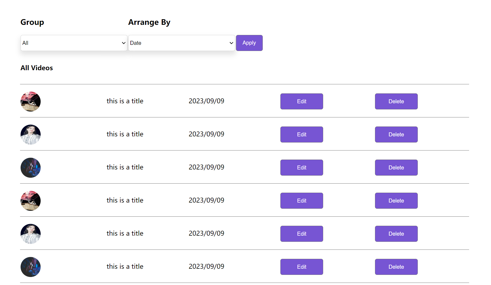

# Individual Log - Jiajun Huang (Week 4)

## Applicable data range
**September/26/2023** to **October/1/2023**

## Recap Goal 
*My Jobs This Week:* 
* Complete user scenarios with different users' perspective.
* Complete teamwork distribution table. 
* Complete personal experience and skills table. 
* Complete the peer evaluation. 

## Completed Tasks 
* Met with my teammates and divided the work
* Completed my part of the project plan. Created different user scenarios including senders, professional receivers and casual users.
* Completed peer evaluation 
* Filled my part of the teamwork distribution table and skill&experience table.

## ScreenShot of peer evaluation

## My Task on Board
*Board format:*

*Table format:*

# Individual Log - Jiajun Huang (Week 5)

## Applicable data range
**October/5/2023** to **October/8/2023**

## Recap Goal 
*My Jobs This Week:* 
* Met with my team and discussed about plans this week in the meeting
* Created figma and completed design of post page on it
* Finished the basic UI of the post page
* Complete Peer Evaluation

## Completed Tasks 
* Met with my teammates and divided the work
* Created figma and complete design on it
* Coded the basic UI of the post page with no functionality
* Filled my part of the teamwork distribution table and skill&experience table.

## UI design for the Post Page

## ScreenShot of peer evaluation

## My Task on Board
*Board format:*

*Table format:*

# Individual Log - Jiajun Huang (Week 6)

## Applicable data range
**October/9/2023** to **October/13/2023**

## Recap Goal 
*My jobs in this week are:* 
* Met with my team members and talked about further design of the page
* Made a more detailed layout design
* Complete the recorded page with editing and deleting 
* Complete the peer evaluation. 

## Completed Tasks 
* Finalized the design with members
* Finished the detailed design
* Complete the recorded page with editing and deleting 
* Complete the peer evaluation. 

## UI design for the Receive Page

## ScreenShot of peer evaluation

## My Task on Board
*Board format:*

*Table format:*

# Individual Log - Jiajun Huang (Week 7)

## Applicable data range
**October/16/2023** to **October/23/2023**

## Recap Goal 
*My jobs in this week are:*
* Met with my team members and talked about further design of the page
* Design and create the database
* Improve CSS

## Completed Tasks 
* Met with my team members and talked about further design of the page
* Created the initial database
* Revised the post page and recorded page design, made the buttons look better
* Helped a team member to set up xampp

## UI design for the Receive Page

## My Task on Board
*Board format:*

*Table format:*

# Individual Log - Jiajun Huang (Week 8)

## Applicable data range
**October/24/2023** to **October/29/2023**

## Recap Goal 
*My jobs in this week are:*
* Met with my team members and talked about functionalities
* Manually test own pages(No UI crashes)
* Start on functionality of recording

## Completed Tasks 
* Met with my team members and talked about functionalities
* All UI pass the test
* Learned about some basics of WebRTC, still working on how to use it in our app

## ScreenShot of peer evaluation

## My Task on Board
*Board format:*

*Table format:*

# Individual Log - Jiajun Huang (Week 9)

## Applicable data range
**October/30/2023** to **November/05/2023**

## Recap Goal 
*My jobs in this week are:*
* Met with my team members to talk about framework
* Set up react environment
* Convert current code to js and use react to build frontend
* Peer evaluation

## Completed Tasks 
* Met with my team members and talked about framework
* React environment has set up
* Converted code to js
* Used react for frontend
* Finished Peer evaluation

## ScreenShot of pages

## ScreenShot of peer evaluation

## My Task on Board
*Board format:*

*Table format:*

# Individual Log - Jiajun Huang (Week 12)

## Applicable data range
**November/13/2023** to **November/26/2023**

## Recap Goal 
*My jobs in this week are:*
* Met with my team members
* Finish frontend and backend linking for post and recorded pages
* Complete button functionalities in recorded page
* Peer evaluation

## Completed Tasks 
* Met with my team members
* Post page linking is done
* Finished Peer evaluation

## In Progress
* Recorded page linking
* Button functionalities in recorded page

## ScreenShot of peer evaluation

## My Task on Board
*Board format:*

*Table format:*

# Individual Log - Jiajun Huang (Week 13)

## Applicable data range
**November/27/2023** to **December/3/2023**

## Recap Goal 
*My jobs in this week are:*
* Met with my team members
* Finish button functionalities for two pages
* Making a button for create groups
* Peer evaluation

## Completed Tasks 
* Met with my team members
* Completed adding, editing, deleting videos button in frontend
* Successfully created a button for creating group and it can actually store in database
* Finished Peer evaluation

## In Progress
* Improving hover for some pages

## Self reflection
I have made a reasonable progress in this week. After a productive team meeting, I successfully deployed functionalities to most of the button. Also made frontend interacting with backend. I showed a strong understanding of using react framework for both backend and frontend. I worked with Yiqi this week and we have accomplished an amazing achieve.

## ScreenShot of peer evaluation

## My Task on Board
*Board format:*

*Table format:*
