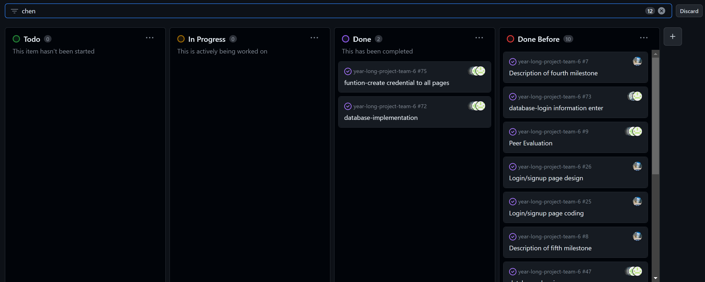

# Individual Log - Wenrui Chen (Week 5)

## Applicable data range
**October/4/2023** to **October/8/2023**

## Recap Goal 
*My jobs in this week are:* 
* Meetings and see what's the plan. 
* Design of login/signup page. 
* React structure setup to prepare database setup. 
* Complete the peer evaluation. 
* AWS activation. 

## Completed Tasks 
* meeting with team members.
* Completed the design of login/signup page using Figma. 
* Completed the peer evaluation of this week. 
* Activated AWS accounts
* Login/signup database setup in progress. 

## UI design for LOGIN and SIGNUP
*Figma:*

*What I did:*

## ScreenShot of peer evaluation

## Task on Board
*Board format:*

*Table format:*

*** 
***
***

# (Two weeks) Individual Log - Wenrui Chen (Week 6 and 7)

## Applicable data range
**October/10/2023** to **October/19/2023**

## Recap Goal 
*My jobs in these two weeks are:* 

**Week 6 and 7:**
* Meeting, discussion about plan 
* Login/Signup UI design completed 
* peer evaluation 
* Fixed some tiny problem about Login/signup UI design 

## Completed Tasks 
* Meeting in person or on discord in week 6 and 7
* peer evaluation 
* Basic UI of login/signup page
* Fixed login/signup page
* Xampp (something like Docker) setup for future database use

## Fixed Login/Signup UI 

## ScreenShot of peer evaluation on Week 6

## My Task on Board on Week 6 and 7
*Board format:*

*Table format:*

*** 
***
***

# Individual Log - Wenrui Chen (Week 8)

## Applicable date range
**October/24/2023** to **October/29/2023**

## Recap Goal 
*My jobs are:* 
* Meeting with group members. 
* Connect AWS database to my PC  
* Sign up and login functions   
* Complete the peer evaluation. 

## Completed Tasks 
* Meeting 
* AWS database connection with my PC. 
* Signup/Login functions and their tests
* Peer evaluation. 

## ScreenShot of peer evaluation

## My Task on Board
*Board format:*

*Table format:*

# Individual Log - Wenrui Chen (Week 9)

## Applicable date range
**October/30/2023** to **November/5/2023**

## Recap Goal 
*My jobs in this week are:* 
* meeting to discuss our plan 
* Prepare the presentation and live demo
* Prepare my own part
* Complete the peer evaluation 
* Complete 5+ team evaluations 

## Completed Tasks 
* meeting  
* Completed my own part of the presentation (Signup)
* Completed the peer evaluation
* Complete 5+ team evaluations

## ScreenShot of peer evaluation

## My Task on Board
*Board format:*

*Table format:*

