# Individual Log - Yiqi Xu (Week 4)

## Applicable data range
**September/26/2023** to **October/1/2023**

## Recap Goal 
*My jobs in this week are:* 
* Complete the Overview of our Plan
* Complete the table of teamwork distribution with teammates. 
* Complete the table of personal experience and skills. 
* Complete the peer evaluation. 

## Completed Tasks 
* Completed the Overview
* Had a meeting with team members 
* Filled the table of teamwork distribution and skill, experience.
* Gave my group a better understanding of my abilities and experiences
* Completed peer evaluation 

## ScreenShot of peer evaluation
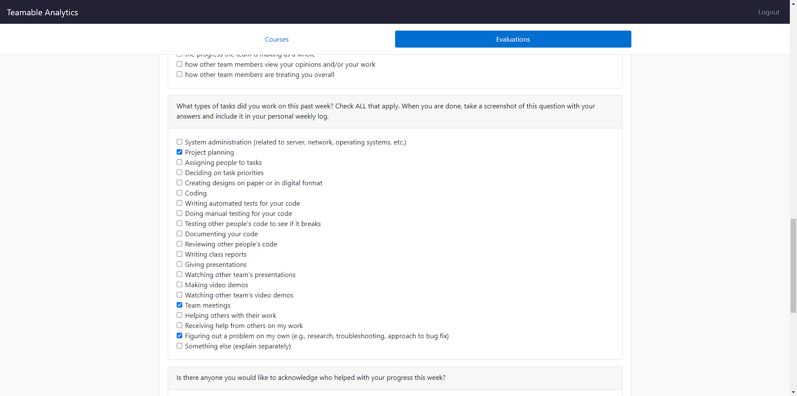

## My Task on Board
*Board format:*
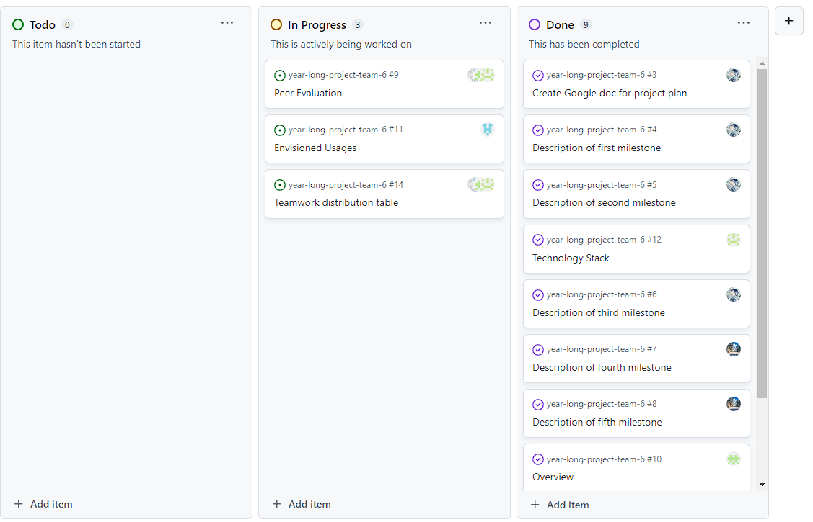
*Table format:*
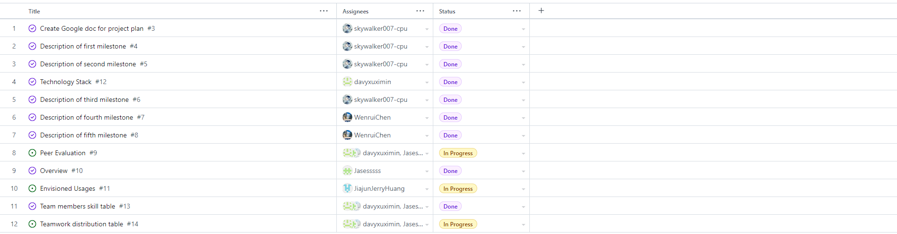

*** 
***
***

# Individual Log - Yiqi Xu (Week 5)

## Applicable data range
**October/5/2023** to **October/8/2023**

## Recap Goal 
*My jobs in this week are:* 
* Have a meeting to discuss our plan about the week.
* Create a figma accout which uses to design our website.
* Make a brief layout for our website.
* Complete the desgin of receive page of our website.  
* Begin to create the UI of receive of the website. 
* Complete the peer evaluation. 

## Completed Tasks 
* Had a meeting to discuss our plan about the week.
* Created a figma accout which uses to design our website.
* Finished a brief layout for our website.
* Completed the desgin of receive page of our website.  
* started to create the UI of receive of the website. 
* Completed the peer evaluation. 

## UI design for the Receive Page
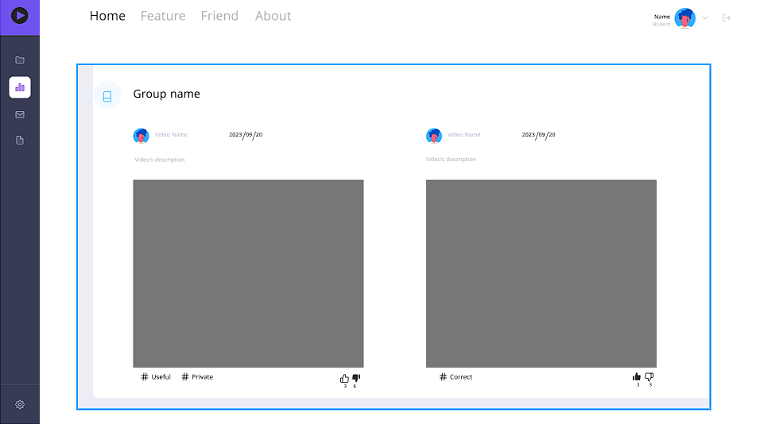

## ScreenShot of peer evaluation
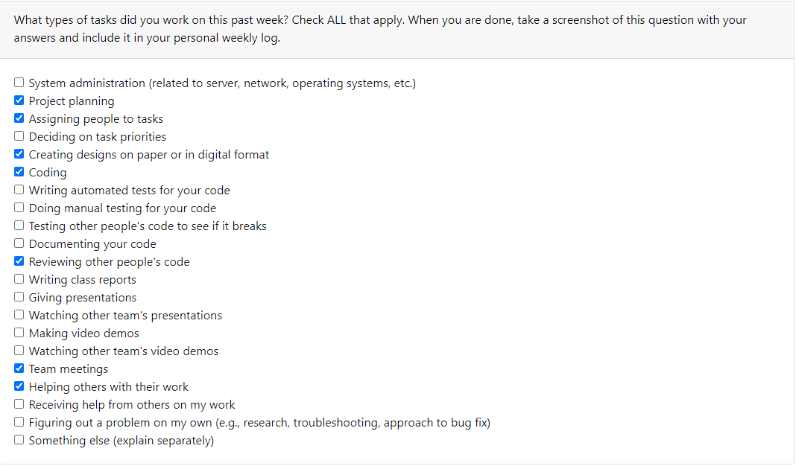

## My Task on Board
*Board format:*
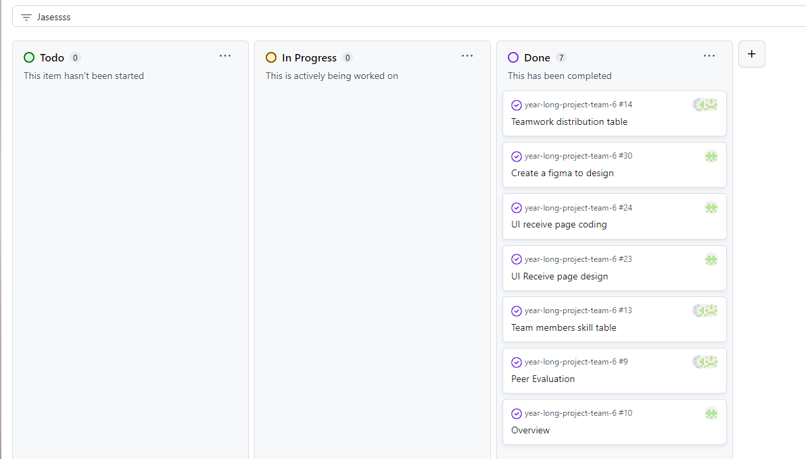
*Table format:*
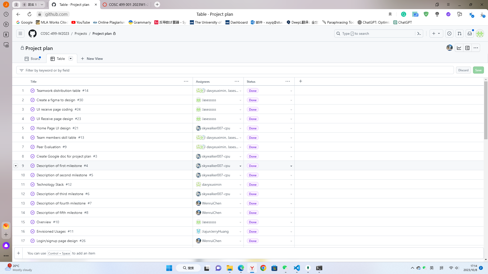

# Individual Log - Yiqi Xu (Week 6)

## Applicable data range
**October/9/2023** to **October/13/2023**

## Recap Goal 
*My jobs in this week are:* 
* Have a meeting to discuss our pages
* Make a brief layout for our website.
* Complete the receive page  
* Complete the peer evaluation. 

## Completed Tasks 
* Had a meeting to discuss our pages.
* Finished a layout for our website.
* Completed the receive page  
* Completed the peer evaluation. 

## UI design for the Receive Page
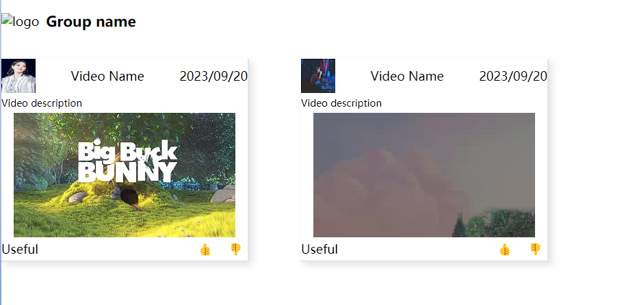

## ScreenShot of peer evaluation
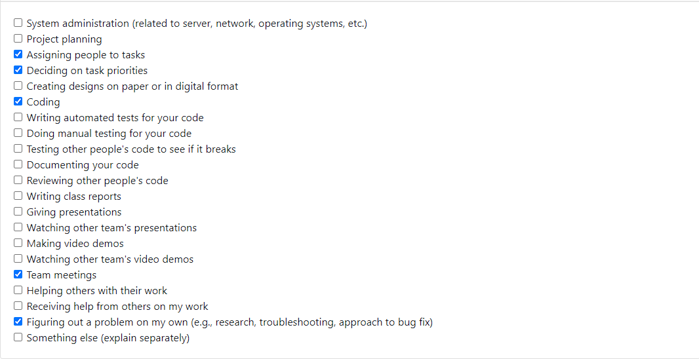

## My Task on Board
*Board format:*
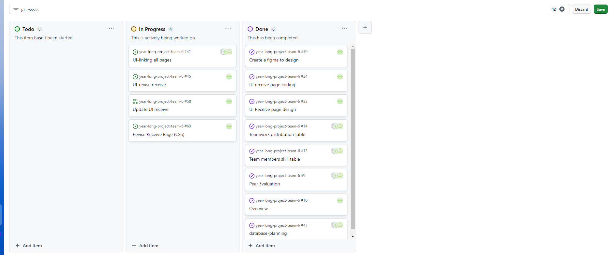
*Table format:*
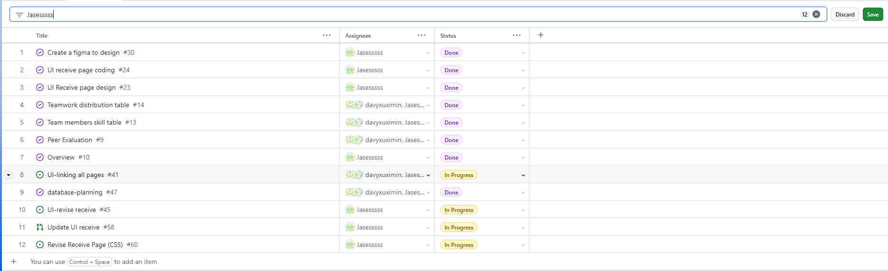

# Individual Log - Yiqi Xu (Week 7)

## Applicable data range
**October/16/2023** to **October/23/2023**

## Recap Goal 
*My jobs in this week are:* 
* Have a meeting to discuss our pages
* Design the database
* Revise the receive page (CSS)

## Completed Tasks 
* Had a meeting to discuss our pages.
* Designed the database
* Revise the receive page (CSS), made pages available on different devices
* Helped a team member to set up xampp

## UI design for the Receive Page
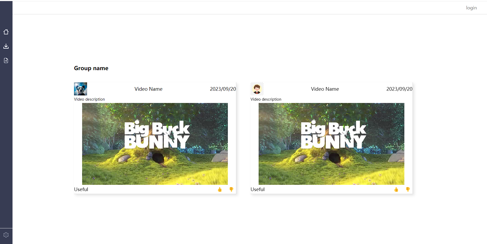

## My Task on Board
*Board format:*
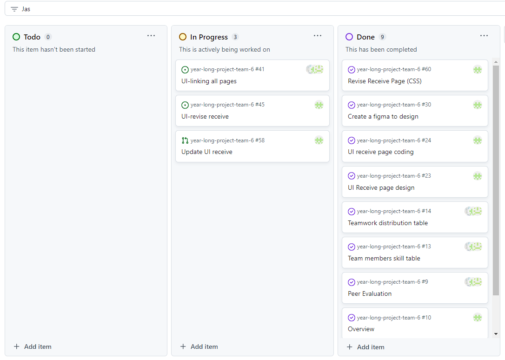
*Table format:*
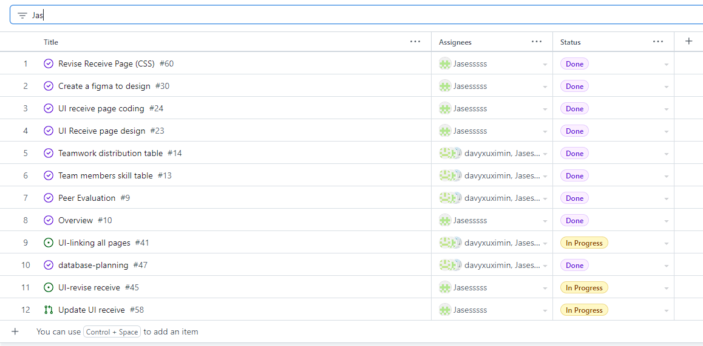

# Individual Log - Yiqi Xu (Week 8)

## Applicable data range
**October/23/2023** to **October/29/2023**

## Recap Goal 
*My jobs in this week are:* 
* Have a meeting to discuss the database
* Set up the database
* Connect to the database
* Check the other's work
* Write a test

## Completed Tasks 
* Had a meeting to discuss the database
* Set up the database
* Connected to the database
* Wrote a test for Function.php

## Test Report
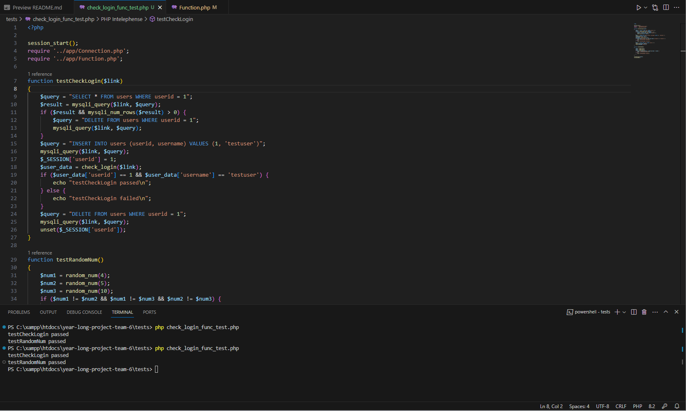

## ScreenShot of peer evaluation

## My Task on Board
*Board format:*
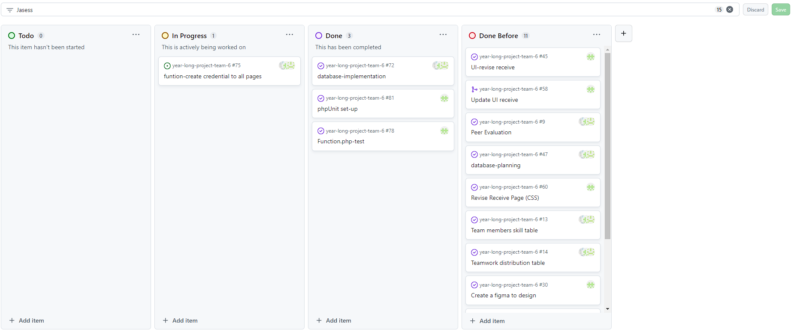
*Table format:*
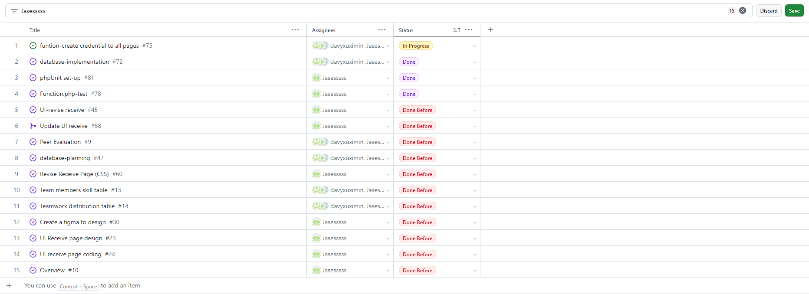