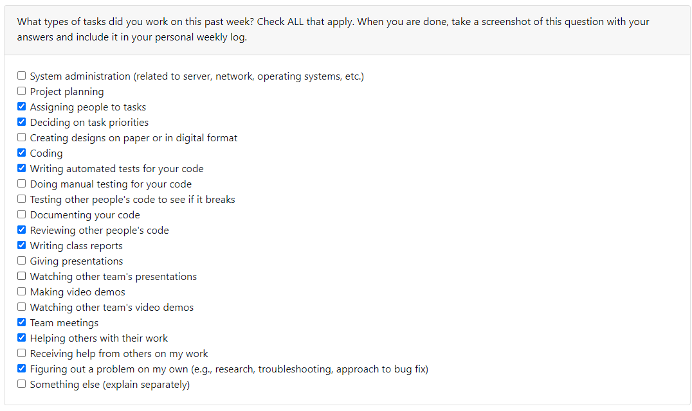

# Individual Log - Yiqi Xu (Week 4)

## Applicable data range
**September/26/2023** to **October/1/2023**

## Recap Goal 
*My jobs in this week are:* 
* Complete the Overview of our Plan
* Complete the table of teamwork distribution with teammates. 
* Complete the table of personal experience and skills. 
* Complete the peer evaluation. 

## Completed Tasks 
* Completed the Overview
* Had a meeting with team members 
* Filled the table of teamwork distribution and skill, experience.
* Gave my group a better understanding of my abilities and experiences
* Completed peer evaluation 

## ScreenShot of peer evaluation

## My Task on Board
*Board format:*

*Table format:*

*** 
***
***

# Individual Log - Yiqi Xu (Week 5)

## Applicable data range
**October/5/2023** to **October/8/2023**

## Recap Goal 
*My jobs in this week are:* 
* Have a meeting to discuss our plan about the week.
* Create a figma accout which uses to design our website.
* Make a brief layout for our website.
* Complete the desgin of receive page of our website.  
* Begin to create the UI of receive of the website. 
* Complete the peer evaluation. 

## Completed Tasks 
* Had a meeting to discuss our plan about the week.
* Created a figma accout which uses to design our website.
* Finished a brief layout for our website.
* Completed the desgin of receive page of our website.  
* started to create the UI of receive of the website. 
* Completed the peer evaluation. 

## UI design for the Receive Page

## ScreenShot of peer evaluation

## My Task on Board
*Board format:*

*Table format:*

# Individual Log - Yiqi Xu (Week 6)

## Applicable data range
**October/9/2023** to **October/13/2023**

## Recap Goal 
*My jobs in this week are:* 
* Have a meeting to discuss our pages
* Make a brief layout for our website.
* Complete the receive page  
* Complete the peer evaluation. 

## Completed Tasks 
* Had a meeting to discuss our pages.
* Finished a layout for our website.
* Completed the receive page  
* Completed the peer evaluation. 

## UI design for the Receive Page

## ScreenShot of peer evaluation

## My Task on Board
*Board format:*

*Table format:*

# Individual Log - Yiqi Xu (Week 7)

## Applicable data range
**October/16/2023** to **October/23/2023**

## Recap Goal 
*My jobs in this week are:* 
* Have a meeting to discuss our pages
* Design the database
* Revise the receive page (CSS)

## Completed Tasks 
* Had a meeting to discuss our pages.
* Designed the database
* Revise the receive page (CSS), made pages available on different devices
* Helped a team member to set up xampp

## UI design for the Receive Page

## My Task on Board
*Board format:*

*Table format:*

# Individual Log - Yiqi Xu (Week 8)

## Applicable data range
**October/23/2023** to **October/29/2023**

## Recap Goal 
*My jobs in this week are:* 
* Have a meeting to discuss the database
* Set up the database
* Connect to the database
* Check the other's work
* Write a test

## Completed Tasks 
* Had a meeting to discuss the database
* Set up the database
* Connected to the database
* Wrote a test for Function.php

## Test Report

## ScreenShot of peer evaluation

## My Task on Board
*Board format:*

*Table format:*

# Individual Log - Yiqi Xu (Week 9)

## Applicable data range
**October/30/2023** to **November/5/2023**

## Recap Goal 
*My jobs in this week are:* 
* Have a meeting to discuss the framework
* set up the environment for React
* Covert the html and php code to javascript (Login&Signup Page)
* Use React as the frontend framework
* Finish Peer Evaluation

## Completed Tasks 
* Had a meeting to discuss the framework
* set up the environment for React
* Coverted the html and php code to javascript (Login&Signup Page)
* Used React as the frontend framework
* Finish Peer Evaluation

## ScreenShot of Login Signup Page with React

## ScreenShot of peer evaluation

## My Task on Board
*Board format:*

*Table format:*

# Individual Log - Yiqi Xu (Week 10)

## Applicable data range
**November/6/2023** to **November/12/2023**

## Recap Goal 
*My jobs in this week are:* 
* Have a meeting to assign work
* Code backend for post page with team member
* Update Database
* Connect Database with Nodejs
* Finish Peer Evaluation

## Completed Tasks 
* Had a meeting to assign work
* Coded backend for post page with team member
* Updated Database
* Connected Database with Nodejs
* Finished Peer Evaluation

## Test Report for PostDao

## ScreenShot of peer evaluation

## My Task on Board
*Board format:*

*Table format:*

# Individual Log - Yiqi Xu (Week 12)

## Applicable data range
**November/20/2023** to **November/26/2023**

## Recap Goal 
*My jobs in this week are:* 
* Have a meeting to assign work
* Code backend for recorded page with team member
* Code the post page frontend and ensure it can work properly
* write a jest for recorded dao
* Update Database
* Finish Peer Evaluation

## Completed Tasks 
* Had a meeting to assign work
* Coded backend for post page with team member
* Coded the post page frontend
* Updated Database
* Finished Peer Evaluation

## ScreenShot of peer evaluation

## My Task on Board
*Board format:*

*Table format:*

# Individual Log - Yiqi Xu (Week 13)

## Applicable data range
**November/27/2023** to **December/3/2023**

## Recap Goal 
*My jobs in this week are:* 
* Have a meeting to assign work
* Code backend (add videos, edit videos, and delete videos)
* Code the functions in post page frontend (add videos, edit videos, and delete videos)
* Code the backend for profile
* Code the backend for group function
* Update the login and sign up
* Update Database structure
* Finish Peer Evaluation
* Finish the team report with team members

## Completed Tasks 
* Had a meeting to assign work
* Coded backend (add videos, edit videos, and delete videos)
* Coded the functions in post page frontend (add videos, edit videos, and delete videos)
* Coded the backend for profile
* Coded the backend for group function (add a new group, edit the group name, delete the group, get group information)
* Updated the login and sign up
* Updated Database structure
* Finished Peer Evaluation
* Finished the team report with team members

## In Progress
* Writing the jest for Daos.

## Self reflection
I've made considerable progress, demonstrating a strong command in both frontend and backend development. My coordination skills were key in team meetings for work assignment, and I successfully developed critical functionalities, including video operations for both frontend and backend, and user profile and group management features. I also updated the database structure and enhanced the login and signup processes, showcasing my grasp of data management and security. 

## ScreenShot of peer evaluation

## My Task on Board
*Board format:*

*Table format:*

# Term 2

# Individual Log - Yiqi Xu (Week 1)

## Applicable data range
**January/8/2023** to **January/14/2023**

## Recap Goal 
*My jobs in this week are:* 
* Have a meeting to
* Code backend (Profile)
* Update Database structure
* Finish Peer Evaluation

## Completed Tasks 
* Had a meeting to
* Coded backend (Profile)
* Updated Database structure
* Finished Peer Evaluation

## In Progress
* Coding on the frontend of Profile

## Self reflection
This week, I demonstrated a strong balance between technical proficiency and collaborative skills. I efficiently managed backend development, updated the database structure, and successfully conducted peer evaluations. Currently we are making progress in frontend coding.

## ScreenShot of peer evaluation

## My Task on Board
*Board format:*

*Table format:*

# Individual Log - Yiqi Xu (Week 2)

## Applicable data range
**January/15/2023** to **January/21/2023**

## Recap Goal 
*My jobs in this week are:* 
* Have a meeting 
* Code backend (homepage)
* Update function for adding group
* Update Database
* Finish Peer Evaluation

## Completed Tasks 
* Had a meeting 
* Coded backend (homepage)
* Updated function for adding group
* Updated Database 
* Finished Peer Evaluation

## In Progress
* Coding on the backend of group member board

## Self reflection
This week, I  made substantial strides in backend development, notably coding the homepage and enhancing the group addition feature. Database updates were pivotal for system efficiency.

## ScreenShot of peer evaluation

## My Task on Board
*Board format:*

*Table format:*

# Individual Log - Yiqi Xu (Week 3)

## Applicable data range
**January/22/2023** to **January/28/2023**

## Recap Goal 
*My jobs in this week are:* 
* Have a meeting 
* Code backend (group member board and group_post)
* Code frontend for group post
* Debug in adding group and inviting user
* Update Database
* Finish Peer Evaluation

## Completed Tasks 
* Had a meeting 
* Coded backend (group member board and group_post)
* Coded frontend for group post
* Debugged in adding group and inviting user
* Updated Database
* Finished Peer Evaluation

## Self reflection
This week, I coded both the backend and frontend, debugged intricate issues, and efficiently updated the database. Overall, this week was a testament to my commitment to quality and the seamless integration of diverse aspects of project development.

## ScreenShot of peer evaluation

## My Task on Board
*Board format:*

*Table format:*

# Individual Log - Yiqi Xu (Week 4)

## Applicable data range
**January/29/2023** to **February/4/2023**

## Recap Goal 
*My jobs in this week are:* 
* Have a meeting 
* Code backend (admin)
* Code frontend for admin pages
* Finish Peer Evaluation

## Completed Tasks 
* Had a meeting 
* Coded backend (admin)
* Coded frontend for admin pages
* Finished Peer Evaluation

## Self reflection
This week, I integrated backend and frontend development for admin functionalities, ensuring robust performance and user-friendly interfaces. My participation in the meeting underscored my commitment to collaborative excellence and continuous growth. It was a week marked by productive synergy and technical finesse.

## ScreenShot of peer evaluation

## My Task on Board
*Board format:*

*Table format:*

# Individual Log - Yiqi Xu (Week 5)

## Applicable data range
**February/5/2023** to **February/11/2023**

## Recap Goal 
*My jobs in this week are:* 
* Have a meeting 
* Code backend (Group admin)
* Code frontend for group admin pages
* Update admin page
* Finish Peer Evaluation

## Completed Tasks 
* Had a meeting 
* Coded backend (Group admin)
* Coded frontend for group admin pages
* Updated admin page
* Finished Peer Evaluation

## Self reflection
This week, I integrated backend and frontend development for group admin functionalities, ensuring robust performance and user-friendly interfaces. My participation in the meeting underscored my commitment to collaborative excellence and continuous growth. 

## ScreenShot of peer evaluation

## My Task on Board
*Board format:*

*Table format:*

# Individual Log - Yiqi Xu (Week 6)

## Applicable data range
**February/12/2023** to **February/18/2023**

## Recap Goal 
*My jobs in this week are:* 
* Have a meeting 
* Modify functions in Admin page
* Update for group board page
* Update UI for admin page
* Finish Peer Evaluation

## Completed Tasks 
* Had a meeting 
* Modified functions in Admin page
* Updated for group board page
* Finished Peer Evaluation

## In progress
* Updated UI for admin page

## Self reflection
This week, I integrated development for group admin functionalities, ensuring robust performance and user-friendly interfaces. Next week we will keep working the UI for the admain page. My participation in the meeting underscored my commitment to collaborative excellence and continuous growth.

## ScreenShot of peer evaluation

## My Task on Board
*Board format:*

*Table format:*
