## Ximin Xu week 4 personal log

### 1. *Date Range*

Sept. 28 --- First team meeting. Decide on which technology we are going to use. Dirstribution of work.

Sept. 29 --- Create project plan file. Work on project plan.

Sept.30 --- Work on project plan.

Oct.1 --- Project plan finished, work on team log and individual log.

### 2. *Screenshot from peer evaluation*
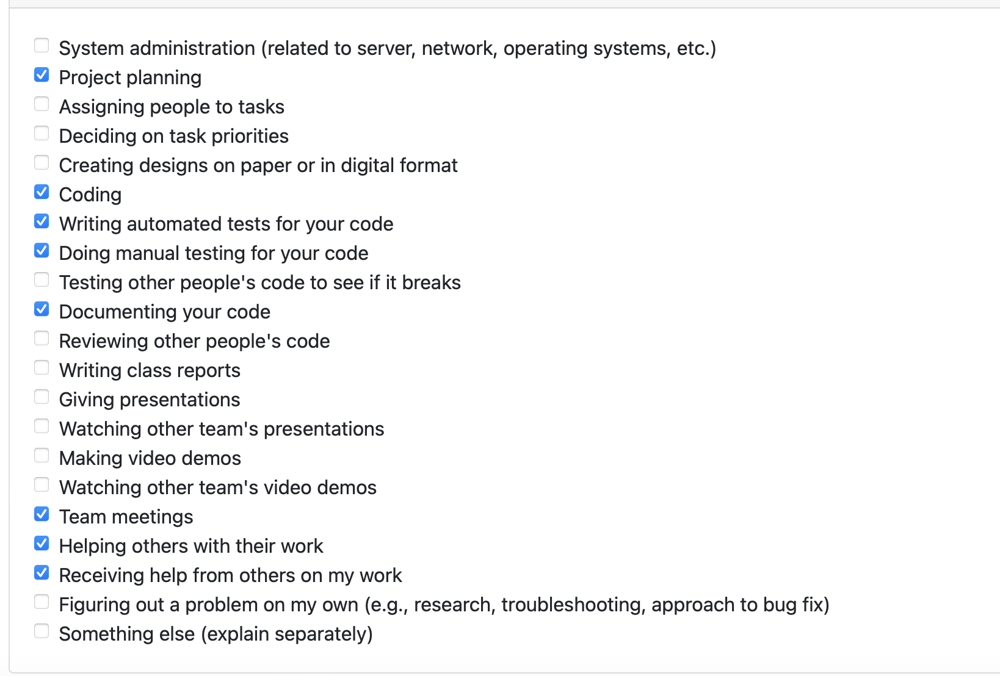

### 3. *Recap*

Tasks done vs in progress

**Tasks done:**
1. Create google doc for project plan
2. Writing technology stack of project plamn
3. Peer Evaluation
4. Teamwork distribution table

**In progress**
 
This week work all done

### 4. *Self Reflection and learned*

This week we have finished the project plan. I am really looking forward to this project and hopefully we will make a good project. 
This week I have learned about AWS, I know what they are and how to use them in practice. 

### 5. *From project board*
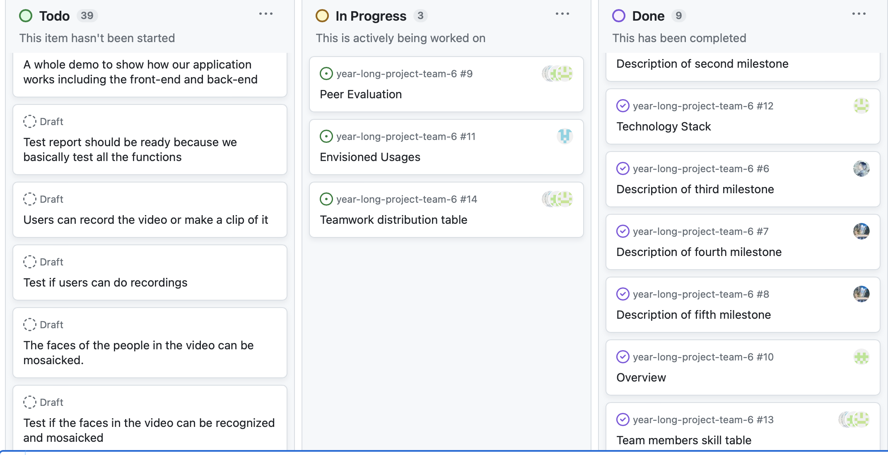
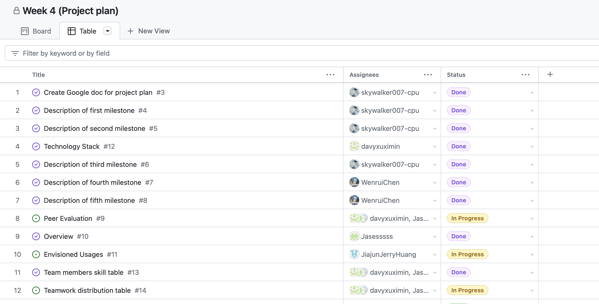

## Ximin Xu week 5 personal log

### 1. *Date Range*

Oct.6 --- First team meeting. Distributing work

Oct. 8 --- Coding work

Oct. 9 --- Second team meeting

### 2. *Screenshot from peer evaluation*
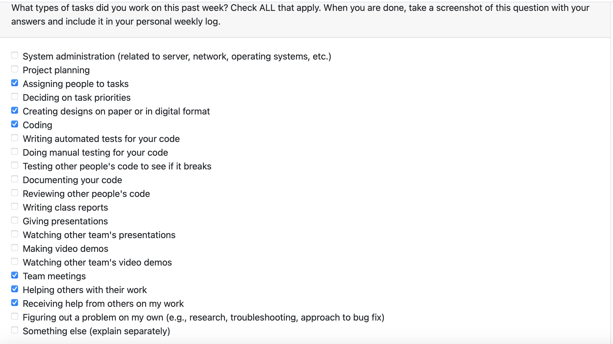

### 3. *Recap*

Tasks done vs in progress

**Tasks done:**
1. Coding the ui bars
**In progress**
 
This week work all done

### 4. *Self Reflection and learned*

This week we have finished the project plan. I am really looking forward to this project and hopefully we will make a good project. 
This week I have learned about AWS, I know what they are and how to use them in practice. 

### 5. *From project board*
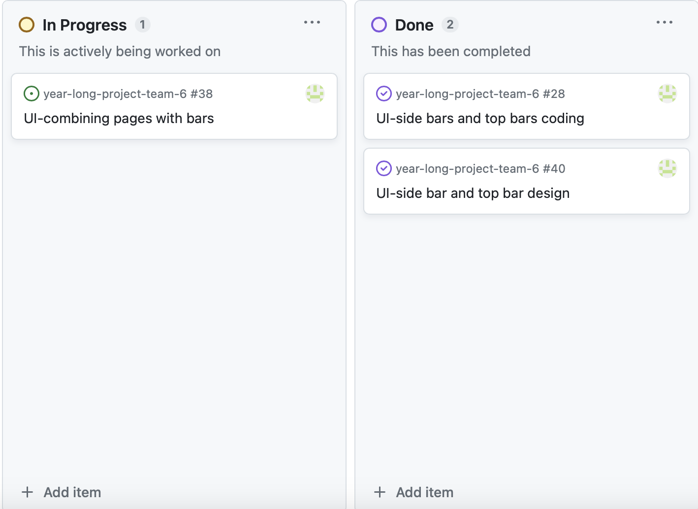
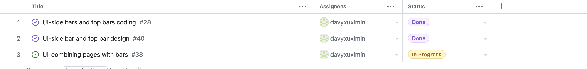

## Ximin Xu week 6-7 personal log

### 1. *Date Range*

Oct.10-23

### 2. *Screenshot from peer evaluation*
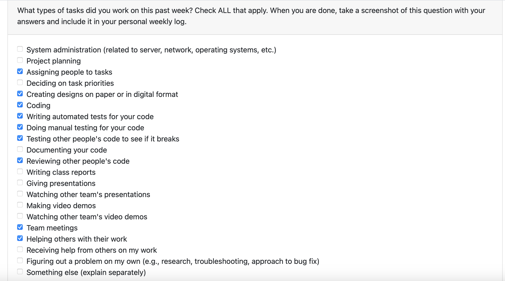

### 3. *Recap*

Tasks done vs in progress

**Tasks done:**
1. Coding the ui bars
2. Writing javascript of ui bar
3. Writing automated test javascript
4. Writing database ddl
5. Connecting pages to each other
6. Fix bugs while connecting pages

**In progress**
 
1. database implementation
2. coding database implement

### 4. *Self Reflection and learned*

These two weeks we have almost finished coding the ui work with some other javascript, we have also started the database implementation, so that we are able to accomplish the implemenation before next week.

### 5. *From project board*
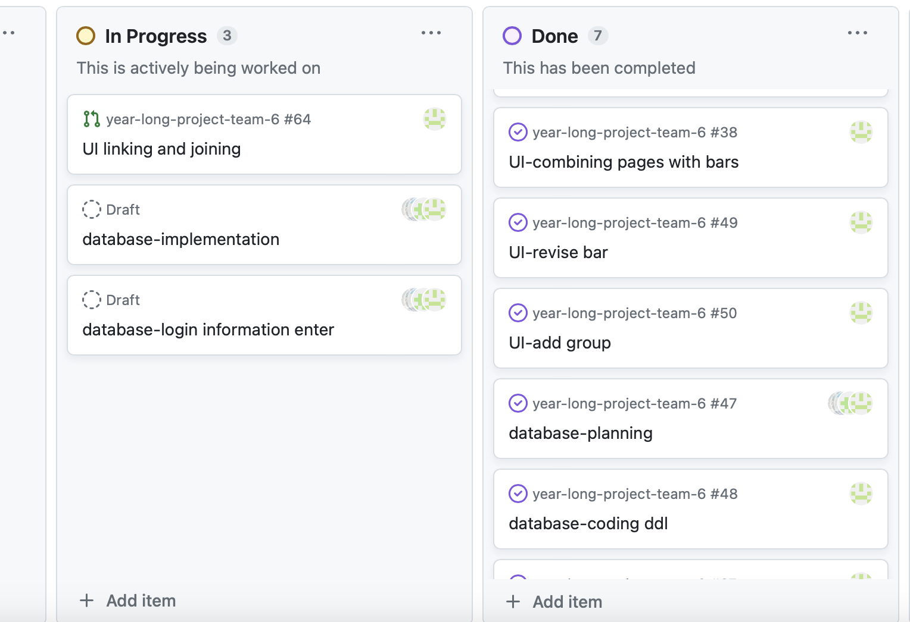
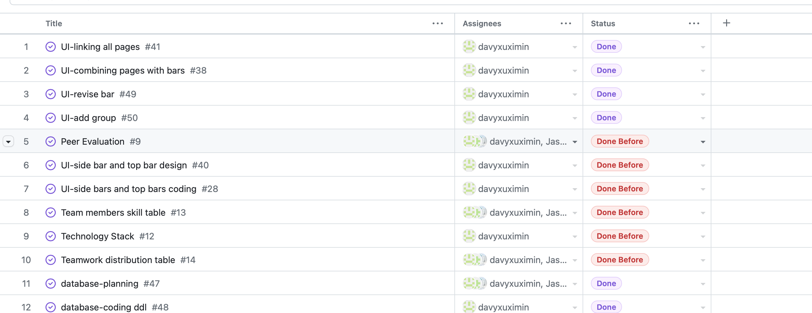

## Ximin Xu week 8 personal log

### 1. *Date Range*

Oct.24-30

### 2. *Screenshot from peer evaluation*
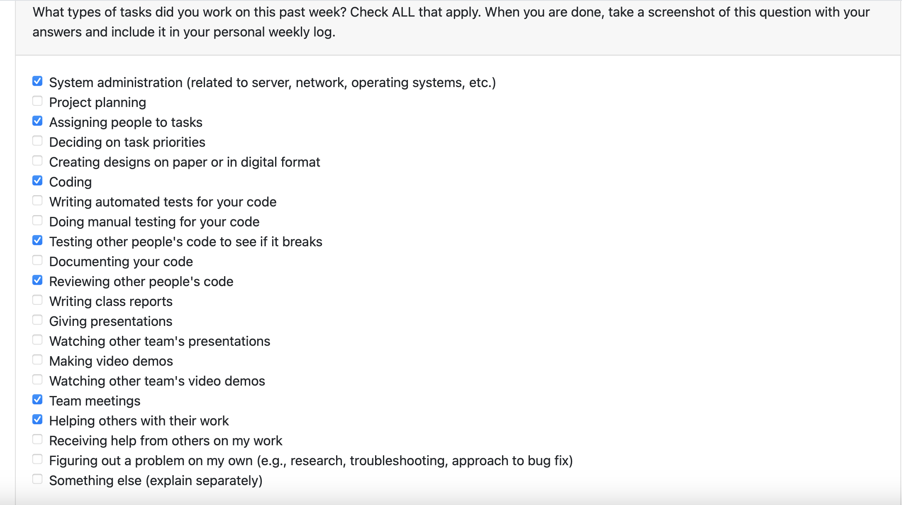

### 3. *Recap*

Tasks done vs in progress

**Tasks done:**
1. AWS-database setup
2. Viewing teams code
3. fixing bug
4. preparing mini presentation

**In progress**
 
1. create credential
2. transverse into react

### 4. *Self Reflection and learned*

This week I have been setup database on my own, and help my teammates implement database. Besides, I have been helping them finding bugs and make important changes.

### 5. *From project board*
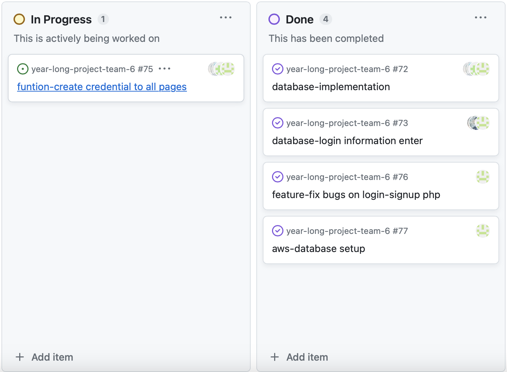
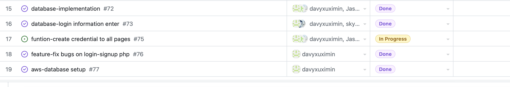

## Ximin Xu week 9 personal log

### 1. *Date Range*

Oct.31-Nov.6

### 2. *Screenshot from peer evaluation*
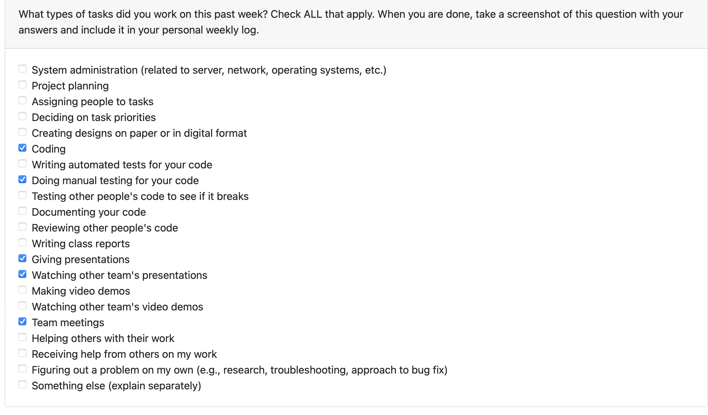

### 3. *Recap*

Tasks done vs in progress

**Tasks done:**
1. mini-presentation
2. coding to embed current work of homepage into react

**In progress**
 
1. create api for react

### 4. *Self Reflection and learned*

This week we finish our mini presentation, although accidents occured when presenting. I learned how react works and embed the current ui into react.Next week I am planning to figure out how api works and try to connect react to one of it.

### 5. *From project board*
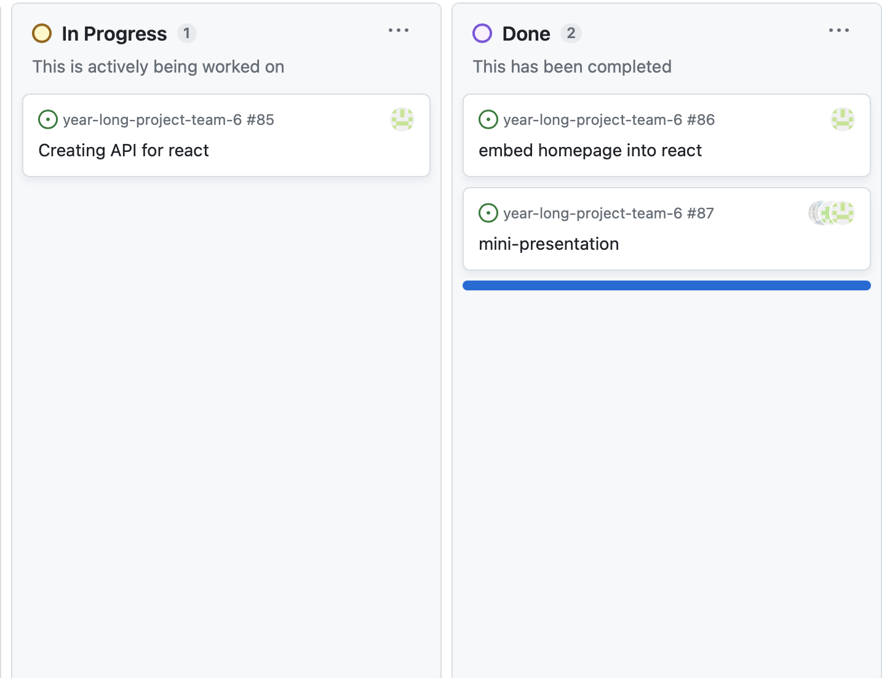

## Ximin Xu week 10 personal log

### 1. *Date Range*

Nov.7-Nov.12

### 2. *Screenshot from peer evaluation*
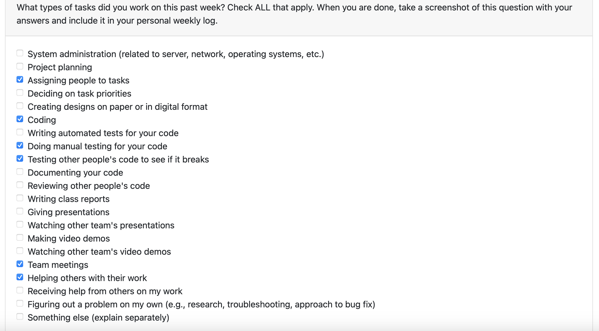

### 3. *Recap*

Tasks done vs in progress

**Tasks done:**
1. Group meeting, assigning people to work
2. Linking all pages in react
3. Fixing UI bugs of their signup page 
4. Manual testing on UI function

**In progress**
 
1. Linking frontend with backend

### 4. *Self Reflection and learned*

This week, we completed the process of integrating the code into React, and moving forward, our focus will be on working with React. I have a stronger familiarity with React, and I'm optimistic about successfully connecting the frontend with the backend.

### 5. *From project board*
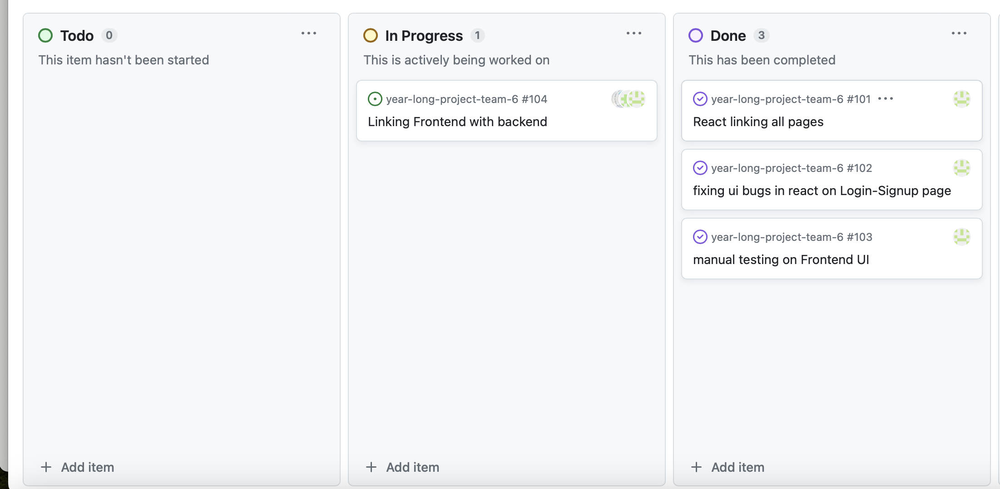

## Ximin Xu week 11-12 personal log

### 1. *Date Range*

Nov.13-Nov.26

### 2. *Screenshot from peer evaluation*
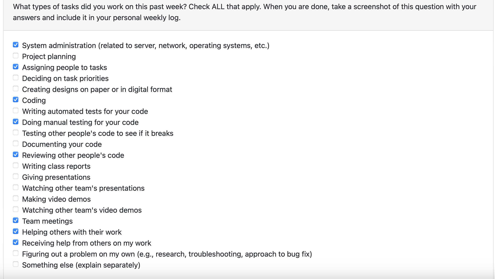

### 3. *Recap*

Tasks done vs in progress

**Tasks done:**
1. Group meeting, assigning people to work
2. Finishing API for Login
3. React integrate to api
4. Combining all apis into one server

**In progress**
 
1. testing on login API
2. Signup API

### 4. *Self Reflection and learned*

Finishing tasks helped us work together better and get better at coding. We also learned to keep things safe, write things down clearly, and make sure everything works well. Putting all the computer parts in one place made things faster. We also learned to keep checking and fixing problems. Right now, we're making another part for people to sign up, and we're making sure it's consistent. Learning never stops in computer work, and teamwork is important for success.

### 5. *From project board*
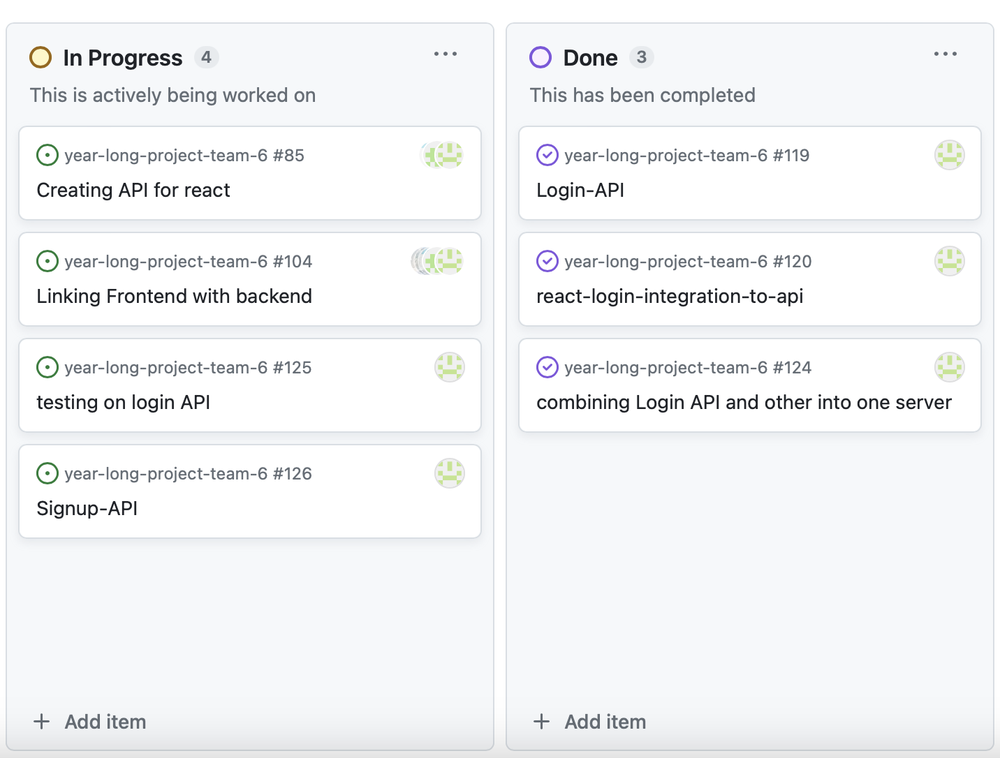

