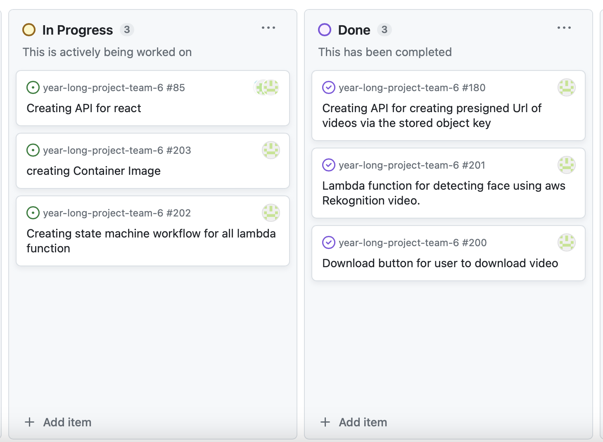

## Ximin Xu week 4 personal log

### 1. *Date Range*

Sept. 28 --- First team meeting. Decide on which technology we are going to use. Dirstribution of work.

Sept. 29 --- Create project plan file. Work on project plan.

Sept.30 --- Work on project plan.

Oct.1 --- Project plan finished, work on team log and individual log.

### 2. *Screenshot from peer evaluation*

### 3. *Recap*

Tasks done vs in progress

**Tasks done:**
1. Create google doc for project plan
2. Writing technology stack of project plamn
3. Peer Evaluation
4. Teamwork distribution table

**In progress**
 
This week work all done

### 4. *Self Reflection and learned*

This week we have finished the project plan. I am really looking forward to this project and hopefully we will make a good project. 
This week I have learned about AWS, I know what they are and how to use them in practice. 

### 5. *From project board*

## Ximin Xu week 5 personal log

### 1. *Date Range*

Oct.6 --- First team meeting. Distributing work

Oct. 8 --- Coding work

Oct. 9 --- Second team meeting

### 2. *Screenshot from peer evaluation*

### 3. *Recap*

Tasks done vs in progress

**Tasks done:**
1. Coding the ui bars
**In progress**
 
This week work all done

### 4. *Self Reflection and learned*

This week we have finished the project plan. I am really looking forward to this project and hopefully we will make a good project. 
This week I have learned about AWS, I know what they are and how to use them in practice. 

### 5. *From project board*

## Ximin Xu week 6-7 personal log

### 1. *Date Range*

Oct.10-23

### 2. *Screenshot from peer evaluation*

### 3. *Recap*

Tasks done vs in progress

**Tasks done:**
1. Coding the ui bars
2. Writing javascript of ui bar
3. Writing automated test javascript
4. Writing database ddl
5. Connecting pages to each other
6. Fix bugs while connecting pages

**In progress**
 
1. database implementation
2. coding database implement

### 4. *Self Reflection and learned*

These two weeks we have almost finished coding the ui work with some other javascript, we have also started the database implementation, so that we are able to accomplish the implemenation before next week.

### 5. *From project board*

## Ximin Xu week 8 personal log

### 1. *Date Range*

Oct.24-30

### 2. *Screenshot from peer evaluation*

### 3. *Recap*

Tasks done vs in progress

**Tasks done:**
1. AWS-database setup
2. Viewing teams code
3. fixing bug
4. preparing mini presentation

**In progress**
 
1. create credential
2. transverse into react

### 4. *Self Reflection and learned*

This week I have been setup database on my own, and help my teammates implement database. Besides, I have been helping them finding bugs and make important changes.

### 5. *From project board*

## Ximin Xu week 9 personal log

### 1. *Date Range*

Oct.31-Nov.6

### 2. *Screenshot from peer evaluation*

### 3. *Recap*

Tasks done vs in progress

**Tasks done:**
1. mini-presentation
2. coding to embed current work of homepage into react

**In progress**
 
1. create api for react

### 4. *Self Reflection and learned*

This week we finish our mini presentation, although accidents occured when presenting. I learned how react works and embed the current ui into react.Next week I am planning to figure out how api works and try to connect react to one of it.

### 5. *From project board*

## Ximin Xu week 10 personal log

### 1. *Date Range*

Nov.7-Nov.12

### 2. *Screenshot from peer evaluation*

### 3. *Recap*

Tasks done vs in progress

**Tasks done:**
1. Group meeting, assigning people to work
2. Linking all pages in react
3. Fixing UI bugs of their signup page 
4. Manual testing on UI function

**In progress**
 
1. Linking frontend with backend

### 4. *Self Reflection and learned*

This week, we completed the process of integrating the code into React, and moving forward, our focus will be on working with React. I have a stronger familiarity with React, and I'm optimistic about successfully connecting the frontend with the backend.

### 5. *From project board*

## Ximin Xu week 11-12 personal log

### 1. *Date Range*

Nov.13-Nov.26

### 2. *Screenshot from peer evaluation*

### 3. *Recap*

Tasks done vs in progress

**Tasks done:**
1. Group meeting, assigning people to work
2. Finishing API for Login
3. React integrate to api
4. Combining all apis into one server

**In progress**
 
1. testing on login API
2. Signup API

### 4. *Self Reflection and learned*

Finishing tasks helped us work together better and get better at coding. We also learned to keep things safe, write things down clearly, and make sure everything works well. Putting all the computer parts in one place made things faster. We also learned to keep checking and fixing problems. Right now, we're making another part for people to sign up, and we're making sure it's consistent. Learning never stops in computer work, and teamwork is important for success.

### 5. *From project board*

## Ximin Xu week 13 personal log

### 1. *Date Range*

Nov.27-Dec.3

### 2. *Screenshot from peer evaluation*

### 3. *Recap*

Tasks done vs in progress

**Tasks done:**
1. Group meeting, assigning people to work
2. Finish Signup API
3. Frontend fetching to Signup API
4. Learning Webrtc and KVS
5. linking connection between server and KVS
6. Peerconnection with KVS
7. Capture video 
8. Store captured video into S3 bucket

**In progress**
 1. Updating post.js to allow storing s3 bucket information into db.
 2. Writing jest on APIs.

### 4. *Self Reflection and learned*
In our recent project update, I've accomplished several crucial tasks. I began with a productive group meeting, efficiently assigning responsibilities. Next, I successfully completed the Signup API, ensuring it's ready for integration. The frontend has been configured to fetch data from the Signup API seamlessly. Additionally, I embarked on learning Webrtc and KVS, establishing a connection between the server and KVS. I've also made significant progress in implementing peer connections with KVS. On the video front, I achieved video capture and streamlined the process of storing captured videos in the S3 bucket. Currently, I'm diligently working on updating the 'post.js' file to facilitate the storage of S3 bucket information into our database.

### 5. *From project board*

## Ximin Xu T2 week 1 personal log

### 1. *Date Range*

Jan.8-Jan.14

### 2. *Screenshot from peer evaluation*

### 3. *Recap*

Tasks done vs in progress

**Tasks done:**
1. Group meeting, assigning people to work
2. Change the input format of s3 bucket from webm to mp4 for better adapatability
3. Return the Object key of videos and store them into db

**In progress**
 1. Creating API for creating presigned Url of videos via the stored object key

### 4. *Self Reflection and learned*
I successfully converted video formats to mp4 and stored them in our S3 bucket, enhancing compatibility and accessibility. This technical task required attention to detail and ensured more user-friendly content. Currently, I'm developing an API for generating secure presigned URLs for video access. These tasks have highlighted the importance of adaptability and efficient data management. I'm learning valuable technical skills and project relevance as I continue working on the API project, aiming to contribute significantly to our project's success.

### 5. *From project board*

## Ximin Xu T2 week 2 personal log

### 1. *Date Range*

Jan.15-Jan.21

### 2. *Screenshot from peer evaluation*

### 3. *Recap*

Tasks done vs in progress

**Tasks done:**
1. Group meeting, assigning people to work
2. Creating signed url for videos everytime the user ask to view the video
3. Download button for user to download video
4. Lambda function for detecting face using aws Rekognition video.

**In progress**
 1. Creating state machine workflow for all lambda function
 2. creating Container Image 

### 4. *Self Reflection and learned*
In our recent project, I've made significant progress. I successfully held a productive group meeting and distributed tasks efficiently. I've implemented key features like creating signed URLs for video access and enabling video downloads, enhancing user experience. Additionally, I've started working on a vital aspect, which is setting up a state machine workflow for all my lambda functions, ensuring seamless execution. Furthermore, I'm actively engaged in creating a container image, a critical step that promises to further enhance my project's efficiency and scalability. This balance between completed tasks and ongoing initiatives reflects my commitment to achieving project milestones.

### 5. *From project board*

## Ximin Xu T2 week 3 personal log

### 1. *Date Range*

Jan.21-Jan.28

### 2. *Screenshot from peer evaluation*

### 3. *Recap*

Tasks done vs in progress

**Tasks done:**
1. Group meeting, assigning people to work
2. Modify lambda functions to python
3. Creating state machine workflow for all lambda function
4. Accomplishing blurring face feature

**In progress**
 1. Creating page for admin user

### 4. *Self Reflection and learned*
Reflecting on my contributions to our group project, I feel a sense of accomplishment and growth. The initial group meeting where we assigned tasks was a pivotal moment, allowing me to understand the importance of clear communication and teamwork in achieving our objectives. My work on modifying lambda functions to Python not only challenged my technical skills but also enhanced the project's adaptability and efficiency. The development of a state machine workflow for integrating these functions was particularly rewarding, as it significantly streamlined our operations. Implementing the face-blurring feature was a highlight, adding a crucial privacy aspect to our project. Currently, I am focused on creating a page for admin users, aiming to further refine our project's functionality and user experience. This journey has been a valuable learning experience, highlighting the importance of collaboration, innovation, and continuous improvement.

### 5. *From project board*

## Ximin Xu T2 week 4 personal log

### 1. *Date Range*

Jan.29-Feb.4

### 2. *Screenshot from peer evaluation*

### 3. *Recap*

Tasks done vs in progress

**Tasks done:**
1. Group meeting, assigning people to work
2. Fixing bugs(detail in project board)
3. In post page create identity check, for receivers can see posts from senders, and vice versa
4. clean unused data for frontend and db
5. peer testing

**In progress**
 1. Create announcement feature

### 4. *Self Reflection and learned*
This week, my contributions to the team project were significant and multifaceted. I played a pivotal role during our group meeting, where I was instrumental in delegating tasks effectively. I tackled and resolved numerous bugs, as detailed on our project board, enhancing the project's stability. I implemented an identity verification feature on the post page, ensuring secure and relevant content visibility between senders and receivers. Additionally, I streamlined the project by purging unnecessary data from both the frontend and database. My efforts in peer testing further ensured our project's robustness. Currently, I am focused on developing an announcement feature to improve our project's communication capabilities.

### 5. *From project board*

## Ximin Xu T2 week 5 personal log

### 1. *Date Range*

Feb.4-Feb.11

### 2. *Screenshot from peer evaluation*

### 3. *Recap*

Tasks done vs in progress

**Tasks done:**
1. Group meeting, assigning people to work
2. fix selected group bug in postpage
3. create new postbutton in group members page
4. update ui, shrink group card
5. Create announcement feature page frontend finished

**In progress**
 1. Create announcement page ui 
 2. Create announcement page backend
 3. View announcements page

### 4. *Self Reflection and learned*
In this group project, my contributions spanned various aspects, from initial planning in group meetings and task delegation to specific technical implementations. I played a pivotal role in addressing a critical bug on the post page, enhancing user interaction by adding a new post button on the group members' page, and refining the UI by minimizing the group card size. Additionally, I took the initiative to design the frontend of a new announcement feature, which is now complete. Currently, I'm focusing on developing the UI for the announcement creation page, its backend functionalities, and the page for viewing announcements. 
### 5. *From project board*

## Ximin Xu T2 week 6 personal log

### 1. *Date Range*

Feb.12-Feb.18

### 2. *Screenshot from peer evaluation*

### 3. *Recap*

Tasks done vs in progress

**Tasks done:**
1. Group meeting, assigning people to work
2. Add router of announcement
3. Add dao of announcement
4. Frontend fetch to the backend

**In progress**
 1. UI announcement
 2. View announcements feature

### 4. *Self Reflection and learned*
Efficiently managed group meetings and task assignments, successfully integrated announcement routing and data access layers, and established frontend-backend connectivity. Currently focusing on enhancing UI for announcements and developing the feature to view announcements.
### 5. *From project board*

## Ximin Xu T2 week 7,8 personal log

### 1. *Date Range*

Feb.19-Mar.3

### 2. *Screenshot from peer evaluation*

### 3. *Recap*

Tasks done vs in progress

**Tasks done:**
1. View announcement feature
2. View announcement UI 

**In progress**
 1. finalization 
 

### 4. *Self Reflection and learned*
I effectively completed viewing announcement features and UI. Currently, I'm progressing towards finalization. 
All features are done and no more features shall be added, for the following weeks we will focus on testing and improvement.
### 5. *From project board*
