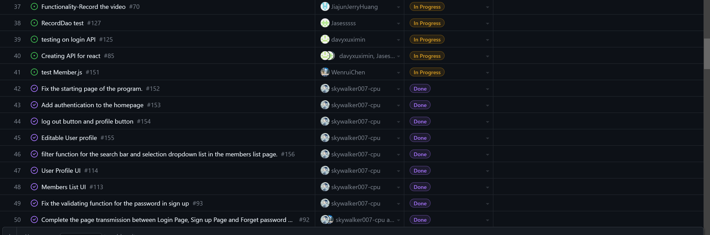

# Team Log - _Team 6_

## Reminder of username 
* skywalker007-cpu --- **Zetian Zhao**

* davyxuximin --- **XiMin Xu**

* JiajunJerryHuang --- **Jiajun Huang**

* Jasesssss --- **Yiqi Xu**

* WenruiChen --- **Wenrui Chen**

## Applicable data range
**November/28/2023** to **December/3/2023**

## Milestone Goals
The uniform user interface for the website (font, color scheme, layout)

Testing user interface interaction

Video submission feature which will work with AWS on the upload page.

Testing if the video can be uploaded(webRTC, S3, KVS). 

Inbox windows for all people

Documentation and video demo

## Completed Tasks 
Video demo and documentation

Testing of AuthContext, userProfile and LoginSignup

Uniform user interface

Credentials of users

Logout

backend and frontend of videos functions

backend of group functions (creating groups in the frontend as well)

Using WebRTC to send and record video (included S3, KVS)

backend of userProfile
## Task in progress

RecordDao test

other API tests

other API creations

## Test Report
*Code :*
```import React from 'react';
import '@testing-library/jest-dom';
import { render, screen, fireEvent, waitFor } from '@testing-library/react';
import UserProfile from './userProfile';
import profilePicture from '../app/userProfile_UI/AvatarForProfile.png';
jest.mock('../app/userProfile_UI/AvatarForProfile.png', () => 'mock-image-path');

describe('UserProfile Component', () => {
    beforeEach(() => {
        sessionStorage.setItem('user', JSON.stringify({
            name: 'David',
            email: 'DavidIsWorking@UBC.com',
            // profilePicture: profilePicture,
            gender: 'Male',
            Bdate: '2001-01-01',
            role: 'Sender'
        }));
    });
    it('renders user profile with default values', () => {
        render(<UserProfile />);
        expect(screen.getByText(/Username:/)).toBeInTheDocument();
        expect(screen.getByText(/Email:/)).toBeInTheDocument();
        expect(screen.getByText(/DavidIsWorking@UBC\.com/)).toBeInTheDocument();
        expect(screen.getByText(/Gender:/)).toBeInTheDocument();
        expect(screen.getByText(/Male/)).toBeInTheDocument();
        expect(screen.getByText(/Birth Date:/)).toBeInTheDocument();
        expect(screen.getByText(/2001-01-01/)).toBeInTheDocument();
        expect(screen.getByText(/Role:/)).toBeInTheDocument();
        expect(screen.getByText(/Sender/)).toBeInTheDocument();
    });
    //edit function in progress
    //test if button wroks
    it('toggles edit mode', async () => {
        render(<UserProfile />);
        expect(screen.getByText('Edit Profile')).toBeInTheDocument();
        fireEvent.click(screen.getByText('Edit Profile'));
        await waitFor(() => {
            expect(screen.getByText('Save')).toBeInTheDocument();
        });
    });
});
```
```import React from 'react';
import { render, act, screen } from '@testing-library/react';
import '@testing-library/jest-dom';
import { AuthProvider, AuthContext } from './authContext.js';

describe('authContext', () => {
    it('renders without crashing', () => {
        render(
            <AuthProvider>
                <div>Test</div>
            </AuthProvider>
        );
    });

    it('should provide initial isAuthenticated state as false', () => {
        sessionStorage.removeItem('user');

        render(
            <AuthProvider>
                <AuthContext.Consumer>
                    {({ isAuthenticated }) => {
                        expect(isAuthenticated).toBe(false);
                    }}
                </AuthContext.Consumer>
            </AuthProvider>
        );
    });

    it('should update isAuthenticated state when setIsAuthenticated is called', async () => {
        let triggerUpdate;
        function TestComponent() {
            const { isAuthenticated, setIsAuthenticated } = React.useContext(AuthContext);
            triggerUpdate = setIsAuthenticated;
            return <div>{isAuthenticated ? 'Authenticated' : 'Not Authenticated'}</div>;
        }
        render(
            <AuthProvider>
                <TestComponent />
            </AuthProvider>
        );
        await act(async () => {
            triggerUpdate(true);
            await new Promise(resolve => setTimeout(resolve, 0)); // Wait for state to update
        });
        expect(screen.getByText('Authenticated')).toBeInTheDocument();
        await act(async () => {
            triggerUpdate(false);
            await new Promise(resolve => setTimeout(resolve, 0)); // Wait for state to update
        });
        expect(screen.getByText('Not Authenticated')).toBeInTheDocument();
    });
    it('sets isAuthenticated based on session storage', () => {
        Storage.prototype.getItem = jest.fn(() => 'user');
        let testRender;
        act(() => {
            testRender = render(
                <AuthProvider>
                    <div>Authenticated</div>
                </AuthProvider>
            );
        });
        expect(testRender.getByText('Authenticated')).toBeInTheDocument();
    });
});
```
*Output:*


## Project on Board
*Board format:*


*Table format:*




## Burnup chart
