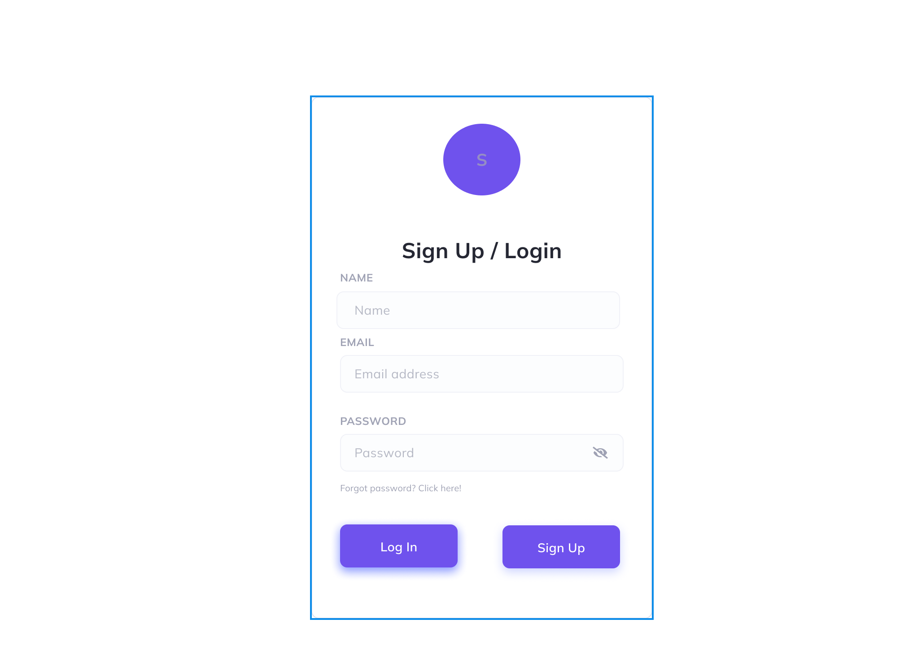
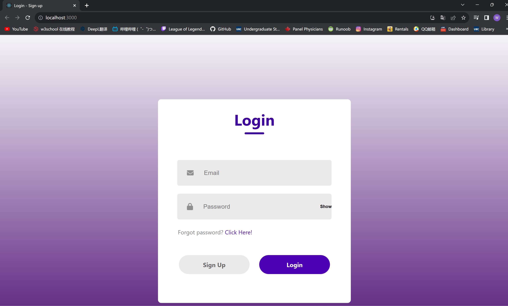
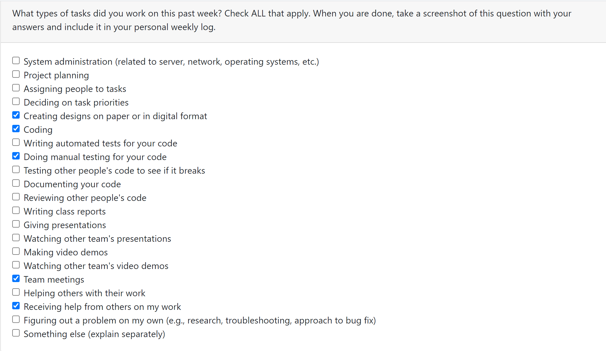
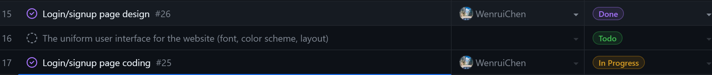

# Individual Log - Wenrui Chen (Week 5)

## Applicable data range
**October/4/2023** to **October/8/2023**

## Recap Goal 
*My jobs in this week are:* 
* Meetings and see what's the plan. 
* Design of login/signup page. 
* React structure setup to prepare database setup. 
* Complete the peer evaluation. 
* AWS activation. 

## Completed Tasks 
* meeting with team members.
* Completed the design of login/signup page using Figma. 
* Completed the peer evaluation of this week. 
* Activated AWS accounts
* Login/signup database setup in progress. 

## UI design for LOGIN and SIGNUP
*Figma:*

*What I did:*

## ScreenShot of peer evaluation

## Task on Board
*Board format:*

*Table format:*

