# Team Log - _Team 6_

## Reminder of username 
* skywalker007-cpu --- **Zetian Zhao**

* davyxuximin --- **XiMin Xu**

* JiajunJerryHuang --- **Jiajun Huang**

* Jasesssss --- **Yiqi Xu**

* WenruiChen --- **Wenrui Chen**

## Applicable data range
**November/7/2023** to **November/12/2023**

## Milestone Goals
The uniform user interface for the website (font, color scheme, layout)

Testing user interface interaction

Editable personal info (change password and so on) 

Video submission feature which will work with AWS on the upload page.

Testing if the video can be uploaded. 

Inbox windows for all people

Testing if people can receive videos from others in private.

sign out feature

Documentation and video demo


## Completed Tasks 
Uniform user interface

Sign in/ Sign out feature

Editable personal info (change password and so on) 

## Task in progress

Using WebRTC to send and record video

Inbox windows for all people

Testing

## Test Report
*Code :*
```describe('validateRole', () => {
    it('should return false for an empty role', () => {
        // Arrange
        const role = "";
        // Act
        const result = validateRole(role);
        // Assert
        expect(result).toBe(false);
    });

    it('should return true for a non-empty role', () => {
        // Arrange
        const role = "Sender"; // Replace with a non-empty role value
        // Act
        const result = validateRole(role);
        // Assert
        expect(result).toBe(true);
    });

    it('should return true for a non-empty role', () => {
        // Arrange
        const role = "Receiver"; // Replace with a non-empty role value
        // Act
        const result = validateRole(role);
        // Assert
        expect(result).toBe(true);
    });
});
```
*Output:*
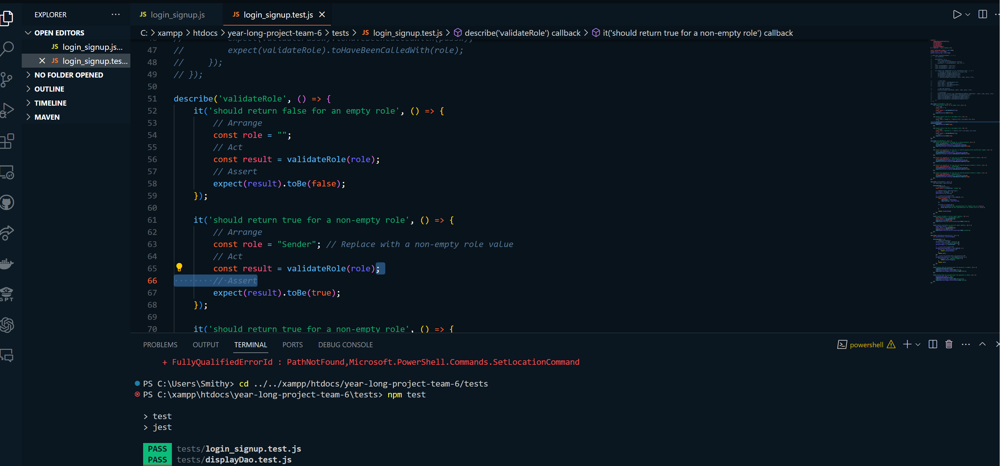
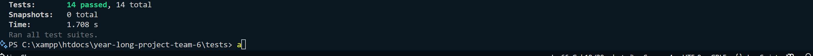

## Project on Board
*Board format:*

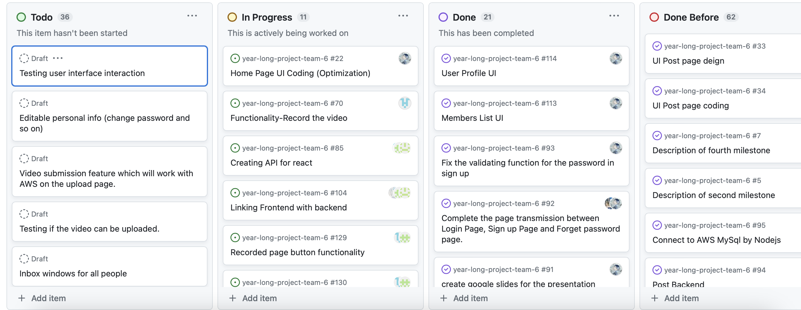

*Table format:*

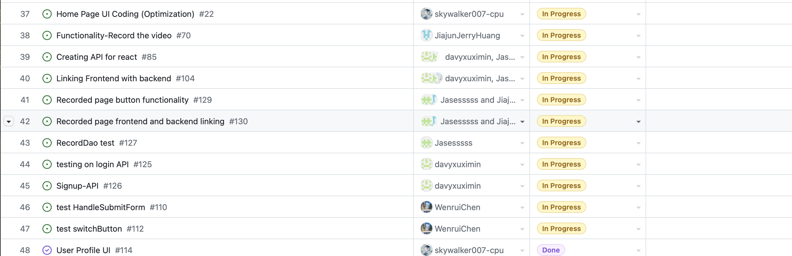
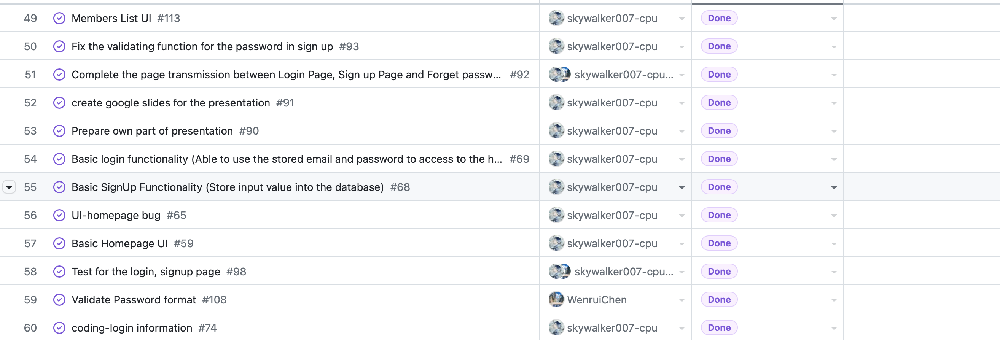
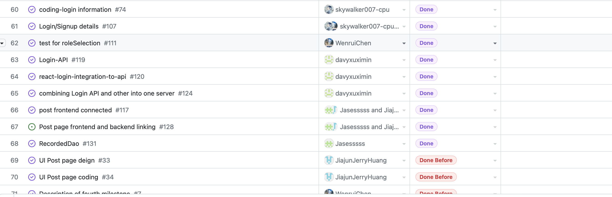
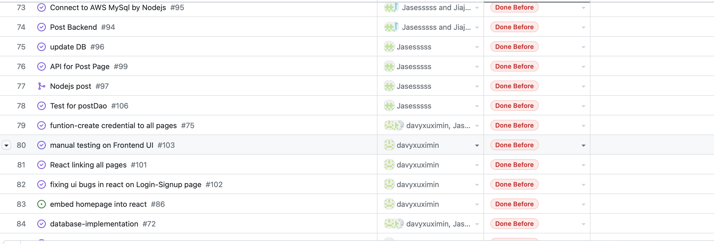
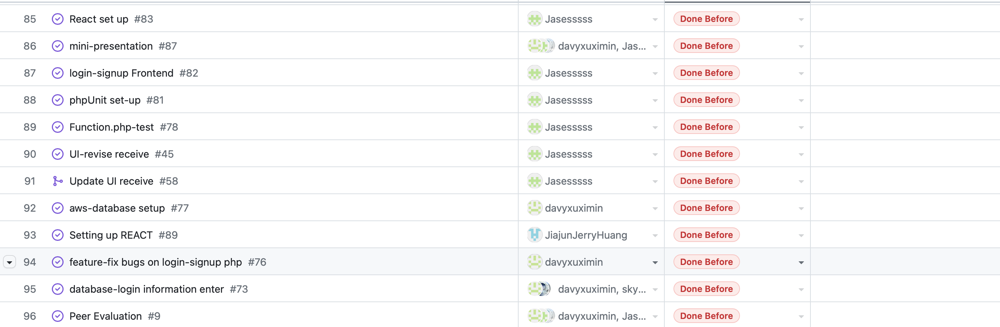
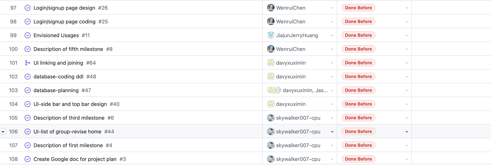
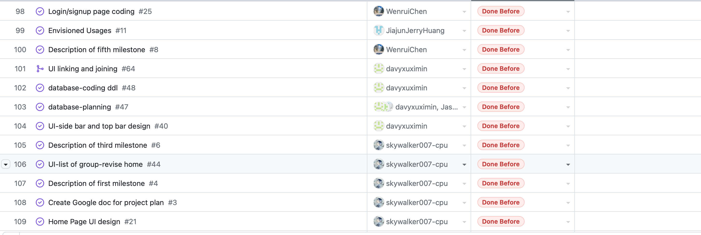
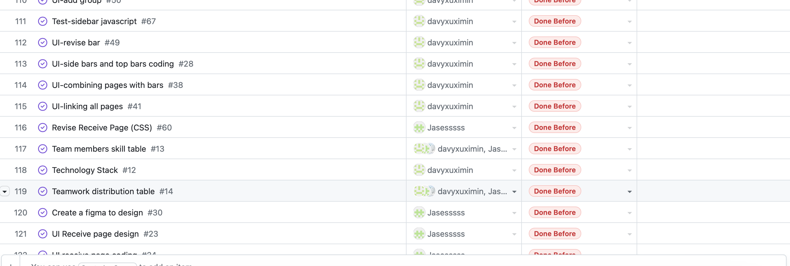

## Burnup chart
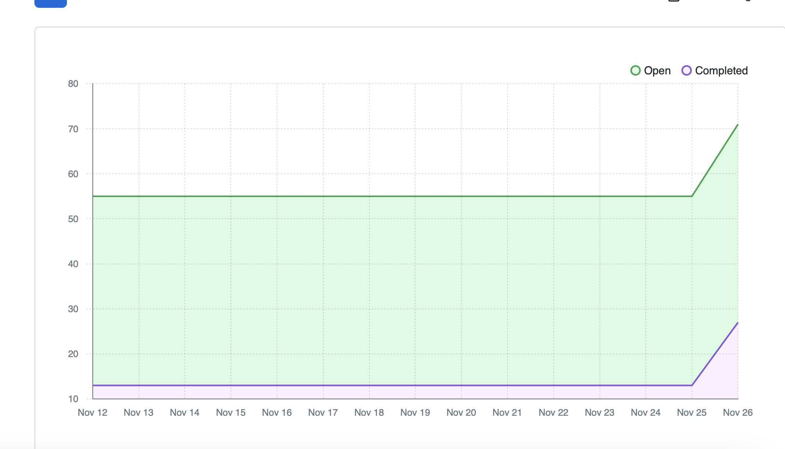